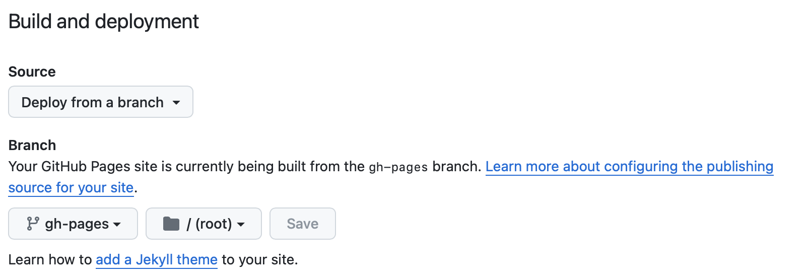

# certifications

To get start, run:

```bash
python3 -m venv venv
source ./venv/bin/activate
pip install -r requirements.txt
```

# Welcome to MkDocs

For full documentation visit [mkdocs.org](https://www.mkdocs.org).

## Commands

- `mkdocs new [dir-name]` - Create a new project.
- `mkdocs serve` - Start the live-reloading docs server.
- `mkdocs build` - Build the documentation site.
- `mkdocs -h` - Print help message and exit.

## Project layout

    mkdocs.yml    # The configuration file.
    docs/
        index.md  # The documentation homepage.
        ...       # Other markdown pages, images and other files.

# To print the whole notebook

Start notebook with `mkdocs serve`, then navigate to `/print_page/`

`mkdocs serve --dev-addr=0.0.0.0:80` to start the notebooks in a specified port.

In the browser, File > Print > Save as PDF (see export to PDF)

# Deploy in Github Page

1. make sure the repo name is `<git account name>.github.io`
2. run `mkdocs gh-deploy`: this will create a new git branch `gh-pages` and **push it to your repo automatically**
3. In the repo, under Settings > [Code and Automation] Pages > [Build and Deploy], setup the corrent branch:
   

## Update deployment

After pushing the changes using the common `add`-`commit`-`push` steps, make sure use `mkdocs gh-deploy` to build and push the changes to `gh-deploy` branch.
