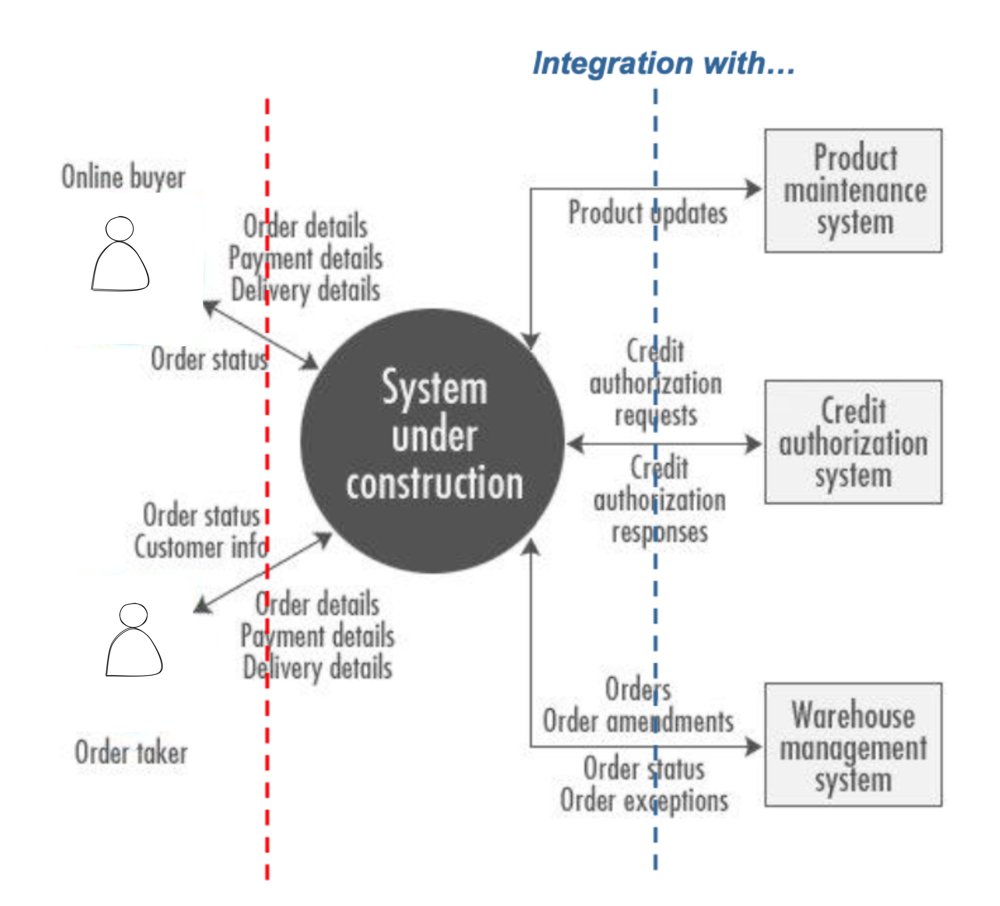
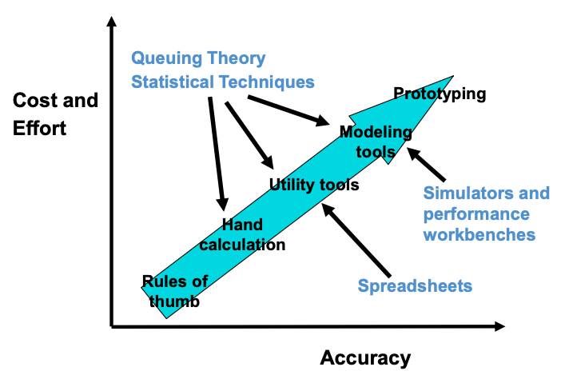

# 1. Course Goals
- Learning a variety of architecture styles & approaches
- Avoiding "golden hammer" anti-pattern
- Not rushing to a solution
- Understanding that fixing one problem often casuse another
- Looking for unconventional solutions

!!! info "Golden Hammer"
    When you have a preferred solution style (a "golden hammer"), every problem begins to look the same, like a silver nail.

# 2. What is Architecture
- Architecture (as an artefact): The architecture of a system describes its overall **static structure and dynamic behaviour**. It models the **system's elements** (which for IT systems are software, hardware, and its human users), the **externally manifested properties** of those elements, and the static and dynamic relationships among them.
- Architecture (as a discipline): Architecture is an **engineering discipline** That studies methods of designing **IT systems** that provide **a solution to a business problem**.
The solution must satisfy **functional and non-functional requirements** in a way that best balances **competing stakeholders' concerns** and must take constraints into account.
- Architecture can be at any scale:
    - 'Above the scale': **the requirements of the world** in which the system sits
    - 'At the scale': the **Architecture** between the elements of the system
    - 'Below the scale': the **design insides of the elements** of the system

!!! info "Architecture vs Design"
    Architecture: Creating the structure
    Design: Detailing the Content

## Perspectives to be consider
- **Solution blueprint**(架构图) that can be reviewed and validated
    - show different level of blueprint to different stakeholders
- **Communication tool** for stakeholders and teams (business, IT delivery and BAU - IT
Operations), future reference for maintenance and change, developing neighbouring systems and integration
- **Delivery Environments**: Input into the delivery environments' design and specification, tools and platforms of choice for solution delivery
- **Delivery Planning**: Starting point for developing the project plan (Traditional delivery), solution and feature backlog (Agile delivery), resource requirements and team structure
- **Estimates**: Starting point for cost estimation (labour, licences, platform costs, etc)
- **Enable parallel development**: by understanding how inter-component dependencies can and should be managed
- **Foundation for commercial agreements** (i.e. "This is what you get for the price we have agreed on'")
- **Foundation for DOU** and segregation of responsibilities between various parties - e.g.
Client and Solution Provider, Solution Provider and Partner(s)/Subcontractors) (e.g.
RACI matrices)

!!! note "Architecture guidance includes"
    - Good things
        - Tried and tested parts
        - Tried and tested structures of parts (reference architectures)
    - Good ways of doing things
        - Principles and patterns that help ensure the architecture is created in a good

## Why is Architect important?
- ppl can validate it in advance
- for documentation purpose
- the whole team take it as **guidance**

!!! note "How detail should the Documentation be?"
    Take 80:20 Principle, try to document the things with high priorities:

    - things that cover 80% requirements
    - critical ones
    ...

## Architecture Types
As Architect, you need to be standing in different areas. 

- Business Architecture(BA): understands the business intention and motivation
- IT Architecture(ITA): do ITA, at SA level
- Enterprise Architecture(EA): enterprise level, across BA and ITA, also offer guidance at SA level
- Solution Architect(SA): create solutions to business problems(BA), typically within ITA

## Architect Aspects

Architect takes **Technology**, **Process** and **People** into consideration and asks questions from different aspects

## Architect Work
|At the front|At the back|
|:-|:-|
|- Listening to clients  - Understanding business requirements  - Negotiating feasible requirements and scope  - Forming detailed definitions of solution structures |  - During construction  - Serving as a customer advocate  - Guiding the team  |

!!! note "IT Architect vs IT Specialist"
    - IT Architect: more high level, needs to understand the Business Problem
    - IT Specialist: received detailed Task from **IT Architect**, is able to focus on its own speciality(e.g. DevOps)

# 3. Requirements

!!! note "why requirements are important?"
    - only 39% projects are successful
    - among the failed projects, 37% are mainly caused by **inaccurate requirements**
    - 15%-20% Software development fee are wasted due to bad requirement 

The requirements need to be **SMART**:

- **S**pecific: Unambiguous, consistent, and at the appropriate level of detail
- **M**easurable: Possible to verify that a requirement has been met, so include success criteria
- **A**ttainable: Technically feasible and within the art of the possible
- **R**ealizable: Realistic given all the constraints (e.g., resources, skills, time, infrastructure)
- **T**raceable: Linked from conception through specification, design, implementation, and test

As a group, requirements have to be **non-conflicting** and **prioritzed**.

!!! note "what makes a good requirement"
    1. a complete sentence
    2. avoid abbreviation unless defined
    3. consistent in verbs: will/shall/must=mandatory, should/might=optional, could/would=desirable
    4. must contain the success criteria and be measurable and testable.
    5. has a unique reference ID
    6. Refer to supporting material without duplication
    7. avoid ambiguity, rambling and inrealistic thinking (e.g.: 100% up-time)

!!! warning
    - Requirements must be **prioritized**
    - Requirements should be able to **traced** - to answer how far did it go?

## Stakeholders
Definition: A stakeholder in a **solution architecture** is someone with interest in or concerns about the realization of the architecture. 

## Tool - System Context Diagram
The [System Context Diagram](https://zh.wikipedia.org/wiki/%E7%B3%BB%E7%BB%9F%E5%85%B3%E7%B3%BB%E5%9B%BE)

- it carifies the **environment** on which the system operates
- captures **boundary** of the system
- identifies the **external interfaces**
- clarifies the **personal** that will use the system
- define **use cases** & **data flows**

!!! info "Example"
    The Diagram doesn't have a fixed form, but it has some conventions, you must have:

    - the **personal**
    - the **System under Construction** - the one you are gonna build
    - set of **external systems** that you will integrate with

    

!!! note
    One can use **System Context Diagram** to analyse an existing system too.

## Requirement Types
There are usually LOOOOTS OF requirements, we start with categorizing them into the following 4 types:

1. **Functional Requirements (FRs)**: capabilities need to be delivered, answer the question "What does user need?"
    - Example: User is able to login
2. **Non-Functional Requirements (NFRs)**: expectations and chracteristics the the IT system should have
    - Example of runtime expectations: performance, availability
    - Example of non-runtime expectations: scalability, maintainability
3. **Constraints**: immutable
    - Example: existing environments, available skills, budget, oprational limitations
4. **Future Requirements**: how system might change in the future, could be functional or non-functional
    - Example: legislation

### 1. Functional Requirements (FRs)
**Functional requirements** describe what the system will do from a number of perspectives. In the Agile world, the **Functional requirements** are hidden behind those concepts: **Epics**, **User Stories**

!!! note "activities"
    |Activities from **Business** perspective:|Activities from **User** perspective:|
    |:-|:-|
    |- Business Process Model  - Use Case Model  - Use Case Specification: e.g. The user supplies the address and phone number|- Design Thinking Methodology|

!!! note "Use Cases vs User Stories"
    **User Stories** are a way to describe **requirements**. **Use Cases** can be used as a way to detail the **User Stories**.

### 2. Nonfunctional Requirements (NFRs)
**Non-Functional Requirements (NFRs)** define “how good” the solution should be.

!!! note "NFR Types"
    1. Runtime NFRs - value to the user
        - Performance
        - Volumetrics
        - Security
        - Usability
        - Availability
        - Manageability
    2. Non-runtime NFRs - value to the operator
        - Can it scale?
        - Is it compliant?
        - Can it be maintained?
        - Can it be managed?
        - Is it environmentally sound?
        - Is it portable?
        - Is it reliable?

!!! info "Runtime NFR - Performance"
    You need to find a balance between:
    
    - Cost & Effort
    - How accurate it needs to be
    <!--  -->

!!! info "Runtime NFR - Availability"
    Important concepts for **Availability**: 

    - High Availability (HA): System is always available whenever it’s expected to be.
    - Continuous operations (CO): System is intended to be available all the time, no scheduled outages
    - Continuous availability (= HA + CO): System is always available all the time.

    Important metrics for **Availability**: 
    
    - Mean time to repair (MTTR): The average time something is “down” (“1”)
    - Mean time to failure (MTTF) – The average time something is “up” (“99”)
    - Mean time between failures (MTBF) – The average time between “going down” (“100”)

    To measure the "unavailability", we use percentage to describe the Uptime. However, ONLY using percentage is a BAD IDEA:

    - 99 days “up,” 1 day “down”
    - 99 hours “up,” 1 hour “down”
    - 99 seconds “up,” 1 second “down” --> almost no time for MTTR, which is impossible!

    ⚠️ Consider both Percentage and Context

!!! info "Runtime NFR - Security"
    The ability to protect an IT system against malicious use while at the same time allowing legitimate use. It has the following categories:

    - Authentication
    - Authorization
    - Integrity: immutability of data
    - Confidentiality
    - Non-repudiation: certified sender

!!! info "Non-runtime NFR - Scalability"
    A system’s ability to increase (or decrease) in size according to changing workloads, such as an increase in user numbers. There are 2 approaches:
    
    - Vertical scaling (“scaling up”)
    - Horizontal scaling (“scaling out”): Spreading the load across more machines

### 3. Constraints
Constraints are limitations imposed upon a solution. What we CANNOT change. Examples:

- Regulatory
- Organizational
- Geographic
- Risk taking willingness
- Project: time, resource, scope
- Development skills
- Existing infrastructure: hard- and software
- Technology leadership
- IT architectural standards

### 4. Future Requirements
Describe how the system might change in the future, whether these are functional or nonfunctional enhancements. Aspects:

-  New and modified business processes and goals
- Adaptation of the system to new technologies
- Changes in the profiles of the average user
- Changes in the integration needs with other systems

## Managing Requirements
Determine significant requirements that most likely affect the architecture. considering aspects:

- Early pre-project sizing?
- Proposal development?
- Outline solution architecture?
- Focused functional or operational design?

## Changes
Requirements are dynamic and require careful management throughout a project’s life cycle

!!! note "How to manage the changes?"
    - Iterative documentation
    - well-defined change mgmg procedure - V model
    - Ongoing evaluation

!!! note "Activity - Joint Application Design (JAD)"
    JAD is similar to brainstorming sessions, can be short or long (several days). Results:

    - Service portfolio candidates
    - User “stories”
    - Use cases
    - Assumptions

# 4. Architectural Decisions and Principles

## Documenting the Decision
Architectural decisions should be formally documented, each decision should include the following elements:

!!! note "Example"
    2.2 AD02: Choice of Integration

    |||
    |:-|:-|
    | **An unique identifier** |AD02|
    | **Design decision** | how to integrate into the exisiting systems? |
    | **Issue/problem** | there are existing systems... |
    | **Assumption** | with a interface|
    | **Alternatives** | (1) FIle trasfer   (2) Messaging|
    | **Decision** | Alternative (2) is better|
    | **Justification** | together with the client I made the decision, because (2) Messaging provides reliable, asynchronous program-to-program communication|
    | **Implications** | an integration server node will be required|
    |**Parties Agreeing to the  Decision**|Person 1 (Representing the solution architecture team)  Person 2 (representing the client)|

!!! note "Difference"
    | Architectural Decisions | Architectural Principles|
    |:-|:-|
    |are made within the context of the development of the solution’s architecture.|are imposed from outside the context of the solution architecture; they are often part of the enterprise’s Enterprise Architecture.|

!!! note "other concepts"
    | Policy | Lets protect the data|
    | Principle| use SSO to protect the data.   Define Principle with `Name`, `Statement`, `Motivation` and `Implication` |
    | Guideline| ...|

## Best Practise
How to get a good architectural decision? There are **11 Solution Patterns** that you can follow:

## Value Proposition
### 1. Check Value Proposition
- Confirming the customer wants and needs
- Identify your differentiators of your Design

## Simplification
### 2. Simplify the Architecture 
Simplify complex architectures and excessive infrastructure layers.

### 3. Breakthrough the Design 
### 4 Integrate the Facilities 
### 5 Rightshape the Platforms & Processors
Dont sale Cloud just because you want to sale it, the Client's Requirements have the highest priority.

## Assets
### 6 Re-use Existing Assets 
### 7 Recycle Existing Code 
### 8 Apply Frameworks / Skeletons

## Delievery
### 9 Optimize the Application Development environment
### 10 Optimize the Delivery Model
### 11. Rationalize SW/HW License Lifecycle

# 5. Architecture Overview
The **Architecture Overview Diagram** is a part of **Architecture Overview**. The goals:

- to communicate a conceptual understanding of the intended IT system with the stakeholders
- to explore and evaluate alternative architectural options
- to enable early recognition and validation of the implication
- to facilitate orientation for new people who join the project

!!! note "where does Architecture Overview sit?"
    Requirements (NFRs + FRs) --> **Architecture Overview** --> Component Model + Operational Model

## Best Practises

1. For who are you drawing this Diagram for? Considering drawing different Diagrams for different stakeholders
2. No information overflow
3. Use the language of your client
4. Use colors - but be consistent

## Anti-patterns
Bad things to avoid:

- Information overload
- Information underload
- too many acronyms -> solution: to annotate them
- Providing more **technical** details than required for a **business** audience

