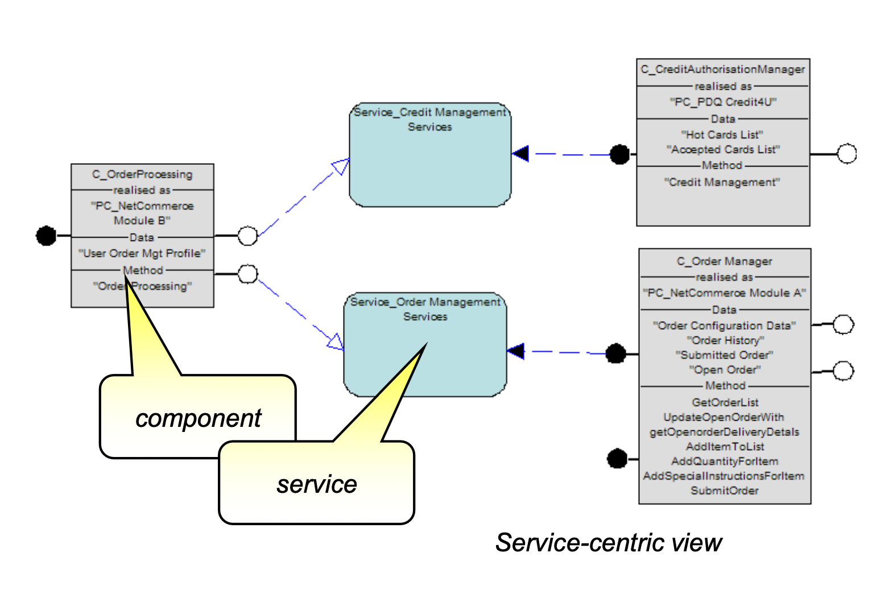
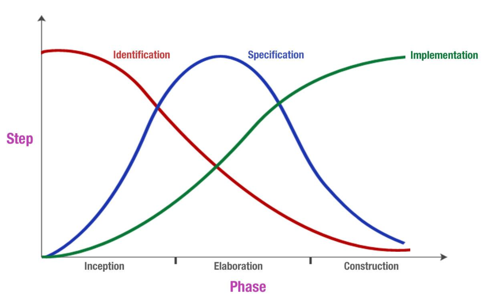
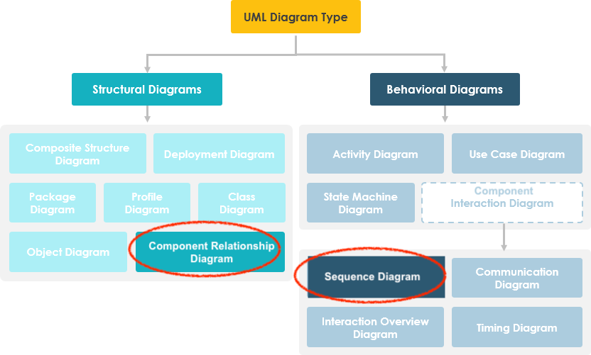

# 1. Course Goals
- Learning a variety of architecture styles & approaches
- Avoiding "golden hammer" anti-pattern
- Not rushing to a solution
- Understanding that fixing one problem often casuse another
- Looking for unconventional solutions

!!! info "Golden Hammer"
    When you have a preferred solution style (a "golden hammer"), every problem begins to look the same, like a silver nail.

# 2. What is Architecture
- Architecture (as an artefact): The architecture of a system describes its overall **static structure and dynamic behaviour**. It models the **system's elements** (which for IT systems are software, hardware, and its human users), the **externally manifested properties** of those elements, and the static and dynamic relationships among them.
- Architecture (as a discipline): Architecture is an **engineering discipline** That studies methods of designing **IT systems** that provide **a solution to a business problem**.
The solution must satisfy **functional and non-functional requirements** in a way that best balances **competing stakeholders' concerns** and must take constraints into account.
- Architecture can be at any scale:
    - 'Above the scale': **the requirements of the world** in which the system sits
    - 'At the scale': the **Architecture** between the elements of the system
    - 'Below the scale': the **design insides of the elements** of the system

!!! info "Architecture vs Design"
    Architecture: Creating the structure
    Design: Detailing the Content

## Perspectives to be consider
- **Solution blueprint**(架构图) that can be reviewed and validated
    - show different level of blueprint to different stakeholders
- **Communication tool** for stakeholders and teams (business, IT delivery and BAU - IT
Operations), future reference for maintenance and change, developing neighbouring systems and integration
- **Delivery Environments**: Input into the delivery environments' design and specification, tools and platforms of choice for solution delivery
- **Delivery Planning**: Starting point for developing the project plan (Traditional delivery), solution and feature backlog (Agile delivery), resource requirements and team structure
- **Estimates**: Starting point for cost estimation (labour, licences, platform costs, etc)
- **Enable parallel development**: by understanding how inter-component dependencies can and should be managed
- **Foundation for commercial agreements** (i.e. "This is what you get for the price we have agreed on'")
- **Foundation for DOU** and segregation of responsibilities between various parties - e.g.
Client and Solution Provider, Solution Provider and Partner(s)/Subcontractors) (e.g.
RACI matrices)

!!! note "Architecture guidance includes"
    - Good things
        - Tried and tested parts
        - Tried and tested structures of parts (reference architectures)
    - Good ways of doing things
        - Principles and patterns that help ensure the architecture is created in a good

## Why is Architect important?
- ppl can validate it in advance
- for documentation purpose
- the whole team take it as **guidance**

!!! note "How detail should the Documentation be?"
    Take 80:20 Principle, try to document the things with high priorities:

    - things that cover 80% requirements
    - critical ones
    ...

## Architecture Types
As Architect, you need to be standing in different areas. 

- Business Architecture(BA): understands the business intention and motivation
- IT Architecture(ITA): do ITA, at SA level. Includes the following perspectives:
    - Application level
    - Technical level
    - Physical perspective
    - Logical perspective
    - Functional aspect
    - Operational aspect
- Enterprise Architecture(EA): enterprise level, across BA and ITA, also offer guidance at SA level
- Solution Architect(SA): create solutions to business problems(BA), typically within ITA

## Architect Aspects

Architect takes **Technology**, **Process** and **People** into consideration and asks questions from different aspects

## Architect Work
|At the front|At the back|
|:-|:-|
|- Listening to clients  - Understanding business requirements  - Negotiating feasible requirements and scope  - Forming detailed definitions of solution structures |  - During construction  - Serving as a customer advocate  - Guiding the team  |

!!! note "IT Architect vs IT Specialist"
    - IT Architect: more high level, needs to understand the Business Problem
    - IT Specialist: received detailed Task from **IT Architect**, is able to focus on its own speciality(e.g. DevOps)

# 3. Requirements

!!! note "why requirements are important?"
    - only 39% projects are successful
    - among the failed projects, 37% are mainly caused by **inaccurate requirements**
    - 15%-20% Software development fee are wasted due to bad requirement 

The requirements need to be **SMART**:

- **S**pecific: Unambiguous, consistent, and at the appropriate level of detail
- **M**easurable: Possible to verify that a requirement has been met, so include success criteria
- **A**ttainable: Technically feasible and within the art of the possible
- **R**ealizable: Realistic given all the constraints (e.g., resources, skills, time, infrastructure)
- **T**raceable: Linked from conception through specification, design, implementation, and test

As a group, requirements have to be **non-conflicting** and **prioritzed**.

!!! note "what makes a good requirement"
    1. a complete sentence
    2. avoid abbreviation unless defined
    3. consistent in verbs: will/shall/must=mandatory, should/might=optional, could/would=desirable
    4. must contain the success criteria and be measurable and testable.
    5. has a unique reference ID
    6. Refer to supporting material without duplication
    7. avoid ambiguity, rambling and inrealistic thinking (e.g.: 100% up-time)

!!! warning
    - Requirements must be **prioritized**
    - Requirements should be able to **traced** - to answer how far did it go?

## Stakeholders
Definition: A stakeholder in a **solution architecture** is someone with interest in or concerns about the realization of the architecture. 

## Tool - System Context Diagram
The [System Context Diagram](https://zh.wikipedia.org/wiki/%E7%B3%BB%E7%BB%9F%E5%85%B3%E7%B3%BB%E5%9B%BE)

- it carifies the **environment** on which the system operates
- captures **boundary** of the system
- identifies the **external interfaces**
- clarifies the **personal** that will use the system
- define **use cases** & **data flows**

!!! info "Example"
    The Diagram doesn't have a fixed form, but it has some conventions, you must have:

    - the **personal**
    - the **System under Construction** - the one you are gonna build
    - set of **external systems** that you will integrate with

    

!!! note
    One can use **System Context Diagram** to analyse an existing system too.

## Requirement Types
There are usually LOOOOTS OF requirements, we start with categorizing them into the following 4 types:

1. **Functional Requirements (FRs)**: capabilities need to be delivered, answer the question "What does user need?"
    - Example: User is able to login
2. **Non-Functional Requirements (NFRs)**: expectations and chracteristics the the IT system should have
    - Example of runtime expectations: performance, availability
    - Example of non-runtime expectations: scalability, maintainability
3. **Constraints**: immutable
    - Example: existing environments, available skills, budget, oprational limitations
4. **Future Requirements**: how system might change in the future, could be functional or non-functional
    - Example: legislation

### 1. Functional Requirements (FRs)
**Functional requirements** describe what the system will do from a number of perspectives. In the Agile world, the **Functional requirements** are hidden behind those concepts: **Epics**, **User Stories**

!!! note "activities"
    |Activities from **Business** perspective:|Activities from **User** perspective:|
    |:-|:-|
    |- Business Process Model  - Use Case Model  - Use Case Specification: e.g. The user supplies the address and phone number|- Design Thinking Methodology|

!!! note "Use Cases vs User Stories"
    **User Stories** are a way to describe **requirements**. **Use Cases** can be used as a way to detail the **User Stories**.

### 2. Nonfunctional Requirements (NFRs)
**Non-Functional Requirements (NFRs)** define “how good” the solution should be.

!!! note "NFR Types"
    1. Runtime NFRs - value to the user
        - Performance
        - Volumetrics
        - Security
        - Usability
        - Availability
        - Manageability
    2. Non-runtime NFRs - value to the operator
        - Can it scale?
        - Is it compliant?
        - Can it be maintained?
        - Can it be managed?
        - Is it environmentally sound?
        - Is it portable?
        - Is it reliable?

!!! info "Runtime NFR - Performance"
    You need to find a balance between:
    
    - Cost & Effort
    - How accurate it needs to be
    <!--  -->

!!! info "Runtime NFR - Availability"
    Important concepts for **Availability**: 

    - High Availability (HA): System is always available whenever it’s expected to be.
    - Continuous operations (CO): System is intended to be available all the time, no scheduled outages
    - Continuous availability (= HA + CO): System is always available all the time.

    Important metrics for **Availability**: 
    
    - Mean time to repair (MTTR): The average time something is “down” (“1”)
    - Mean time to failure (MTTF) – The average time something is “up” (“99”)
    - Mean time between failures (MTBF) – The average time between “going down” (“100”)

    To measure the "unavailability", we use percentage to describe the Uptime. However, ONLY using percentage is a BAD IDEA:

    - 99 days “up,” 1 day “down”
    - 99 hours “up,” 1 hour “down”
    - 99 seconds “up,” 1 second “down” --> almost no time for MTTR, which is impossible!

    ⚠️ Consider both Percentage and Context

!!! info "Runtime NFR - Security"
    The ability to protect an IT system against malicious use while at the same time allowing legitimate use. It has the following categories:

    - Authentication
    - Authorization
    - Integrity: immutability of data
    - Confidentiality
    - Non-repudiation: certified sender

!!! info "Non-runtime NFR - Scalability"
    A system’s ability to increase (or decrease) in size according to changing workloads, such as an increase in user numbers. There are 2 approaches:
    
    - Vertical scaling (“scaling up”)
    - Horizontal scaling (“scaling out”): Spreading the load across more machines

### 3. Constraints
Constraints are limitations imposed upon a solution. What we CANNOT change. Examples:

- Regulatory
- Organizational
- Geographic
- Risk taking willingness
- Project: time, resource, scope
- Development skills
- Existing infrastructure: hard- and software
- Technology leadership
- IT architectural standards

### 4. Future Requirements
Describe how the system might change in the future, whether these are functional or nonfunctional enhancements. Aspects:

-  New and modified business processes and goals
- Adaptation of the system to new technologies
- Changes in the profiles of the average user
- Changes in the integration needs with other systems

## Managing Requirements
Determine significant requirements that most likely affect the architecture. considering aspects:

- Early pre-project sizing?
- Proposal development?
- Outline solution architecture?
- Focused functional or operational design?

## Changes
Requirements are dynamic and require careful management throughout a project’s life cycle

!!! note "How to manage the changes?"
    - Iterative documentation
    - well-defined change mgmg procedure - V model
    - Ongoing evaluation

!!! note "Activity - Joint Application Design (JAD)"
    JAD is similar to brainstorming sessions, can be short or long (several days). Results:

    - Service portfolio candidates
    - User “stories”
    - Use cases
    - Assumptions

# 4. Architectural Decisions and Principles

## Documenting the Decision
Architectural decisions should be formally documented, each decision should include the following elements:

!!! note "Example"
    2.2 AD02: Choice of Integration

    |||
    |:-|:-|
    | **An unique identifier** |AD02|
    | **Design decision** | how to integrate into the exisiting systems? |
    | **Issue/problem** | there are existing systems... |
    | **Assumption** | with a interface|
    | **Alternatives** | (1) FIle trasfer   (2) Messaging|
    | **Decision** | Alternative (2) is better|
    | **Justification** | together with the client I made the decision, because (2) Messaging provides reliable, asynchronous program-to-program communication|
    | **Implications** | an integration server node will be required|
    |**Parties Agreeing to the  Decision**|Person 1 (Representing the solution architecture team)  Person 2 (representing the client)|

!!! note "Difference"
    | Architectural Decisions | Architectural Principles|
    |:-|:-|
    |are made within the context of the development of the solution’s architecture.|are imposed from outside the context of the solution architecture; they are often part of the enterprise’s Enterprise Architecture.|

!!! note "other concepts"
    | Policy | Lets protect the data|
    | Principle| use SSO to protect the data.   Define Principle with `Name`, `Statement`, `Motivation` and `Implication` |
    | Guideline| ...|

## Best Practise
How to get a good architectural decision? There are **11 Solution Patterns** that you can follow:

## Value Proposition
### 1. Check Value Proposition
- Confirming the customer wants and needs
- Identify your differentiators of your Design

## Simplification
### 2. Simplify the Architecture 
Simplify complex architectures and excessive infrastructure layers.

### 3. Breakthrough the Design 
### 4 Integrate the Facilities 
### 5 Rightshape the Platforms & Processors
Dont sale Cloud just because you want to sale it, the Client's Requirements have the highest priority.

## Assets
### 6 Re-use Existing Assets 
### 7 Recycle Existing Code 
### 8 Apply Frameworks / Skeletons

## Delievery
### 9 Optimize the Application Development environment
### 10 Optimize the Delivery Model
### 11. Rationalize SW/HW License Lifecycle

# 5. Architecture Overview
The **Architecture Overview Diagram** is a part of **Architecture Overview**. The goals:

- to communicate a conceptual understanding of the intended IT system with the stakeholders
- to explore and evaluate alternative architectural options
- to enable early recognition and validation of the implication
- to facilitate orientation for new people who join the project

⚠️ Like a house floor plan!

!!! note "where does Architecture Overview sit?"
    Requirements (NFRs + FRs) --> **Architecture Overview** --> Component Model + Operational Model

## Best Practises

1. For who are you drawing this Diagram for? Considering drawing different Diagrams for different stakeholders
2. No information overflow
3. Use the language of your client
4. Use colors - but be consistent

## Anti-patterns
Bad things to avoid:

- Information overload
- Information underload
- too many acronyms -> solution: to annotate them
- Providing more **technical** details than required for a **business** audience

# 6. Component Model

We use **Component Model** to describe theh Functional Aspect of a IT Achitecture.

!!! note "why Model?"
    - **Models** break down complex system to smaller parts - the **Components**
    - **components**, that have well understood functional responsibilities.
    - **Models** visualize the system

**Component Model** is a formal representation of:

- the internal Structure of the solution - shows the relationships between the **component**
-  a next step from **the System Context Diagram** that aligns with the Black Box engineering principle to the White Box principle
-  provides the necessary input for **the Operational model**:
    - where run the **component**
    - where should the **component's** data be
    - Where should the **component** be installed?
    - How will the **components** communicate with each other?

## 6.1 Functional Aspect Modeling
The Functional Aspect of an IT system has various Modelling Types:

- **Component(service) modeling**: functionalities
- **Data modelling**: data that make the functionality works

### Why Component Model
we use **Component Model** as **input** for the following:

|In application development | In the operational aspect | In operations |
|:-|:-|:-|
|- Work allocation  - Version control  - Design strategy  - Reuse  - Testing  - Project management  - Product or Package selection|- The *things* that have to be deployed|- Systems management and so on|

### Component
A **Component** is a modular unit of functionality. It makes its functionality and state available through one or more interfaces. 

A **Component** is not just a programming-level concept such as an Oracle
EJB or .NET component. It can be at different **Levels**:
- At Application Level: a component can be <ins>Account Manager component</ins>
- At the technical level, a component can be <ins>security service</ins>

!!! note "Black Box engineering principle"
    Using a **Black Box engineering principle**, we focus on what the components’ interfaces (or APIs) offer - rather than how the requested function is realized

!!! note "Components & Services"
    **Components** and **Services** are interrelated:

    - **Components** offer and request **Services** via their Service Interfaces or APIs
    - **Services** are satisfied by **Components**, which, if necessary, request **Services** from other **Components**.

    

#### Step-by-step: how to create a Component?
**1. Component identification:**  

- Partition the system into subsystems and components
- Use a reference architecture
- Ensure the components are: 
    1. Highly **cohesive**: high dependencies within a component
    2. Loosely **coupled**: low dependencies between components
    3. Well **isolated**: high isolation of prodcut/technology dependencies
    4. Of the right **granularity**: suitable functionality amount assigned to a component, not too many, not too little
    5. **Layered** according to their generality --> Layering provides a logical partitioning of components into a number of sets or layers.

Doc: [Software Architecture Documentation in Practice: Documenting Architectural Layers](https://insights.sei.cmu.edu/library/software-architecture-documentation-in-practice-documenting-architectural-layers/)

**2. Component specification:**  
For each interface, specifying:

- their **operations** = parameters passed
- their **signatures** = return values
- contract of behavior
- pre-/post-conditions

Approaches: use **Use Case Model** or **Data Model**

**3. Component implementation:**  
implementation approach.

- For **commercial-off-the-shelf (COTS) products**: map the <ins>specified-level</ins> components to the
appropriate products or packages.
- For **components to be built**, identify the approach to implementation by defining the <ins>physical-level</ins> components. 

During component implementation, the **logical-level model** is transformed into 1 or more **physical-level model**. The transformation involves:
    - Selecting products and packages
    - Identifying frameworks and patterns
    - Deciding what components have to be developed
    - Making choices about what technology should be used to realize the components

!!! note
    \[logical-level model\] -> Technology Selection -> \[Physical Level Model\] -> Development -> Code

!!! warning "Enterprise Architectures Guideline"
    Reuse > Customise > Buy > Build

!!! info
    **Components** may be Grouped into **Subsystems**

### Notation
**Unified Modeling Language (UML)** is one of the notations used. There are 2 types of UML:

1. [STATIC] **Structural Diagram**: on the system’s internal structure
2. [DYNAMIC] **Behavior Diagram**: as well as, its behavior

### Component Classification
**Application** vs **Technical**:

- **Application** Components implement a specific business function, e.g. `Payment Component`
- **Technical** Components are NOT associated with a specific business function. They play a
technical role that supports realization, e.g. `Hypervisor` or `Web Server`

Logical vs Physical:

- **Logical**: focuses on the functional responsibility and purpose of the of the solution
components without being concerned of their implementation
- **Physical**: Represents actual concrete software or hardware technology, a
product/package used for component implementation. These are decision usually made
during the Component Implementation stage

## 6.2 Operational Aspect Modeling

!!! note "Functional vs Operational"
    ||Functional|Operational|
    |:-|:-|:-|
    |**Content:**|- the structure of components (of all kinds) related to actual functionality  - their dynamic behavior (collaboration)  - their interfaces  - Embodied in the Component Model work product |- what runs where (component placement)  - includes the network topology (hardware nodes, locations, etc.),  - ensures the achievement of the solution's service level characteristics (performance, availability),  - describes the management and operation of the IT system.  - Embodied in the Operational Model work product |

🏔️ The design of **Operational Aspect** might be challenging, because:

- Many competing concerns:
    - **NFR**'s: for example, performance, availability, manageability, security
    - **Constraints**: for example, affordability, standards compliance, existing infrastructure
- Many coordinating activities:
    - Detailed design: capacity planning, software and data distribution, network, hardware, service management
    - Commercial: planning, pricing, procurement, service level agreement

### Step-by-step
to create Operational Aspect Modeling, we can follow these steps:

1. Understand **NFRs**
2. Conceptualize from an application perspective - Application Logical Operational Model (ALOM)
    - identify application level nodes and their placement
3. Conceptualize the Logical Operational Model (LOM)
    - determine the logical application 只是逻辑组件
components 
4. Transform into the Physical Operational Model (POM) 
    - determine the technologies 真正的技术选择

#### 3. LOM

- Step 1: The overall structure of the LOM is largely based on the locations over which the solution will be deployed.
- Step 2: Then identify Candidate Logical Nodes
- Step 3: We have to understand what it is we need to deploy, via the DEPLOYMENT UNIT Model
- Step 4: Operational Modeling helps ensure the system’s non-functional requirements are delivered, within all constraints…

#### 4. Transform LOM into POM
(1) Identifying your role in the product selection process and the definition of the selection criteria
(2) Performing the necessary product selections for the nodes and connections
(3) Defining the solution details and describing how
technologies will be put together to deliver the specific SLAs
(4) Rationalizing the solution architecture to get to a sized POM

!!! info "what is captured in a POM?"
    - **Physical Nodes**: 
        - Hardware: processor speed, memory, disk configuration
        - Software: WebSphere Application
    - **Physical Connections**: Physical networks protocols, network bandwidth, latency
    - **Cloud Services**:
        - Deployment Model: Public, Private(Managed or Hosted), Hybrid
        - Services Model: 
            - `IaaS`: provides raw infra
            - `PaaS`: provides a container/runtime env
            - `SaaS`: provides application functionality
            - `BPaaS`: provides Business Process to automate runtime

!!! note "Best Practise"
    Its easier to first design **Unsized POM**, then a **Sized POM** with quantitative details

### Elements
Elements in Operational Modeling

Deployed System includes:

- Location/Border
- Node: in the **Location**
- Deployment Unit: Deployment Units represent all the bits required to bring an application component to life within the operational model
- Connection: between Nodes
- Zones

OM also documents:

- The overall physical configuration 
- Sizing and other hardware specifications 

### Notations
|Notation | Naming| Example|
|:-|:-|:-|
|**=== ACTORS & INFRAS ===**|||
|Location|`LL_xxx`|`LL_Office`, `LL_Cloud_0`|
|Node|`LN_xxx`|`LN_Apple Laptop`|
|Human Actor   System Actor|`A_xxx`|`A_Staff` `A_Respondent PC`|
|**=== CLOUD ===**|||
|Offering||`On-premises` `IaaS`  `SaaSM` Software Managed `SaaSH Hosted` `External/Web Resource` |
|Support||`SS`: Standard Service Level Agreement(s)  `CS`: Custom Service Level Agreement(s) |
|Data|`_xxx`|`E`: Encrypted `NE`: Non-Encrypted `AU`: Audited `AR`: Archiving Required|
|**=== DEPLOYMENT UNITS (DU) ===**|||
|Presentation|`U_xxx`|`U_CRM `: a CRM interface|
|Execution|`E_xxx`|`E_Update_CRM_ Data`, `E_Consult_CRM_ Data`|
|Installation|`I_xxx`|``|
|Data|`D_xxx`|`D_CRM_Data `|
|Technical|`T_xxx`|``|

# 7. Validation & Viability

!!! note "motivatin"
    to ensure the designed architecture:

    - can be implemented and delivered - Validation
    - satisfies the FR and NRFs - Viablity

    ⚠️ The earlier the better & cheaper & easier!

!!! danger "Common Causes of Troubled Projects"
    |Project Design|Project Delivery|
    |:-|:-|
    |- Fixed price for combined phases  - Vague or misunderstood completion criteria  - Customer responsibilities not clearly identified and documented  - Assumptions not clearly identified and documented  - Concessions during negotiations  - Pricing concessions, “low-balling”  - Poorly written proposals or SOWs  - Inaccurate project estimates  - Not performing QA reviews  - Lack of transition, marketing to delivery|- Project skills deficiencies  - Lack of, or inadequate, project mgmt  - Not performing QA reviews and action plans  - Lack of line mgmt oversight and support  - Not implementing or exercising change control  - Starting a phase before completing the preceding phase  - Unplanned turnover of key project team members|
    
## Validation Assessment

to ensure that the proposed solution is acceptable to the various stakeholders - use **Requirements Traceability and Verification Matrix (RTVM)**. --> RTVM is used throughout the whole project, not just at the end.

!!! note "RTVM"
    - ensure the completeness of FR and NFR
    - Provides the basis for test
    - Provides a framework for risk 
    - Provides the basis of clear and timely client communication with regard to schedule, risk, and financial impacts

## Viability Assessment
- assess: as-is to to-be
- confirm the solution is operable and maintainable
- context of the architecture are the key NFs & NFRs
- enough resource to impolement the solution:
    - team availability
    - infrastructure
- identify the risks

## Approach - CVM
Client Value Method (CVM):

1. UNDERSTAND the client’s business and needs  
2. EXPLORE options and approach  
3. DEVELOP and agree to client solution  
4. IMPLEMENT client solution  
5. CONFIRM client value and experience 

!!! info "Three Quality Checkpoints"
    TDA and ITR (for complex, cross-LOB, and/or cross-IOT deals) are quality checkpoints:

    1. Technical and Delivery Assessment (TDA)
    2. Integrated Technical Review (ITR)
    3. Proposal Baseline Assessment (PBA)

!!! note "RAID"
    **Risks**, **Assumptions**, **Issues**, and **Dependencies** (RAID) should also be addressed

# 8. Agile
## Concepts

Key roles:

▪ Product owner: voice of customers
▪ Delivery team: multidisciplinary, self-organising, three to 9 members
▪ Scrum master – facilitator and roadblock remover

Workflow

▪ Sprint– Time-boxed unit of development – one week to one month
▪ Sprint planning – scrum team discuss and agree on the scope of work
▪ Daily scrum (or stand-up) – What was done yesterday / plan for today / any roadblocks
▪ Sprint review– playback to stakeholders
▪ Sprint retrospective – reflection / lessons learnt / improvement plan

Artefacts

▪ Product backlog – ordered list of requirements in form of user stories, use cases or any other form the team decides to be useful
▪ Sprint Backlog - list of work the development team must address during the next sprint
▪ Scrum Board – means of tracking sprint status
▪ Product Increment – potentially releasable increment is the sum of all the product backlog items completed during a sprint, integrated with the work of all previous sprints.

## Scaling
Challenges of scaling up Agile from MVP towards an Agile enterprise?

- Team size: Under 10 developers -> 1000’s of developers
- Geographical distribution: Co-located -> Global
- Enterprise discipline: Project focus -> Enterprise focus
- Organisational complexity: Flexible -> Rigid
- Compliance requirement: Low risk -> Critical,Audited
- Domain Complexity: Straight-forward -> Intricate/Emerging
- Organisation distribution (outsourcing, partnerships): Collaborative -> Contractual
- Technical complexity: Homogenous -> Heterogeneous, Legacy

Solution: **SAFe® 4.6 for Lean Enterprises**

## Architecture in Agile
Architecture in Agile is benefitial to the project. Create “fit for purpose” architecture - avoid gold plating --> **Initial Architecture**

    

!!! note "Intentional Architecture"
    Intentional Architecture involves creating a deliberate, strategic blueprint for a system's structure and components to guide development from the start.

!!! note "Emerging Design"
    Emerging Design is an **iterative approach** where a system's design evolves over time through continuous refactoring and adaptation to changing requirements

### Initial Architecture
▪ Identify high-level scope
▪ Identify initial requirements
▪ Identify and architecture vision

Activities:

1. **Design Thinking / Scoping Workshops**: 2-3 days
    1.1 Initial Requirements: Capture key non-functional requirements: Capacity, Performance, Reliability & Recovery, Security
    1.2 Architecture-on-a-page with annotations
        - (main) users
        - components
        - Integration
        - Detail: logical and/or physical boundary
2. **Project Initiation / Feasibility / Sprint 0**: 1 – 2 weeks
    - Initial Architecture: 
        - Component Model
        - Environments
        - Redundancy
        - Connectivity
        - Security Architecture: key steps for authentication and identity

## how Agile impact Architect
Architecture Styles based on Microservices and APIs lead to **development**, **deployment** and **operations**:

1. **development** agility: Decentralized Ownership
2. **deployment** agility: Fine grained deployment: better agility & scalability & resilience
3. **operational** agility: Cloud native infrastructure
    - Elastic scalability: horizontally or vertically
    - Disposable and re-creatable
    - Starts and stops in seconds
    - Minimal Interdependencies
    - Infrastructure as Code

!!! note "Service Mesh (in Microservices application)"
    A **Service Mesh** is an **infrastructure layer** in microservices applications that manages service-to-service communication, providing features like load balancing, service discovery, traffic management, security (e.g., mTLS), observability, and resilience (e.g., retries, circuit breaking) without requiring changes to the application code.

!!! note "**Service Granularity**: monoliths <--> nano-services"
    Its important to find the proper **Granularity**, not too mono, not too modular!!

## Agile & DevOps
**DevOps** is the practice, culture of Development and Operations engineers participating together in the entire service lifecycle, from design through the development process to production support.

### Deployment pipeline

Continuous delivery is enabled through the **deployment pipeline** that provides:

- Visibility
- Feedback
- Continually deploy

### DevOps tools
Main categories of DevOps tools:

1. Version control
2. Build and deploy
3. Functional and non-functional testing
4. Platform provisioning and change management

!!! danger "Selecting DevOps tools is hard…"
    How to choose?
    - tools that can be used by broad user types
    - tools with APIs
    - those can start small
    - Encourage learning: hold learning sessions among peers
    - Avoid special 'singleton' tools – for example avoid “production only” tool due to high licencing costs