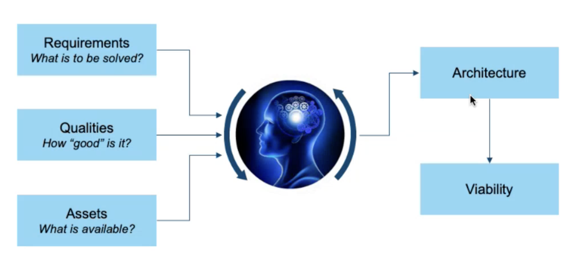
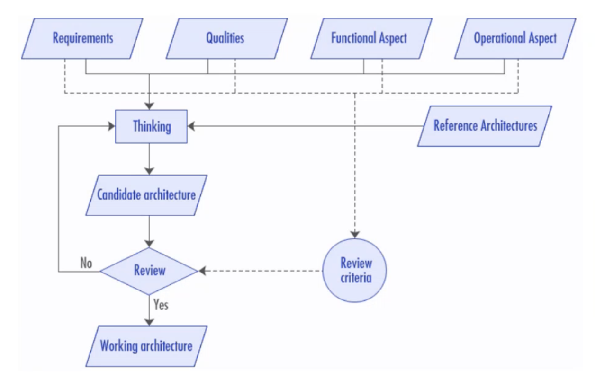
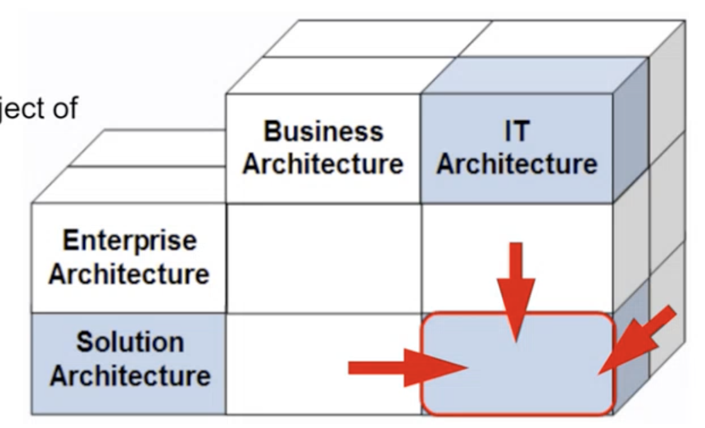
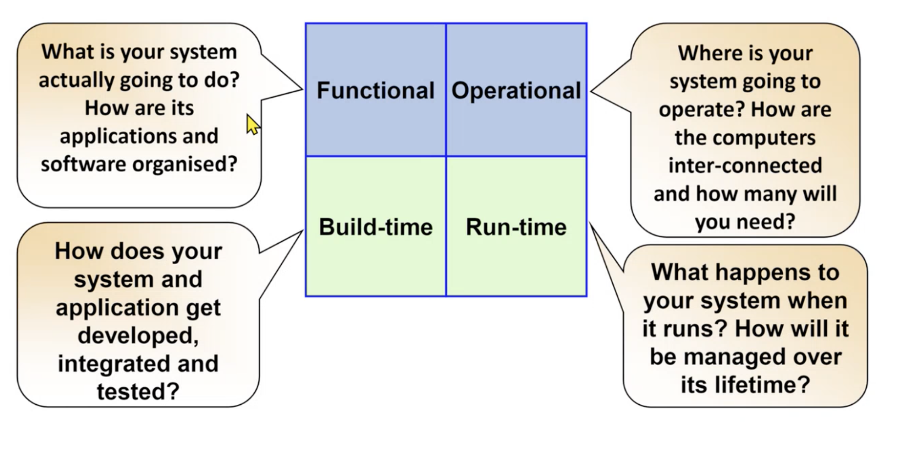

# Course Goals
- Learning a variety of architecture styles & approaches
- Avoiding "golden hammer" anti-pattern
- Not rushing to a solution
- Understanding: fixing one problem often casuse another
- Looking for unconventional solutions

!!! info "Golden Hammer"
    When you have a preferred solution style (a "golden hammer"), every problem begins to look the same, like a silver nail.

# What is Architecture
Architecture (as an artefact):

The architecture of a system describes its overall **static structure and dynamic behaviour**. It models the **system's elements** (which for IT systems are software, hardware, and its human users), the **externally manifested properties** of those elements, and the static and dynamic relationships among them.

Architecture (as a discipline):

Architecture is an **engineering discipline** That studies methods of designing **IT systems** that provide **a solution to a business problem**.
The solution must satisfy **functional and non-functional requirements** in a way that best balances **competing stakeholders' concerns** and must take constraints into account.

## Perspectives to be considered
- **Solution blueprint**(架构图) that can be reviewed and validated
    - show different level of blueprint to different stakeholders
- **Communication tool** for stakeholders and teams (business, IT delivery and BAU - IT
Operations), future reference for maintenance and change, developing neighbouring systems and integration
- **Delivery Environments**: Input into the delivery environments' design and specification, tools and platforms of choice for solution delivery
- **Delivery Planning**: Starting point for developing the project plan (Traditional delivery), solution and feature backlog (Agile delivery), resource requirements and team structure
- **Estimates**: Starting point for cost estimation (labour, licences, platform costs, etc)
- **Enable parallel development**: by understanding how inter-component dependencies can and should be managed
- **Foundation for commercial agreements** (i.e. "This is what you get for the price we have agreed on'")
- **Foundation for DOU** and segregation of responsibilities between various parties - e.g.
Client and Solution Provider, Solution Provider and Partner(s)/Subcontractors) (e.g.
RACI matrices)

!!! note "Architecture guidance"
    Architecture guidance includes:

    - Good things: tried & tested parte
    - Good ways of doing things: principles & patterns

## Why is Architect important?
- ppl can validate it in advance
- for documentation purpose
- the whole team take it as **guidance**

!!! note "How detail should the Documentation be?"
    Take 80:20 Principle, try to document the things with high priorities:

    - things that cover 80% requirements
    - critical ones
    ...

## Different Architectures
The class focuses on the use of these **IT system model artifacts** at the solution scale, by **IT
Architects**.

# Architect Aspects
Architect takes **Technology**, **Process** and **People** into consideration and asks questions from different aspects:

