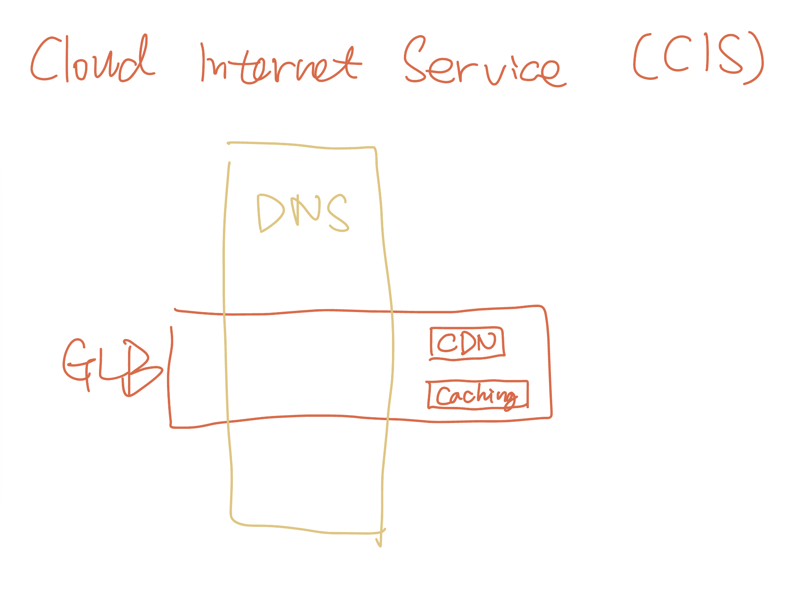

# Security
## Cloud Internet Service (CIS)
CIS protects web applications from internet-based attacks using Cloudflare's Global Points of Presence (PoP). Its NOT for:

- applicatinos connected through VPN
- applications connected through IBM Cloud's Direct Link service

Three major capabilities:

1. reliability: to boost the reliability, highly recommended to set up **DNS configuration** and **global load balancers**
2. security: prevents DDoS attacks, data theft, and bot attacks. 
3. performance: provides the fastest experience by:
    - optimizes multimedia and stores web content as near as possible to end-users
    - **Proxied edge servers**

!!! info "Proxied edge servers"
    often part of a Content Delivery Network (CDN), act as intermediaries between the client (user's device) and the origin server (where the actual web content is hosted). These servers are strategically positioned at the "edge" of the network, _close to the user's geographic location_. They store cached copies of the web content and handle requests from users on behalf of the origin server.

    \* The term `proxied` means that these edge servers act as a gateway or intermediary. They receive incoming requests from clients, check if they have the requested content, and, if available, serve it directly without reaching the origin server.

### 1. Global Load Balancer (GLB)
A global load balancer manages traffic across server resources located in multiple regions, like all load balancers, automatically distribute traffic with a goal to minimize impact on users. It offers high availability and geographical distribution of traffic, based on the health of origin servers and the geographical region where the request originates. 

Features:

- Proxy and non-proxy options for load balancing
- Origin pools and health checks

GLB Types:

- geographically-based
- performance-based: distributes traffics by weights

### 2. Domain Network System (DNS)
DNS within CIS has the following features:

- DNS management: manage DNS records, control proxying, and enable DNS security.
- DNSSEC: DNS security cryptographically signs a zone to ensure that the DNS records provided to the user are the same as the DNS records published on the DNS server.
- Root record CNAME flattening: to overcome the IETF RFC restriction that if a root record is a CNAME, it cannot have any other records for that domain.
- Proxying DNS records and global load balancers:
    - HTTP Proxy mode
    - DNS only mode

in **CIS**, we recommend you to configure both **1. Global Load Balancer (GLB)** and **2. Domain Network System (DNS)**. 👇

!!! info "CDN"
    CDN endpoints are placed in as many locations around the world where clients exist. With the CDN in place, clients are able to retrieve content directly from the CDN, drastically reducing the response time. 

!!! info "Caching"
    CIS uses file extensions to cache content. CIS does not cache by MIME type or HTML. Some examples of the file extensions that are cached automatically by CIS include: bmp, css, doc, docx, gif, jpg, pdf, png, ppt, pptx, tif, webp, and more.
    
    When an Internet client requests static content, the GLB does not have to send the request to the application. Instead, it can return cached content from the CDN in CIS.

### 3. Page Rules
CIS configurations can be customized on a page-by-page basis. Enterprise version also enables:

- sorting query strings
- minifying web content: by removing unnecessary content

!!! summary
    **Global load balancer** offers high availability and geographical distribution of traffic, based on the health of origin servers and the geographical region where the request originates.
    
    **Caching** is the process of storing files on edge servers to improve response time for clients.
    
    **Page rules** ensures efficient security, performance, and reliability based on each individual URL.

    **CDN** is a network of servers that is geographically dispersed to enable faster web performance.

### 4. Web Application Firewall (WAF)
Features:

- **Easy setup**: The CIS WAF is part of IBM's overall service, which takes just a few minutes to set up. After the client redirects their DNS to IBM CIS, they can switch on the WAF and set up the rules they need. 
- Detailed reporting: See greater detail in the reporting, for example, threats blocked by rule/rule group.

### 5. Transport Layer Security (TLS) 
TLS options let clients control whether visitors can browse their website over a secure connection, and when they do, how CIS connects to the origin server.

TLS Encryption Modes:

- Off (not recommended)    
- Client-to-Edge (edge to origin not encrypted, self-signed certificates are not supported)    
- End-to-End flexible (edge to origin certificates can be self-signed)    
- End-to-End CA signed (default and recommended)    
- HTTPS only origin pull (Enterprise only)

### 6. Range
Range is a global TCP proxy running on CIS edge nodes that extends the power of CIS DDoS, TLS, and IP firewall to web servers and TCP-based services, keeping applications online and secure. 

!!! note "Range Limitations"
    users can create a maximum of 10 Range applications with unique origins. Each Range application with a unique origin must have a unique IP address allocated, and IP addresses are a limited resource.