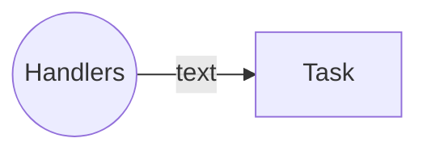

- [Udemy Course](https://ibm-learning.udemy.com/course/learn-ansible/learn/lecture/16681102#overview)
- [Kodekloud](https://learn.kodekloud.com/user/courses/labs-ansible-for-the-absolute-beginners?utm_source=udemy&utm_medium=labs&utm_campaign=ansible)

# 1. Install

```bash
brew install ansible
```

!!! warning
    Ansible is VERY STRICT about identation

# 2. Config
double check the version and where the default config file is:

```bash
> ansible --version
ansible [core 2.18.6]
  config file = None
  configured module search path = ['/Users/<User>/.ansible/plugins/modules', '/usr/share/ansible/plugins/modules']
  ansible python module location = /opt/homebrew/Cellar/ansible/11.7.0_1/libexec/lib/python3.13/site-packages/ansible
  ansible collection location = /Users/<User>/.ansible/collections:/usr/share/ansible/collections
  executable location = /opt/homebrew/bin/ansible
  python version = 3.13.7 (main, Aug 14 2025, 11:12:11) [Clang 17.0.0 (clang-1700.0.13.3)] (/opt/homebrew/Cellar/ansible/11.7.0_1/libexec/bin/python)
  jinja version = 3.1.6
  libyaml = True
```

!!! note "Config File"
    - commonly used location in iOS: `/Users/<User>/ansible.cfg`
    - the **configuration parameters** are divided into **sections**:
        - `[default]`
        - `[inventory]`
        - `[privileges_escalation]`
        - `[paramiko_connection]`
        - `[ssh_connection]`
        - `[persistent_connection]`
        - `[colors]`

    - example of `[default]` section:
        ```cfg
        [defaults]
        inventory       = /etc/ansible/hosts
        1og_path        = /var/log/ansible.log

        library         = /usr/share/my_modules/
        roles_path      = /etc/ansible/roles
        action_plugins  = /usr/share/ansible/plugins/action
        
        gathering       = implicit

        # SSH timeout
        timeout         = 10
        forks           = 5
        ```
    
!!! note "Multiple Configuration Possiblities with priority"
    
    1. **[CLI]** single parameter as ENV: 
        - temporary oneliner:
          ```bash
          ANSIBLE_GATHERING=explicit ansible-playbook playbook.yml
          ```
        - shell-wide:
          ```bash
          export ANSIBLE_GATHERING=explicit 
          ansible-playbook playbook.yml
          ```
    1. **[CLI]** `ANSIBLE_CONFIG=*.cfg` file pass as ENV: 
      ```bash
      ANSIBLE_CONFIG=/opt/ansible-common.cfg ansible-playbook playbook.yml
      ```
    1. **[FILE]** `*.cfg` in the Playbook's directory 
    1. **[FILE]** `~/.ansible.cfg` in HOME directory
    1. **[FILE]** default `ansible.cfg` (in MacOS, mostly in `/Users/<User>/ansible.cfg`)

!!! info "View Configuration"
    ```bash
    # render all config
    ansible-config list

    # show current config file
    ansible-config view

    # show all config, and where got them from
    ansible-config dump
    ```


# 3. Inventory
**inventory** is a list of all machines that involved in task executions. the **Inventory** can be written in INI or YAML formats, here are examples:

- INI
  ```ini
  10.24.0.100

  [webservers]
  webl.example.com
  Web2.example.com
  
  [dbservers]
  10.24.0.7
  10.24.0.8

  [allservers:children]
  webservers
  dbservers
  ```
- YAML: suitable for more complex organisation
  ```yaml
  allservers:
    children:
      webservers: 
        hosts:
          webl.example.com: 
          web2.example.com:
      dbservers: 
        hosts:
          db1.example.com:
          db2.example.com:
  ```

- you can use either <u>IP address</u> or <u>hostnames</u>
- the IP could be from Cloud Servers, Virtual Machine or Bare Metal Servers
- default inventory file: `/etc/ansible/hosts`


## alias
here we specifiy alias: `web`, `db`, `mail`, `web2`
```bash
web   ansible_host=server1.company.com
db    ansible_host=server2.company.com
mail  ansible_host=server3.company.com
web2  ansible_host=server4.company.com
```

## inventory parameters
common **inventory parameters**:
    
- `ansible_host`: the FQDN or IP address of a server
- `ansible_connection`: how to connect to the server
- `ansible_port`: the connection port --> by default `22`for ssh
- `ansible_user`: the user used to make remote connections --> by default is `root` for linux
- `ansible_ssh_pass` defines the SSH password for Linux. --> NOT best practise -> because the password will be plain text
    
Example:
```bash
web   ansible_host=server1.company.com  ansible_connection=ssh    ansible_user=root
db    ansible_host=server2.company.com  ansible_connection=winrm  ansible_user=admin
mail  ansible_host=server3.company.com  ansible_connection=ssh    ansible_ssh_pass=p@ssw0rd
web2  ansible_host=server4.company.com  ansible_connection=winrm

# localhost: 
#     有一个名为 "localhost" （alias=localhost） 的目标主机
# ansible_connection=localhost:
#     使用 localhost 连接插件（即不在远程服务器上执行，而是在当前控制机本地执行任务）
localhost ansible_connection=localhost
```


!!! note "winrm"
    `WinRM` stands for **Windows Remote Management**. It is Microsoft's protocol for remotely managing Windows systems, similar to what SSH is for Linux/Unix systems.

    |`ansible_connection`|**inventory parameters** for password|
    |:-|:-|
    |`ssh`|`ansible_ssh_pass`|
    |`winrm`|`ansible_password`|


## groups
use `[group_name]` to group servers together, so that you can reference them in the **Play**

```bash
[webservers]
web1.myserver.com
web2.myserver.com
```

### group of groups
```bash
[web_servers]
web1
web2

[db_servers]
db1

[all_servers:children]    # <-- 注意这里要加 :children
web_servers
db_servers
```

!!! note "常见的应用场景"
    make groups out of different perspectives:  
    ```bash
    [db_nodes]
    sql_db1
    sql_db2

    [web_nodes]
    web_node1
    web_node2
    web_node3

    [boston_nodes]
    sql_db1
    web_node1

    [dallas_nodes]
    sql_db2
    web_node2
    web_node3
    ```

# 4. Variables
**Variables** store information that varies with each host using [Jinja2 Tempating](jinja2.md). The **Common Inventory Parameters** are pre-defined **variables**. 

Example:
```yaml
name: Add DNS server to resolv.conf
hosts: localhost
vars:
  dns_server: 10.1.250.10                 # variable definition
tasks:
  - lineinfile:
      path: /etc/resolv.conf 
      line: 'nameserver {{ dns_server }}' # variable usage
```

!!! note "how to use"
    - pure variable: `source: '{{ dns_server }}'` --> WITH quotes!
    - variable concatenated in text: `source: blabla{{ dns_server }}blabla` --> WITHOUT quotes!

## Types
- **String**
- **Number**: integer or float
- **Boolean**: 
    - `true` = `True`, `'true'`, `'t'`, `'yes'`, `'y'`, `'on'`, `'1'`, `1`, `1.0`
    - `false` = `False`, `'false'`, `'f'`, `'no'`, `'n'`, `'off'`, `'0'`, `0`, `0.0`
- **List**: list of value(of any type):
    - example:
      ```yaml
      packages:
        - nginx
        - postgresql
        - git
      ```
    - usage:
      ```yaml
      # whole list
      loop: "{{ packages }}"

      # first value in the list
      package0: "{{ packages[0]] }}"
      ```
- **Dictionary**: key and value can be any type
    - example:
      ```yaml
      user:
        name: "admin"
        password: "secret"
      ```
    - usage
      ```yaml
      # whole dict
      user: "{{ user }}"

      # first element in the dict
      name: "{{ user.name }}"
      ```

!!! warning
    - `dict` has no order
    - `list` has order, therefore **tasks**(**plays**) could be depending on other **tasks**(**plays**)

## Variable Precedence
you can define **variable** in different ways (with prioritized order), here are some examples:

1. in inventory's **group**
    ```yaml
    [web_servers:vars]
    dns_server=10.5.5.3
    ```
1. in inventory's **host**
    ```yaml
    web2 ansible_host=172.20.1.101  dns_server=10.5.5.4
    ```
1. in **play**/**playbook**
    ```yaml
    - name: Configure DNS Server
      hosts: all
      vars:
        dns_server: 10.5.5.5
      tasks:
      - nsupdate:
        server: '{{ dns_server }}'
    ```
1. in **CLI**:
    ```bash
    ansible-playbook playbook.yml --extra-vars "dns_server=10.5.5.6"
    ```

!!! info "Full Variable Precedence List"
    [variable precedence](https://docs.ansible.com/ansible/latest/playbook_guide/playbooks_variables.html#understanding-variable-precedence)

## Registering Variables
in a **play**, you can use a special variable - **Registering Variables** to pass result of a **task** to the upcoming **task**:

```yaml
- name: Check /etc/hosts file
  hosts: all
  tasks:
    - shell: cat /etc/hosts
      register: result      # to create a Registering Variables `result`

- name: Fail if mount point doesn't exist
  debug:  
    var: result
```


!!! note "`result`"
    a example of `result` content

    ```json
    "result": {
        "changed": true,
        "cmd": "cat /etc/hosts",
        "delta": "0:00:00.005621",
        "end": "2024-01-15 10:30:45.123456",
        "failed": false,
        "rc": 0,
        "start": "2024-01-15 10:30:45.117835",
        "stderr": "",
        "stderr_lines": [],
        "stdout": "127.0.0.1   localhost\n127.0.1.1   my-ubuntu-server\n192.168.1.10 webserver01\n192.168.1.20 dbserver01\n# The following lines are desirable for IPv6 capable hosts\n::1     ip6-localhost ip6-loopback\nfe00::0 ip6-localnet\nff00::0 ip6-mcastprefix\nff02::1 ip6-allnodes\nff02::2 ip6-allrouters",
        "stdout_lines": [
            "127.0.0.1   localhost",
            "127.0.1.1   my-ubuntu-server",
            "192.168.1.10 webserver01",
            "192.168.1.20 dbserver01",
            "# The following lines are desirable for IPv6 capable hosts",
            "::1     ip6-localhost ip6-loopback",
            "fe00::0 ip6-localnet",
            "ff00::0 ip6-mcastprefix",
            "ff02::1 ip6-allnodes",
            "ff02::2 ip6-allrouters"
        ]
    }
    ```

    important attributes:

    - `.changed`: Whether the task changed the system
    - `.cmd`:  The command that was executed
    - `.rc` Return code (0 = success)
    - `.stdout`:  Full command output as a string
    - `.stdout_lines`:  Output as a list (array) of lines
    - `.stderr`:  Error output (if any)
    - `.failed`:  Whether the task failed
    - `.start/.end`:  Timestamps of execution

### How to debug
2 ways to debug and see what a **registering variable** content

1. use `debug` mode
    ```yaml
    - name: Check /etc/hosts file
      hosts: all
      tasks:

      - shell: cat /etc/hosts # ---- register mode ----
        register: result      # 1. register a variable named "result", saved shell result to it

      - debug:                # ---- debug mode ----
        var: result           # 2. print "result"
    ```
2. add flag `-v` while running the playbook:
    ```bash
    ansible-playbook –i inventory playbook.yml –v
    ```


!!! warning "scope"
    **registering variable** is associated to its **host** and is available for the rest of the **playbook** execution.

## Variable Scope
**Variables** has scope depends on where they are declared:

### - Host scope
```ini
# accessible in ALL hosts
[all:vars] 
app_list=['vim', 'sqlite', 'jq']

# accessible in CURRENT host
localhost ansible_connection=local nameserver_ip=8.8.8.8 snmp_port=160-161  # snmp_port is ONLY accessible for "localhost"
node01 ansible_host=node01 ansible_ssh_pass=caleston123
```

### - Play scope
```yaml
---
- name: Play1
  hosts: web1 
  vars:
    ntp_server: 10.1.1.1
  tasks:
    - debug:
        var: ntp_server     # ntp_server is ONLY availble in current Play

- name: Play2
  hosts: web1 
  tasks:
    - debug:
      var: ntp_server       # ntp_server cannot be found
```

### - Global scope
the **variable** defined as ENV in CLI will be accessible everywhere
```bash
ansible-playbook playbook.yml --extra-vars "ntp_server=10.1.1.1"
```

## Magic Variables

### `hostvars` 
1. to access variables defined in other **hosts**. Example:

    ```yaml
    web1 ansible_host=172.20.1.100
    web2 ansible_host=172.20.1.101 dns_server=10.5.5.4
    web3 ansible_host=172.20.1.102
    ```

    ```yaml
    - name: Print dns server
      hosts: web3                                   # in web3
      tasks:
      - debug:
        # use **magic variable** `hostvars` to get the variable defined in web2
        msg: '{{ hostvars['web2'].dns_server }}'    
    ```

2. to get info about other **hosts**: `hostvars` can be used to get information about other **hosts** too:

    ```yaml
    msg: '{{ hostvars['web2'].ansible_host }}'
    msg: '{{ hostvars['web2'].ansible_facts.architecture }}'
    msg: '{{ hostvars['web2'].ansible_facts.devices }}'
    msg: '{{ hostvars['web2'].ansible_facts.mounts }}'
    msg: '{{ hostvars['web2'].ansible_facts.processor }}  # 也可以这样写： msg: '{{ hostvars['web2']['ansible_facts']['processor'] }}'
    ```

### `groups['boston_nodes']`
it return all **hosts** under it:
```yaml
msg: '{{ groups['boston_nodes'] }}'

# result:
web1
web2
```

### `group_names`
it returns all the **groups** the current **host** belongs to:
```yaml
# web1
msg: '{{ group_names }}'

# result:
boston_nodes
webservers
```

# 5. Facts
When you run a **playbook** and when Ansible connects to a target machine, a `setup` module runs automatically, and collects **facts** and saves in variable `ansible_facts`:

1. **Basic system information**: system architecture, operating system version, processor details, memory details, serial numbers etc
1. **Host's network connectivity**: interfaces, IP addresses, FQDN, MAC address etc
1. **Device information**: volumes, mounts, available space etc
1. **Date and time**


!!! note "automatic Facts gathering"
    Whichever **module**/**task** you ran
    ```yaml
    - name: Print hello message
      hosts: all
      tasks:
      - debug:
        msg: Hello from Ansible!
    ```

    if you run the above **playbook** you will see 2 tasks:
    
    


!!! info "disable facts gathering"
    There are 2 ways to disable the **facts** gathering:

    1. disable in **play**
        ```yaml
        - name: Print hello message
          gather_facts: no  # disable fact gathering
          hosts: all
          tasks:
          - debug:
            msg: Hello from Ansible!
        ```

        only one task will be executed:

        

    2. in `ansible.cfg` there is also a config to enable the fact gathering
    ```cfg
    gathering = implicit  # change it to explicit if you want to disable it
    ```

    ⚠️ Priority: 1. `gather_facts` in **playbook** > 2. `gathering` in ansible.cfg


# 6. Playbook
A **Playbook** is a single YAML file containing a set of **plays**. A **Play** defines set of **tasks** to be run on host. A **task** is a single action 

Example - Playbook contains 1 Play:
```yaml
- name: Play 1      # <-- name of the play
  hosts: localhost  # <-- 💗 the host you want to run is ALWAYS on "play" level
  tasks:            # <-- tasks to excute
    - name: Execute command ‘date’
      command: date
    - name: Execute script on server
      script: test_script.sh
    - name: Install httpd service
      yum:
        name: httpd
        state: present
    - name: Start web server
      service:
        name: httpd
        state: started
```

!!! note
    `hosts` is defined in **inventory**

## Task
is an action that accomplished by a **module**. For example, the highlighted parts are all **modules**:


!!! note
    all available **modules** can be found either on the online doc or using:
    ```bash
    ansible-doc -l
    ```

## to run
```bash
ansible-playbook playbook.yml

ansible-playbook --help
```

## to verify
two ways to verify:

1. **Syntax Check mode**:
    ```bash
    ansible-playbook playbook.yml --syntax-check
    ```
1. **Check mode**: dry run without actual change. --> Not all **modules** support this 
    ```bash
    ansible-playbook playbook.yml --check
    ```
1. **Diff mode**: provides before & after comparison
    ```bash
    ansible-playbook playbook.yml --diff
    ```

## to lint
make sure the **Playbook** adheres to best practices and doesn't have any style-related issues.
```bash
ansible-lint playbook.yml
```

## Conditionals
with **conditionals**, you can aggregate code from:
```yaml
# install NGINX on Debian
---
- name: Install NGINX
  hosts: debian_hosts 
  tasks:
    - name: Install NGINX on Debian
      apt:
          name: nginx
          state: present

# install NGINX on Redhat
---
- name: Install NGINX
  hosts: redhat_hosts 
  tasks:
    - name: Install NGINX on Redhat
       yum:
          name: nginx
          state: present
```

aggregated version:
```yaml
---
- name: Install NGINX
  hosts: all 
  tasks:
    - name: Install NGINX on Redhat
      yum:
          name: nginx
          state: present
      when: ansible_os_family == "Redhat"   # with condition

    - name: Install NGINX on Debian
      apt:
          name: nginx
          state: present
      when: ansible_os_family == "Debian"   # with condition
```
!!! note "Operator"
    - `and`
    - `or`    

!!! info "Example: Condition with Registering Variable"
    ```yaml
    - name: Check status of a service and email if its down
      hosts: localhost
      tasks:
        - command: service httpd status
          register: result            # define Registering Variable
        - mail:
          to: admin@company.com
          subject: Service Alert
          body: Httpd Service is down
          when: result.stdout.find('down') != -1  # use Condition
    ```

## Loop

### `loop`
**Item** is saved in a variable named `{{ item }}`

```yaml
---
  - name: 'Print list of fruits'
    hosts: localhost
    vars:
      fruits:
        - Apple
        - Banana
        - Grapes
        - Orange
    tasks:
      - command: 'echo "{{ item }}"'
        loop: "{{ fruits }}"        # loop
```

### `with_*`
this is the OLD grammar, there are lots of **lookup directives**:

- `with_items`
- `with_file`
- `with_url`
- `with_mongodb`
...

Example:
```yaml
---
- name: 'Print list of fruits'
  hosts: localhost
  vars:
    fruits:
      - Apple
      - Banana
      - Grapes
      - Orange
  tasks:
    - command: 'echo "{{ item }}"'
      with_items: "{{ fruits }}"   # with_*                    
```

# 7. Module
Ansible **modules** are categorized into various groups based on their functionality, such as:

- System
- Commands
- Files
- Database
- Cloud
- Windows

!!! note "`command`"
    `command` excutes a command on a remote note ([doc](https://docs.ansible.com/ansible/latest/collections/ansible/builtin/command_module.html))

    The **parameters** should be used in the `command` module. For example:
    

    ```yaml
    tasks:
      # task 1: simply use BASH
      - name: Display resolv.conf contents
        command: cat /etc/resolv.conf
      
      # task 2: use parameter `chdir`
      - name: Display resolv.conf contents
        command: cat resolv.conf chdir=/etc
    ```

    ⚠️ both **task 1** and **task 2** did the same thing. But in **task 2**, the `chdir` **parameter** performs a check first to make sure the `/etc/` directory exits

!!! note "`script`"
    `script` transfers a local script to **Remote Nodes** and executes it.

    ```yaml
    ---
    name: Play 1
    hosts: localhost
    tasks:
      - name: Run a script on remote server
        script: /some/local/script.sh -arg1 -arg2
    ```

!!! note "`service`"
    to manage Services – Start, Stop, Restart

    ```yaml
    ---
    - name: Start Services in order
      hosts: localhost
      tasks:
        - name: Start the database service
          service:
            name: postgresql   
            state: started    # [Idempotency] to ENSURE the postgresql's state is "started"
            # or write it in oneline: service: name=postgresql state=started
    ```

!!! warning "Idempotency / 幂等性"
    幂等性 指的是：一个操作执行一次与执行多次，对系统状态产生的影响是完全相同的。

    换句话说，你可以在任何时候（包括第一次、第二次、第N次）安全地运行同一个 Ansible 任务或剧本，而不会因为重复执行导致意外的结果或错误。

    举例：（1）用Ansible Playbook不会导致结果重复 （2）用CLI有可能会导致重复的结果！
    


# 8. Plugin
Even through Ansible provides a rich set of built-in **modules** and features, you soon realize that you need additional functionality --> thats when we need **Plugin**. 

## Types
there are different types of plugins:

- **inventory plugin**: 告诉 Ansible “我有哪些主机”和“如何连接它们”。可以从文件、云服务、数据库、API <u>动态生成 **inventory**</u>
- **module plugin**: 用于自定义 **module**
- **action plugin**: 负责任务在执行 **module** 前后的逻辑，比如：动态决定是否调用模块，修改模块输出
- **callback plugin**: 定义 Ansible 执行任务时的输出格式、日志记录、或外部通知行为。
- **lookup plugin**: Retrieves data from external sources for use in playbooks (e.g., read secrets, configs). `lookup('file', 'myconfig.txt')` - 读取本地文件内容


## Modules and Plugins Index
the **Modules and Plugins Index** is <u>a centralized and organized list</u> that provides detailed information about the available **modules** and **plugins** in Ansible.

👉 [Indexes of all modules and plugins](https://docs.ansible.com/ansible/latest/collections/all_plugins.html)


`ansible-inventory --list -i aws_inventory.py` | to list all hosts in our AWS inventory using this script.
<!--

## remote_user
```yaml
remote_user: root
```

## vars
```yaml
vars:
    tablename: foo 
    tableowner: someuser

tasks:
    - name: Rename table {{ tablename }} to bar 
      postgresql_table:
        table: {{ tablename }} 
        rename: bar
```
-->

# 9. Handlers
!!! note "background"
    imagine you want to change some system settings on a Web server, to get the changes alive, you usually need to restart the server.

    --> this is error-prone and time-consuming

With **Ansible Handlers**, you can define an **action** to <u>restart the web server service</u> and <u>associate it with the **task**</u> that modifies the configuration file. 


!!! info "Benefits"
    - prevents manual intervention
    - reduces human error
    - improves automation efficiency


Example:
```yaml
# playbook.yml
- name: Deploy Application
  hosts: application_servers
  tasks:
    - name: Copy Application Code
      copy:
        src: app_code/
        dest: /opt/application/
      notify: Restart Application Service   # 🔔 notify the Handler named "Restart Application Service"

  handlers:
    - name: Restart Application Service     # the triggered Handler
      service:                              # module
        name: application_service           # the service to restart
        state: restarted                    # desired state
```

!!! warning 
    - **handlers** are defined in **Playbook**
    - **handlers** are triggerd by **task**'s notification
    - ⚠️ Both **handlers** and **tasks** use **Ansible Modules**!

!!! warning
    🚨 **Handlers** in Ansible are only triggered <u>once per play</u>, even if multiple **tasks** notify them.

    --> this is because of Ansible's Idempotency <br/>
    --> If two configuration files change that <u>both require a service restart</u>, you don’t need two restarts — just one, at the end.


# 10. Roles


||Reality|Ansible|
|:-|:-|:-|
|**Roles**|doctors, engineers, astronauts, policemen, chef|database server, web server, Redis messaging server, backup server|
|**Assigning a Role**|<u>to become engineer</u>:<br>- Go to medical school <br>- Earn medical degree <br>- Complete Residency Program <br>- Obtain License|<u>to become database server, Ansible needs to run **tasks**</u>:<br>- Installing Pre-requisites <br>- Installing mysql packages <br>- Configuring mysql service <br>- Configuring database and users|
|||--> Ansible uses **Roles** to package the <u>necessary tasks</u> to be able to reuse them!|


!!! info "Benefits"
    - reusability
    - to organize Ansible code by introducing <u>best practises</u>. For instance the **role** `MySQL-Role`:
          
    - to share code in community, e.g. [Ansible Galaxy](https://galaxy.ansible.com/ui/)

## create a role
1. [optional] create skeleton using community tool `ansible-galaxy`
    ```bash
    ansible-galaxy init mysql
    ```
    you might see:
    ```bash
    mysql
      ├── defaults
      │   └── main.yml
      ├── files
      ├── handlers
      │   └── main.yml
      ├── meta
      │   └── main.yml
      ├── README.md
      ├── tasks
      │   └── main.yml
      ├── templates
      ├── tests
      │   ├── inventory
      │   └── test.yml
      └── vars
          └── main.yml
    ```
1. put the resources in the corresponding directories

## use a role
there are different ways to use a role:

1. put the **role** in the default role location: `/etc/ansible/roles`
    - the default role file is defined in the `*.cfg` file
2. put the **role** folder directly under the **playbook**:
    ```bash
    my-playbook
      ├── playbook.yml
      └── roles
          └── mysql   # the "mysql" role folder
    ```
## Ansible Galaxy
to **find** a role, use the Ansible Galaxy UI or:
```bash
ansible-galaxy search mysql
```

to **use** a role:
1. install it
    ```bash
    ansible-galaxy install geerlingguy.mysql

    # specify the directory
    ansible-galaxy install geerlingguy.mysql -p ./roles
    ```
2. use in playbook:
    ```yaml
    - name: Install and Configure MySQL
      hosts: db-server
      roles:
        - role: geerlingguy.mysql
          become: yes   # execute the role by escalating privileges
          vars:         # pass Aditional Parameters!
            mysql_user_name: db-user

    ```

to **view** currently installed roles:
```bash
ansible-config list
ansible-config dump | grep ROLE
```

# 11. Collections
as Network Engineer, you need to <u>config & manage large network infrastructure</u> from different venders, such as Cisco, Juniper, Arista. Ansible provides **built-in network modules**, but you still need vender-specifc modules, they are available as **Collections**:

- `network.cisco`
- `network.juniper`
- `network.arista`

!!! warning "naming"
    Naming of the **Collection** consists of:
      - Namespace
      - Collection

## create
**Ansible Collection** packages and distributes **modules**, **roles**, **plugins** etc. It can be created by Community or Vendor.

you can create your own **collection**:
```yaml
---
- hosts: localhost
  collections:
    - my_namespace.my_collection  # format: [Namespace].[Collection]

  roles:
    - my_custom_role

  tasks:
    - name: Use custom module
      my_custom_module:
        param: value
```

!!! note "collection's skeleton"
    ```bash
    my_collection/
      ├── docs/
      ├── galaxy.yml
      ├── plugins/
      │   └── modules/
      │       └── my_custom_module.py
      ├── README.md
      └── roles/
          └── my_custom_role/
              └── tasks/
                  └── main.yml
    ```


## install
install single **collection**:
```bash
ansible-galaxy collection install network.cisco
```


install multiple **collections** use `requirement.yml` file:
```yaml
# requirement.yml
---
collections:
  - name: amazon.aws
    version: "1.5.0"
  - name: community.mysql
    src: https://github.com/ansible-collections/community.mysql
    version: "1.2.1"
```
install the dependencies file:
```bash
ansible-galaxy collection install -r requirements.yml
```

## use
after installing collection `amazon.aws`, you can use it:

```bash
ansible-galaxy collection install amazon.aws
```

```yaml
- hosts: localhost
  collections:
    - amazon.aws      # specify the collection

  tasks:
    - name: Create an S3 bucket
      aws_s3_bucket:  # use the collection
        name: my-bucket
        region: us-west-1
```

# x. Ansible CLI Summary
|||
|:-|:-|
|`ansible`|Runs a single ad-hoc command or module on one or more hosts **without a playbook**|
|`ansible-config`|Displays, validates, or manages **Ansible configuration** settings (e.g., the `*.cfg`).|
|`ansible-console`|Provides **an interactive REPL shell** for running Ansible ad-hoc tasks in real time.|
|`ansible-doc`|Shows documentation and examples|
|`ansible-galaxy`|Manages **Ansible roles** and collections—download, install, create, or publish them to Galaxy or private repos.|
|`ansible-inventory`|Displays or manipulates inventory data, showing which **target hosts and groups**|
|`ansible-playbook`|Executes playbooks (YAML files)|
|`ansible-pull`|Runs playbooks by pulling them from a remote Git repo|
|`ansible-vault`|Encrypts, decrypts, or edits sensitive data files (e.g., passwords) used in playbooks securely.|
|`ansible-lint`|Finds potential errors before execution<br/> ⚠️ Not part of Ansible Core — it’s <u>a community-maintained tool</u>|


* /etc/ansible/hosts