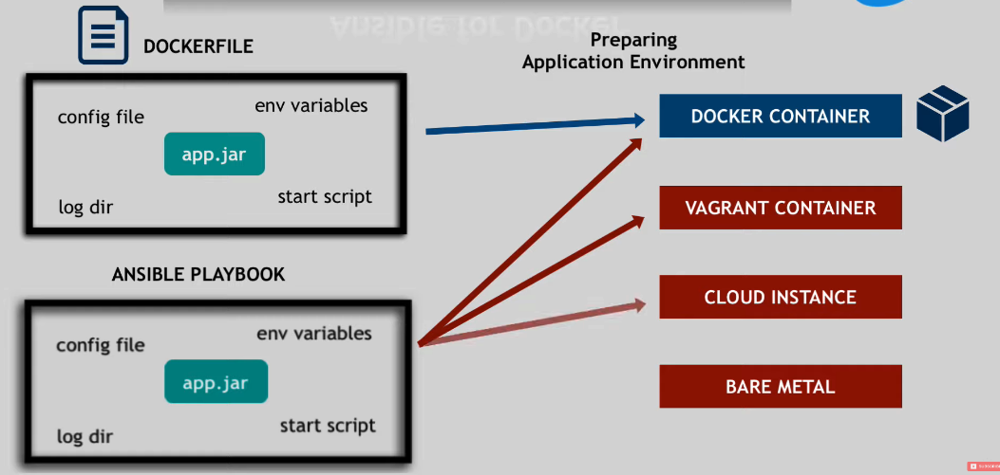

- [Intro Video](https://www.youtube.com/watch?v=1id6ERvfozo)

# Intro
a tool to automate IT tasks, such as:

- upgrade of a distributed app on 10 remote servers
- repetitive tasks: create backup, system reboot, create user etc

!!! note "Scripts vs Ansible"
    |Scripts|Ansible|
    |:-|:-|
    |- coding skill<br/> - need maintainance<br/> - time consumping|- simple<br/> - powerful|

!!! note "Ansible brings conveniences"
    1. Execute tasks from my machine
    1. Config steps in one single YAML file
    1. Re-use same file for different environments
    1. More reliable with less human error

!!! info
    Ansible supports ALL infrastructures: from <u>local operating systems</u> to <u>Cloud Providers</u>


## Distribution

- **Ansible Core**: This is a minimalist component that consists of the core runtime that can interpret Ansible content and a set of commonly used Ansible modules (included as the ansible.builtin Ansible Content Collection).

## Agentless

agentless: in the example above, there is no need to install Ansible on the 10 remote servers

## How it works
### Modules
**Modules** are <u>granular, modular and specific</u> programs that do the actual work. They:

1. get pushed to target servers
1. get the work done
1. get removed

!!! info
    [a list of **Modules**](https://docs.ansible.com/ansible/latest/collections/index_module.html)

### Grammar: YAML
taking usage of Docker **Module** for example:
```yaml
# Create container
- name: Create a data container 
  docker_container:
    name: mydata 
    image: busybox 
    volumes:
        - /data

# Start container
- name: Start a container with a comman 
  docker_container:
    name: sleepy
    image: buntu: 14.04
    command: ["sleep", "infinity"]

# Apply configurations
- name: Add container to networks 
  docker_container:
    name: sleepy 
    networks:
        - name: TestingNet
          ipv4_address: 172.1.1.18
          links:
            - sleeper
        - name: TestingNet2
          ipv4_address: 172.1.10.20
```


## Interesting Facts
### Ansible vs Docker
1. Ansible allow you to create the same App across many envs, not only as a Container.
    
1. with Ansible, you can also control other things besides Container:
    - the Host the container is running on
    - the Host Storage
    - the Network

### Ansible Tower
an UI dashboard from Redhat

- centrally store automation tasks
- across teams
- configure permissions
- manage inventory

### Alternatives
||Ansible|Puppet and Chef|
|:-|:-|:-|
|Language|YAML|Ruby: more difficult to learn|
|Agent|agentless|Installation needed|
