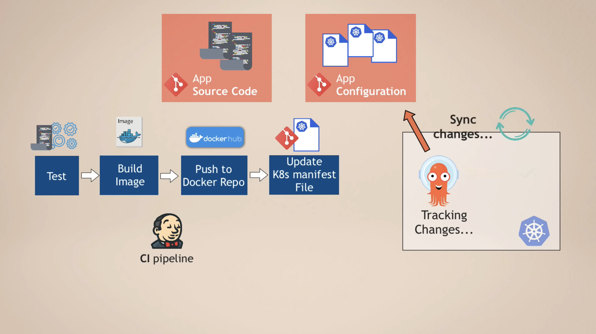

# GitOps

[reference](https://www.youtube.com/watch?v=f5EpcWp0THw&ab_channel=TechWorldwithNana)

!!! info "X as Code"
    - Infrastructure as Code
    - Network as Code
    - Policy as Code
    - Configuration as Code
    - Security as Code


!!! note "How it works?"

    1. **X as Code** on Git repo
    2. Engineer create the <u>Pull Request</u>
    3. Run **CI Pipeline**:
        - validates the manifest files
        - run automated tests
    4. Another Engineer review and approve <u>Pull Request</u>
    5. **CD Pipeline** deployes the changes to the Infrastructure --> instead of running `kubectl apply -f xxx.yaml` on your local computer


## Two Deployment Methods

- **Push Deployment**: tranditional, the Pipeline executes command and deploys the new version to the Infrastructure 
    - Jenkins, Gitlab CICD
- **Pull Deployment**: an **Agent** installed in the Infrastructure(such as a K8S cluster), and it actively pulls changes from Git Repo. The **Agent** compares <u>desired state (in git repo)</u> and the <u>actual state(in Infrastructure)</u>
    - FluxCD
    - ArgoCD


## Advantages

- easy rollback
- single source of truth
- increases security by limiting access: 
    - CD Pipeline deploys the changes, NOT any team member
    - team member only <u>propose</u> changes

# ArgoCD

[reference](https://www.youtube.com/watch?v=MeU5_k9ssrs&pp=ygUGYXJnb2Nk)


## Continual Delivery(CD)
How does Continual Delivery(CD) Tool like **Jenkins** and **GitlabCICD** work?


Disadvantages:

1. Extra tool: besides **Jenkins**, need to <u>install & setup tools</u> like `kubectl`
2. Security challenge: **Jenkins** need access to k8s (and platform if the cluster is on cloud - such as AWS)
3. once deployed, **Jenkins** doesn't know the deployment status

--> ArgoCD is targeting to improve the problematic CD process


## How does ArgoCD help
ArgoCD reverse the flow - use **Pull Deployment**.


1. Deploy **ArgoCD** in K8s cluster
2. Configure **ArgoCD** to track Git repository
3. **ArgoCD** monitors for any changes and applies automatically




!!! info "Manifests"
    ArgoCD supports different manifests:
    
    - Kubernetes YAML file
    - Helm Charts
    - Kustomize

    ... and other <u>template files</u> that generate K8s manifests

### 优点

1. Separate CI and CD:

    
    
1. Separate git repository for:

    - App source code 
    - App confguration (K8s manifest files) 
    - [Optional] system configurations

1. Configuration as Code in git repo 
    --> **Single Source of Truth** 
    --> ONLY way to change is to update the git repo
1. Config Files are not manually `k8s apply -f xxx.yaml` from local laptops
1. Better tea collaboration with `merge request`
1. Easier access control:
    - Configuration in repo:
        - all can make <u>pull request</u>
        - ONLY Senior can <u>approve & merge</u>
    - Access to K8s Cluster:
        - optional access for human
        - no external access for tools such as Jenkins 
1. easy rollback: `git revert`
1. easy Cluster Disaster Recovery


!!! warning "What happens if so updates the cluster manually?"
    ArgoCD compares:
    
    - desired configuration in Git repo
    - actual state in Cluster
    
    --> ArgoCD will overwrites the manual configuration!

## Summary


## configure ArgoCD in k8s Cluster
1. Deploy ArgoCD into K8s Cluster - it extends K8s API with CRD
2. Define ArgoCD resources (in YAML):
    1. `Application`
        ```yaml
        apiVersion: argoproj.io/vlalphal
        kind: Application 
        metadata:
            name: myapp-argo-application
            namespace: argocd
        spec:
            project: default 
            source:
                repoURL: https://gitlab.com/nanuchi/argocd-app-config.git
                targetRevision: HEAD
                path: dev 
            destination:
                server: https://kubernetes.default.svc
                namespace: myapp
            syncPolicy:
                syncOptions:
                - CreateNamespace=true 
                automated:
                    selfHeal: true
                    prune: true
        ```
    2. `AppProject`: to group `Applications`


# Examples
## Working with multiple clusters
To manager multiple cluster, we JUST need to configure and manger 1 ArgoCD - the same instance is able to sync among multiple K8s clusters

## Working with multiple environments
Background: there are `dev`, `staging` and `production` environments. I want to test the configuration in Git repo in this order: `dev` -> `staging` -> `production`. 两种方法来实现:

1. Git branch for each environment
    
2. Use overlays with kustomize. such as:
    ```bash
    ./myapp-cluster
        ├──base
        │   ├── deployment.yaml
        │   ├── kustomization.yaml
        │   ├── rbac.yaml
        │   └── service.yaml
        └── overlays
            ├── development
            │   └── kustomization.yaml
            ├── staging
            │   └── kustomization.yaml
            └── production
                └── kustomization.yaml
    ```


# Understanding
- ArgoCD, as a CD tool, will not replace the CI tools such as Jenkins.
- ArgoCD is a CD tool for K8s, for other platform you need to find other tools
- ArgoCD is not the unique CD tools for K8s - fluxCD, JenkinsX are alternatives

# Grammar
## `ref`
to use Helm value files from external Git repository([doc](https://argo-cd.readthedocs.io/en/latest/user-guide/multiple_sources/#helm-value-files-from-external-git-repository)).


# Demo
## Goal
to setup a fully automated CD pipeline.

## Given materials

- built images with different versions: [nanajanashia/argocd-app](https://hub.docker.com/r/nanajanashia/argocd-app/tags) --> a CI Pipeline has already been run through
- minikube cluster on your local PC
    ```bash
    brew install minikube

    # verify
    which minikube

    minikube start
    minikube status

    kubectl get po -A
    minikube dashboard
    ```

## Steps
### 1. Install ArgoCD in the cluster 
[reference](https://argo-cd.readthedocs.io/en/stable/getting_started/)
```bash
kubectl create namespace argocd
kubectl apply -n argocd -f https://raw.githubusercontent.com/argoproj/argo-cd/stable/manifests/install.yaml
# Use the ARM-compatible manifest (v2.4+ has better ARM support)
kubectl apply -n argocd -f https://raw.githubusercontent.com/argoproj/argo-cd/v2.10.0/manifests/install.yaml

# verify
kubectl get pods -n argocd

# check service "argocd-server" to access the argoCD UI
kubectl get svc -n argocd
# port-forwarding to 127.0.0.1:8080 -> proceed anyway
kubectl port-forward -n argocd svc/argocd-server 8080:443
```

use credential to login to ArgoCD UI:

- Username: `admin`
- Password: get it from:
    ```bash
    kubectl get secret argocd-initial-admin-secret -n argocd -o yaml
    # decode password with base64
    echo TkxxSSSXZ== | base64 --decode
    ```


### 2. Configure ArgoCD `Application` resource
1. Create ArgoCD `Application` resource:
    ```bash
    apiVersion: argoproj.io/v1alpha1
    kind: Application
    metadata:
        name: myapp-argo-application
        namespace: argocd
    spec:
        project: default
        # (1) Source: a git repository where the configurations are save
        source:
            repoURL: https://gitlab.com/nanuchi/argocd-app-config.git
            targetRevision: HEAD # <-- always the last commit
            path: dev
        # (2) Target: a K8s cluster where the configurations will be apply to
        destination:
            # since ArgoCD is running INSIDE k8s cluster, we can put the DNS - an internal svc named "kubernetes"
            server: https://kubernetes.default.svc
            # where you want to deploy the current manifest - if not "default" then you need to specify
            namespace: myapp
        
        syncPolicy:
            syncOptions:
            - CreateNamespace=true  # this auto-generates NS myapp if not exist
            
            # 1. Enable sync
                # 2. Enable auto self-healing: undo/overwrite all, by default its False
                # 3. Enable auto pruning manual changes
            automated:
                selfHeal: true 
                prune: true

    ```
1. Push the `application.yaml` to Git repo
1. `kubectl apply -f application.yaml` to generate resource
1. Now you can see the deployed application in the UI:
    

    


!!! warning
    - by default, ArgoCD pulls git repo **every 3 mins**
    - to get rid of the delay, you can configure a **Git Webhook**

!!! note
    - Every `Application` belongs to a single project

这个Application会查看[git repo](https://gitlab.com/nanuchi/argocd-app-config)中的configuration 代码 - 这里指的是`dev/deployment.yaml`和`dev/service.yaml` 

### 3. Manifests
如果要修改Manifests，则直接修改repo中的yaml文件，push到repo中，修改会被ArgoCD自动更新

# UI


## Applications View


- **Sync** The process of making an application move to its target state. E.g. by applying changes to a Kubernetes cluster.
- **Refresh** Compare the latest code in Git with the live state. Figure out what is different.

## Synchronize Options (right panel)


### 1. 核心同步选项

- **PRUNE**: 删除 Git 中已移除但集群中仍存在的资源（垃圾回收）。<br/>
    --> ⚠️ 若误用可能导致意外删除关键资源（需谨慎启用）。
- **DRY RUN**: 模拟同步过程，仅显示变更（如创建/更新/删除的资源），但不会实际执行。<br/>
    --> 适用场景：验证变更是否符合预期。
- **APPLY ONLY**: 仅应用当前差异的资源，不执行同步其他操作（如不触发 Hook 或健康检查）。<br/>
    --> 适用场景：快速修复部分资源，跳过完整同步流程。
- **FORCE**: 强制覆盖集群状态（即使存在冲突或保护机制）。<br/>
    --> ⚠️ 可能破坏一致性，仅用于解决特定冲突（如资源被手动修改过）。

### 2. SYNC OPTIONS（高级配置）


- **SKIP SCHEMA VALIDATION**: 跳过 Kubernetes 资源 Schema 校验（如 CRD 未定义时）。<br/>
    --> 适用场景：部署自定义资源时遇到校验错误。
- **AUTO-CREATE NAMESPACE**: 若资源指定的命名空间不存在，自动创建它。<br/>
    --> 注意：需确保 ArgoCD 有创建命名空间的权限。
- **PRUNE LAST**: 在同步完成后才删除旧资源（而非过程中）。<br/>
    --> 优势：避免删除依赖项导致应用中断（如先创建新 Pod 再删除旧的）。
- **APPLY OUT OF SYNC ONLY**: 仅同步与 Git 状态不一致的资源，跳过已同步的资源。<br/>
    --> 优势：减少不必要的 API 调用。
- **RESPECT IGNORE DIFFERENCES**: 遵守 argocd.argoproj.io/ignore-differences 注解（如忽略特定字段的差异）。<br/>
    --> 适用场景：避免因动态字段（如镜像 SHA）触发同步。
- **SERVER-SIDE APPLY**: 使用 Kubernetes 的 Server-Side Apply 机制（而非 `kubectl apply`）。<br/>
    --> 优势：更好地处理字段所有权冲突。
- **PRUNE PROPAGATION POLICY**: 控制删除资源的传播策略：

    - foreground：等待依赖资源删除后再删除父资源（默认）。
    - background：立即删除，后台清理依赖。
    - orphan：保留依赖资源（不删除）。
- **REPLACE**: 用 kubectl replace 而非 apply（强制替换资源）。<br/>
    --> ⚠️ 可能丢失未被 Git 管理的字段。
- **RETRY**: 自动重试失败的同步操作（需配置重试次数/间隔）。

### 3. SYNCHRONIZE RESOURCES（资源选择）

- **ALL**：同步所有资源（无论是否差异）。
- **OUT OF SYNC**：仅同步与 Git 有差异的资源（默认推荐）。
- **NONE**：手动选择要同步的资源（需在下方勾选）。

!!! danger 
    注意：若选择 NONE 但未勾选任何资源，同步按钮会失效。

# CLI
```bash
argocd app get myapp
argocd app sync guestbook

```