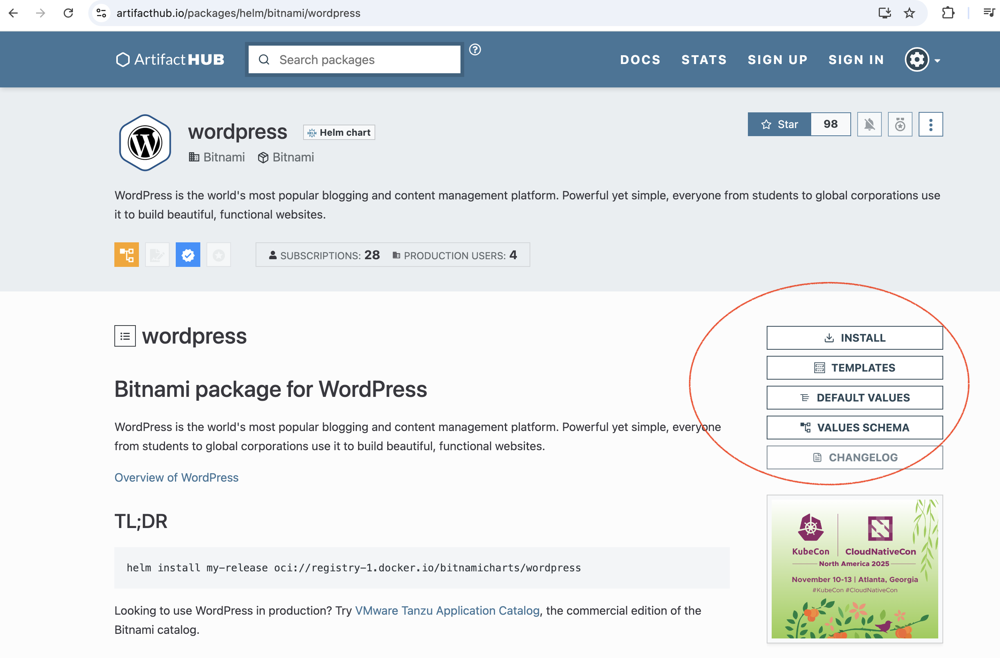
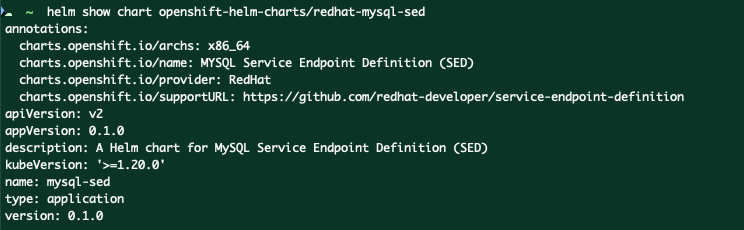
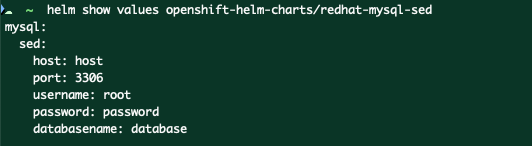

# Helm 模板关键语法
```
{{ tpl .Values.text . }}   # 解析字符串中的模板
```


# --------


- [video course](https://ibm-learning.udemy.com/course/definitive-helm-course-beginner-master/learn/lecture/46456923#overview)
- [git repo - helm](https://github.com/lm-academy/helm-course)
- [git repo - config store](https://github.com/lm-academy/config-store)

# 1. What is Helm
Helm is a command-line application. It introduces the concept of **charts**. A **chart** is a package that describes a set of **Kubernetes resources** that you can deploy.

## Helm and Kubernetes
**Benefits:**

- Simplifies the complex resource mgmt
- Consistency across environment - while allowing environment-specific configs
- avoid error-prone manual edits
- allow Version Control and Rollback
- Templating flexibility

**Limitations:**

- over-complicated chart
- security implications: ONLY use reliable charts!
- release state is stored in Cluster: e.g.:
    - a manually change
    - secret that not saved in Helm
- upgrades might be challenging: make sure you do backup


!!! info
    Helm is package manager for Kubernetes, akin yum for Redhat, brew for MacOS, or npm for NodeJS

!!! note "concepts"
    - chart
    - release: instance of chart


## Helm VS Kustomize

|Dimension|Helm|Kustomize|
|:-|:-|:-|
|Overall purpose|Package manager for Kubernetes with support for emplating, dependency management, and versioning of applications.|Customize <u>existing Kubernetes YAML manifests</u> by overlaying changes also defined in YAML.|
|Complexity|More complex - it introduces the need to learn **Go templates** and the overall structure of charts.|Simpler - it leverages only native YAML.|
|Customization features|Full templating system with conditionals, loops, functions, and variable substitution.|Strategic merge patches, JSON patches, name prefixes/suffixes, common labels, and annotations.|
|Use-cases|<li>Packaging and managing applications and their dependencies</li><li>Versioning of applications</li><li>More advanced customizations via templates and values files.</li>|<li>Managing environment-specific customizations (e.g., dev, staging, prod)</li><li>Applying patches and modifications without duplicating YAML</li>|

## Helm Architecture

**Helm CLI** interacts directly with **Kubernetes API**


1. use **Helm CLI** to deploy **Helm Chart** 
1. use **CI/CD tool** to automatically deploy **Helm Chart**

# 2. Preparation

Make sure the following tools are installed:

## minikube
[Doc](https://minikube.sigs.k8s.io/docs/start/?arch=%2Fmacos%2Farm64%2Fstable%2Fbinary+download)

```bash
minikube version
minikube start

minikube dashboard

minikube pause
minikube unpause
minikube stop

minikube config set memory 9001


minikube addons list
minikube delete --all

# to access service from LocalHost
minikube service [ServiceName]
```

## kubectl
[Doc](https://kubernetes.io/docs/tasks/tools/install-kubectl-macos/)
 
```bash
# get pods in ALL namespaces
kubectl get pods -A

# check both Client and Server Version
kubectl versoin

kubectl config current-context

```

## helm
[Doc](https://helm.sh/docs/intro/install/)

## VSCode
- recommended extension: **Kubernetes @Microsoft**
- Better disable auto formatting from the extension **Prettier**

# 3. Fundamentals

## ArtifactHub
[ArtifactHub](https://artifacthub.io/) **repository** includes lots of popular Helm Charts.



- INSTALL: how to use it
- TEMPLATES: all the Manifests, a.k.a Helm Templates
- DEFAULT VALUES: default values + customizable values
- VALUES SCHEMA: more detials

Other interesting informations:

- APPLICATION VERSIONS: the version of the underlying application - in this case, version of Wordpress
- CHART VERSIONS: the versions of the chart


!!! info "CHART VERSIONS"


## CLIs
👍 [Helm 命令文档](https://helm.sh/docs/helm/)

### Helm Repository
The distributed community Helm chart repository is located at [Artifact Hub](https://artifacthub.io/packages/search?kind=0) and welcomes participation.


The following commands change only local configuration:

|命令||
|:-|:-|
|`helm repo add openshift-helm-charts https://charts.openshift.io/` |add a new Helm chart repository(named `openshift-helm-charts`) to your local Helm configuration. |
|`helm repo list` |List Helm chart repositories.|
|`helm repo update ` |Update Helm chart repository.|
|`helm search repo` |List ALL available charts in the ALL repos<br/>- Add `--versions` flag to list all versions even though its the same chart|
|`helm search repo openshift-helm-charts` |search for available charts in the `openshift-helm-charts` repository|
|`helm repo remove REPOSITORY1_NAME REPOSITORY2_NAME …​	` |Remove repositories |

!!! note "Example"
    result of `helm search repo openshift-helm-charts`:

    

!!! note
    某个chart中有这些values：
    ```bash
    [student@workstation ~]$ helm show values do280-repo/etherpad --version 0.0.6

    replicaCount: 1
    defaultTitle: "Labs Etherpad"
    defaultText: "Assign yourself a user and share your ideas!"

    image:
        repository: etherpad
        name:
        tag:
    ```

    自定义值 `values.yaml`：
    ```
    image:
        repository: registry.ocp4.example.com:8443/etherpad
        name: etherpad
        tag: 1.8.18
    ```
### Deployment

- `[RELEASE]`: release/app
- `[CHART]`: chart name

|命令||
|:-|:-|
|`helm install [RELEASE] [CHART]` |deploy the app from Chart with ReleaseName |
| |➡️ **Customized values** in CLI: <br/>`helm install myChartApp do280-repo/etherpad --set "mariadb.auth.password=xxx" --version 0.0.6` |
| |➡️ **Customized values** in `values.yaml` File: <br/>`helm install myChartApp do280-repo/etherpad -f values.yaml --version 0.0.6` |
|`helm list` |list all deployment |
|`helm status [RELEASE]` |check status of named release |
|`helm history [RELEASE]` |check release history |
|`helm rollback [RELEASE]` |roll back to the previous release <br/>-->⚠️ This does NOT necessary delete all the unwanted resource - such as `replicaset`, because its NOT managed by Helm, but by `deployment` |
|`helm rollback [RELEASE] [REVISION NUMBER]` |roll back to the release X |
|`helm upgrade [RELEASE] [CHART] [flags]` |upgrade the release|
| |`--atomic` auto-rollback if upgrade fails <br/> `--cleanup-on-fail` <br/> `--debug` <br/> `--timeout 2m` <br/>|
| |➡️ upgrade version to 0.0.7: <br/>`helm upgrade myChartApp do280-repo/etherpad --version 0.0.7`|
| |➡️ upgrade values: <br/>`helm upgrade myChartApp do280-repo/etherpad -f values2.yaml` |
||Flags 比如 `-f values.yaml`|
|`helm get values [RELEASE]`|get currently defined values in this RELEASE |
|`helm get values [RELEASE] --revision [REVISION NUMBER]`|get defined values in this RELEASE REVISION X |
|`helm template [RELEASE] helm-directory > base/deployment.yaml` |extract the object definition from <b>Helm Chart</b> into Kustomize's `/base/deployment.yaml`|
|`helm uninstall [RELEASE]` |delete deployment/release <br/>--> this might NOT delete `PV` or `PVC` <br/>--> if there is a database, the OLD password will NOT work for a new release |

!!! info
    to use `values.yaml` you can use either `--values` or `-f` 


### 依赖管理
|命令||
|:-|:-|
| `helm dependency update`| 根据 Chart.yaml 中的依赖关系，下载或更新依赖的 Chart 到 charts/ 目录。|
| `helm dependency build`| 使用 Chart.lock 文件中的版本信息，重新下载依赖的 Chart。|
| `helm dependency list`| 列出当前 Chart 的所有依赖项及其状态。|
| `helm dependency prune`| 删除不再需要的依赖 Chart。|


### create & check

|命令||
|:-|:-|
|`helm create myChart` |to create a new chart |
|`helm pull xxx` |download a chart from a **repository**（即charts的数据库） |
|`helm show chart myChart` |show info of a chart <br/> |
|`helm show values myChart` |show default values of a chart <br/>  |
| |use `--version` to choose a specific version |


# 4. Create Own Helm Chart (manually)
The following diagram shows the structure of a minimal Helm chart:

```bash
sample/
├── Chart.yaml
├── values.yaml
├── README.md
├── LICENSE
├── .helmignore
├── charts/
├── templates/
└── |── tests/
    |── NOTES.txt
    |── deploy.yaml
    |── svc.yaml
    |── ingress.yaml
    └── _helpers.tpl
```

- `Chart.yaml` contains chart `metadata`, such as **name** and **version**
- `values.yaml` file contains default `values` for the chart
- `README.md`
- `LICENSE`: plain text file containing the license
- `.helmignore`: paths to ignore when packing the Chart
- `charts/`: **subscharts**, a.k.a **chart dependencies** -> they should be referred in `Chart.yaml` file and will be <u>downloaded and saved locally</u>
- `templates/` directory contains **manifest templates** such as `deployments`
    - `tests/` tests for running:
        ```bash
        helm test
        ```
    - `NOTES.txt`: the printed contents during chart installation/upgrade
    - `_helpers.tpl` contains **template helper function** to reduce duplication 

## Comments
You can either use **YAML comment** or **GO comment**:

```bash
# I'm a YAML comment, I will remain in the generated YAML
{{/* I'm a GO comment, I will NOT remain, only leave an empty line */}}
{{- /* I'm a GO comment, I will NOT remain, NEITHER leave an empty line */}}
```

> ⚠️ **Indentation** and **Space** are important! Add space after `{{/*` or `{{-`

## Context "."
Helm 的 **Current Context**（.）指的是在模板渲染过程中，当前正在被操作和访问的顶层对象. It has 3 top-level keys:

- `Values`: 来自 `values.yaml`、`--set` 或 `--set-file` 等
- `Release`: built-in release values （比如 `Release.Name`, `Release.Time`, `Release.Namespace`, `Release.Service`, `Release.IsUpgrade`, `Release.IsInstall`, `Release.Revision`）
    - `.Release.Name` is the one you use in `helm install <ReleaseName> .`
- `Chart`: built-in chart values  （比如 `Chart.Name`、`Chart.Version`)

!!! note "`.` 是一个指针"

    最关键的是要将 `.` 理解为一个指针或光标。它指向当前你正在处理的数据结构:

    - 当在模板的最顶层时，`.` 指向一个包含所有内置对象的根对象。你可以通过 `.Values`、`.Release` 来访问它们。
    - 当你使用 `{{ range ... }}` 或 `{{ with ... }}` 语句时，Helm 会**临时改变 `.`的指向**。在循环体或with 块内部，`.` 不再指向根对象，而是指向当前正在遍历的单个元素或你指定的新对象。

!!! warning 
    you can check the meaning by adding a comment in manifest `/templates/svc.yaml`:
    ```yaml
    # The value of the . {{ . }}
    ```
    then run `helm template .`

## Root Context "$"

`$` 指向模板最顶层的根上下文，永远不会变。

```bash
data:
  {{- range .Values.servers }}
    # 使用 `$.Release.Name` 来从根对象获取版本名称
    {{ $.Release.Name }}-{{ .name }}: “{{ .port }}”
  {{- end }}
```

## Packaging & Publishing
This will create a `nginx-0.1.0.tgz`, the `0.1.0` is the `Chart.version`

```bash
helm package nginx
```

!!! note "Publishing"
    1. create a git public repo `https://johndoe.github.io/helm-charts`
    1. add `nginx-0.1.0.tgz`
    1. run `helm repo index .` to list all Charts in current folder --> this generates `index.yaml`
    1. add both `nginx-0.1.0.tgz` and `index.yaml` to git repo
    1. now you can download the chart with git page url `https://johndoe.github.io/helm-charts/nginx-0.1.0.tgz`

!!! note "Usage"
    1. `helm repo add my-git-helm-repo https://johndoe.github.io/helm-charts`
    1. `helm install my-nginx-app johndoe/nginx`


# 5. Go Template
## Variables
in `<chart>/templates/_helpers.tpl` we can create variables:
```go
# create
{{ $fullName := printf "%s-%s" .Release.Name .Chart.Name }}

# update
{{ $fullName = printf "%s-%s" .Release.Name .Chart.Name }}
```

!!! info "Empty string"
    Empty string "" will be consindered as "False", therefore we can always do:

    ```go
    {{- if .Values.customName }}
    ...
    {{- end}}
    ```

!!! info "`default` function"
    provide default value

    ```go
    {{- .Values.customName | default $fullName }}
    ```

    ⚠️ `fullName` will be the DEFAULT value if `.Values.customName` is not defined!

**Variables** has scope, it only works where it is declared. E.g. in `{{ define }}... {{ end }}` or `{{ if }}... {{ end }}` block. --> 和其他编程语言一样


## Template Functions
[](https://helm.sh/docs/chart_template_guide/function_list/#helm)

```bash
<functionName> <arg1> <arg2>
```

### `list`

!!! note "example: list"
    different `myChart/templates/sandbox.yaml` and the results of `helm template .`

    1 ✅
    ```yaml
    list: {{ list 1 2 3 }}
    ```
    
    ```txt
    # result:
    list: [1 2 3]
    ```

    2 ❌
    ```yaml
    list: {{ list 1 2 3 | toYaml }}
    ```
    ```txt
    # result:
    Error: YAML parse error on templating-deep-dive/templates/sandbo x-yaml: error converting YAML to JSON: 
    yaml: block sequence entries are not allowed in this context
    
    它不够不会自动换行！所以你得到的是：
    list: - 1
    - 2
    - 3
    ```

    3 ❓
    ```yaml
    list: 
    {{ list 1 2 3 | toYaml }}
    ```

    ```txt
    # result:
    list:
    - 1
    - 2
    - 3
    ```

    4 ✅
    ```yaml
    list: {{ toYaml (list 1 2 3) | nindent 2 }}
    # or
    list: {{ list 1 2 3 | toYaml | nindent 2 }}
    ```
    ```txt
    # result:
    list:
        - 1
        - 2
        - 3
    ```
    ⚠️ 这里不用手动换行，因为 `nindent` 函数自动给结果前加上 newline


#### |
Pipe `|` passes the left's result to the right (as <u>the LAST argument</u>), these 3 lines have the same effect:

```bash
test: {{ lower (replace " " "-" .Values.test ) }}
test: {{ replace " " "-" .Values.test | lower }}
test: {{ lower .Values.test | replace " " "-" }}
```

#### `range`
range through a **list** such as
```yaml
services:
    - type: ClusterIP
      port: 80
    - type: NodePort
      port: 80
```

```go
{{- range $idx $element := (.Values.services | default list) }}
ports:
    - name: port-{{ $idx }}
      protocol: {{ $svc.type }}
      port: {{ $svc.port }}
      targetPort: {{ $.Values.containerPorts.http }}
{{- end}}
```


range through a **dict** such as
```yaml
services:
    svc1:
        type: ClusterIP
        port: 80
    svc2:
        type: NodePort
        port: 80
```

```go
{{- range $key $value := (.Values.services | default dict) }}
ports:
    - name: port-{{ $key }}
      protocol: {{ $value.type }}
      port: {{ $value.port }}
      targetPort: {{ $.Values.containerPorts.http }}
{{- end}}
```

#### `with`

修改当前context。to reduce repetition of keys from:
```yaml
ports:
    - protocol: {{ .Values.container.myContainer.containerPorts.protocol }}
      port: {{ .Values.container.myContainer.containerPorts.port }}
      targetPort: {{ .Values.container.myContainer.containerPorts.targetPort }}
```

to:
```yaml
{{- with .Values.container.myContainer.containerPorts }}
ports:
    - protocol: {{ .protocol }}
      port: {{ .port }}
      targetPort: {{ .targetPort }}
{{- end }}
```

#### `required`
fail the tempate with msg `$str` if `$val` is NOT provided or EMPTY

```yaml
{{- required $str $val}}

# assign value to dummy variable to PREVENT printing value 
{{- $_ := required $str $val}}

# inline check - here the $val will be used directly
port: {{ required $str $val }}
```

!!! note "example"
    ```yaml
    {{- required "Error: .Values.SecurityContext.enabled is required!" .Values.SecurityContext.enabled}}
    ```

> you can also put all the validation in a separate `/templates/validation.yaml`


#### `fail`

```yaml
{{- if int .Values.securityContent.runAsUser | eq 0 -}}
{{- fail "Container cannot be run as Root, please choose another User Number" }}
{{- end }}
```

#### `include`
to use the **Named Templates**

```yaml
{{ include $str $ctx }}
```

- `$str`: identifier of the **Named Templates**
- `$ctx`: context:
    - `{{ include "MY.NAME" . }}` - `.` means current context
    - `{{ include "MY.NAME" .Values }}` means ONLY the value.yaml


## Named Template
`_helpers.tpl` 是 Helm Chart 中的一个辅助模板文件，通常用来定义可复用的模板片段（类似于函数）。这些模板可以通过 {{ include }} 在其他模板（如 deployment.yaml、service.yaml）中调用。

to avoid duplication by reuse pre-defined **Named Templates**.

> all files under `templates/` and has `_` in the beginning will NOT be rendered as Kubernetes manifests --> they are the ** **template files**

> There are 3 **actions** (`define`, `template`, `block`) and 1 **function** (`include`):

### define
to create a **Named Templates** inside of a template file. Usually the name of the Named Template starts with `[ChartName].`

```tpl
{{- define "MY.NAME" }}
  # body of template here
{{- end }}
```

!!! note "Example"
    ```go
    {{/*Expects a port to be passed as the context*/}}
    {{- define "templating-deep-dive.validators.portRange" -}}
    {{- $sanitizedPort := int . -}}
    {{- if or (lt $sanitizedPort 1) (gt $sanitizedPort 65535) }}
        {{- fail "Error: Ports must always be between 1 and 65535." }}
    {{- end -}}
    {{- . }}
    {{- end -}}
    ```

    `{{- . }}` returns the original value if its valid
### template
### block


# 6. Chart Dependencies
You can use **Subcharts** as dependency in your own chart. Common use cases are:

- Databases
- Shared Services
- Common Utilities

Subcharts are placed under `charts/` folder. They can be:

- folder containing all required Chart files
- `*.tar` file

```yaml
# Chart.yaml
apiVersion: v2 
name: deps-demo
description: Illustrate deps 
type: application 
version: 0.1.0
appVersion: '1.16.0'

dependencies:
    - name: postgresql 
      version: '16.2.1'
      repository: 'https://charts.bitnami.com/bitnami'
```

| CLI | Description |
|:-|:-|
|`helm dependency list <ChartDirectory>`|show dependency of a chart|
|`helm dependency update <ChartDirectory>`|- downloads and saves the dependencies `tar` files<br/>- updates `Chart.lock` file|
|`helm dependency build <ChartDirectory>`|- downloads and saves the dependencies `tar` files|


> `Chart.lock` file is similar to `requirements.txt`

!!! note
    `helm dependency build `fails if the versions in `Chart.yaml` is different from `Chart.lock` file -> run `helm dependency update` to sync the versions in `Chart.yaml`

## Passing values to Subchart

### to one Subchart
to pass values from **Parent** to a specific **Subchart**, just add the name of the **Subchart** in Parent's `values.yaml`:
```yaml
subchart-demo:
    customValue: "Hello from the Parent chart"
```

### to all Subcharts
In `parent/values.yaml`, Whatever is specified under the `global` key becomes available to all the **Subchart** under the current **parent** chart.

1. **Parent**: define variable under `global` key:
    ```yaml
    global:
        customValue: "Hello from the Parent chart"
    ```
1. **Subchart**: use the value by `{{ .Values.global.customValue }}`

## use Named Templates from Subshart
in Parent chart, we can use the Named Templates defined in the `subchart/templates/_helper.tpl`


## Conditinally enable Subchart

### Method 1
1. in `parent/Chart.yaml`:
    ```yaml
    dependencies:
        - name: postgresql 
        version: '16.2.1'
        repository: 'https://charts.bitnami.com/bitnami'
        condition: postgresql.enabled   # ⬅️
    ```
1. in `parent/values.yaml`:
    ```yaml
    postgresql:
        enabled: false
    ```

### Method 2
Better way if you want to manage several **Subcharts** together.

1. in `parent/Chart.yaml`:
    ```yaml
    dependencies:
        - name: postgresql 
        version: '16.2.1'
        repository: 'https://charts.bitnami.com/bitnami'
        tags: 
            - database      # ⬅️
    ```
1. in `parent/values.yaml`:
    ```yaml
    tags:
        database: false
    ```

!!! warning
    the relationship between `tags` are **AND**

# 7. Advanced Topics

# --------


# Common Errors

## cannot re-use a name that is still in use
- Error: 
    ```bash
    Error: INSTALLATION FAILED: cannot re-use a name that is still in use
    ```
- Reason: a Helm release is already exist
- Solution1: `helm uninstall <ReleaseName>`
- Solution2: `helm secrets upgrade <ReleaseName> <ChartName>` instead of `helm secrets install <ReleaseName> <ChartName>`


## unable to decode "": json: 


- Error: 
    ```bash
    INSTALLATION FAILED: unable to build kubernetes objects from release manifest: unable to decode "": json: cannot unmarshal number into Go struct field ObjectMeta.metadata.annotations of type string
    ```
- Reason:  a number value is being used where a string is expected in the `metadata.annotations` section.
- Solution:
    ```yaml
    metadata:
    annotations:
        example.com/timestamp: "1633024800"     # ✅ String with quotes
        example.com/version: 2.0                # ❌ 
    ```
