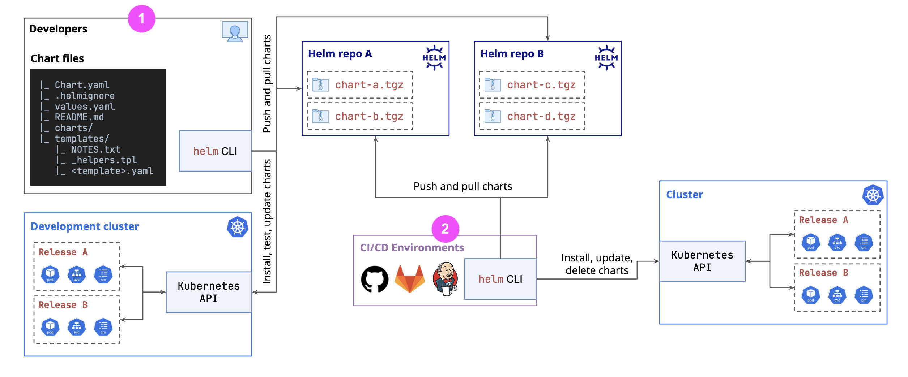

# Helm 模板关键语法

```gotemplate
{{ .Values.key }}          # 访问 Values.yaml 的值
{{ if .Values.enabled }}   # 条件判断
{{ range .Values.list }}   # 循环遍历
{{ include "helper" . }}   # 引用其他模板
{{ tpl .Values.text . }}   # 解析字符串中的模板
```

# tpl
_helpers.tpl 是 Helm Chart 中的一个辅助模板文件，通常用来定义可复用的模板片段（类似于函数）。这些模板可以通过 {{ include }} 在其他模板（如 deployment.yaml、service.yaml）中调用。


# Helm: The Definitive Guide 
- [video course](https://ibm-learning.udemy.com/course/definitive-helm-course-beginner-master/learn/lecture/46456923#overview)
- [git repo - helm](https://github.com/lm-academy/helm-course)
- [git repo - config store](https://github.com/lm-academy/config-store)

## 1. What is Helm
### Helm and Kubernetes
**Benefits:**

- Simplifies the complex resource mgmt
- Consistency across environment - while allowing environment-specific configs
- avoid error-prone manual edits
- allow Version Control and Rollback
- Templating flexibility

**Limitations:**

- over-complicated chart
- security implications: ONLY use reliable charts!
- release state is stored in Cluster: e.g.:
    - a manually change
    - secret that not saved in Helm
- upgrades might be challenging: make sure you do backup


!!! info
    Helm is package manager for Kubernetes, akin yum for Redhat, brew for MacOS, or npm for NodeJS

!!! note "concepts"
    - chart
    - release: instance of chart


### Helm VS Kustomize

|Dimension|Helm|Kustomize|
|:-|:-|:-|
|Overall purpose|Package manager for Kubernetes with support for emplating, dependency management, and versioning of applications.|Customize <u>existing Kubernetes YAML manifests</u> by overlaying changes also defined in YAML.|
|Complexity|More complex - it introduces the need to learn **Go templates** and the overall structure of charts.|Simpler - it leverages only native YAML.|
|Customization features|Full templating system with conditionals, loops, functions, and variable substitution.|Strategic merge patches, JSON patches, name prefixes/suffixes, common labels, and annotations.|
|Use-cases|<li>Packaging and managing applications and their dependencies</li><li>Versioning of applications</li><li>More advanced customizations via templates and values files.</li>|<li>Managing environment-specific customizations (e.g., dev, staging, prod)</li><li>Applying patches and modifications without duplicating YAML</li>|

### Helm Architecture

**Helm CLI** interacts directly with **Kubernetes API**



1. use **Helm CLI** to deploy **Helm Chart** 
1. use **CI/CD tool** to automatically deploy **Helm Chart**

## 2. Helm Fundamentals

- `helm package`: Creates a new TAR file.
- `helm install`: Deploy a new release.
- `helm upgrade`: Update an existing release.
- `helm rollback`: Revert to a previous release.
- `helm uninstall`: Remove a release.

## 3. Creating Helm Chart
## 4. Go Template
## 5. Managing Chart Dependencies
## 6. Advanced Topics
### Template Functions
[](https://helm.sh/docs/chart_template_guide/function_list/#helm)

!!! note "example: list"
    different `myChart/templates/sandbox.yaml` and the results of `helm template .`

    1
    ```yaml
    list: {{ list 1 2 3 }}
    ```
    
    ```txt
    # result:
    list: [1 2 3]
    ```

    2
    ```yaml
    list: {{ list 1 2 3 | toYaml }}
    ```
    ```txt
    # result:
    Error: YAML parse error on templating-deep-dive/templates/sandbo x-yaml: error converting YAML to JSON: 
    yaml: block sequence entries are not allowed in this context
    
    它不够不会自动换行！所以你得到的是：
    list: - 1
    - 2
    - 3
    ```

    3
    ```yaml
    list: 
    {{ list 1 2 3 | toYaml }}
    ```

    ```txt
    # result:
    list:
    - 1
    - 2
    - 3
    ```

    4
    ```yaml
    list: {{ toYaml (list 1 2 3) | nindent 2 }}
    # or
    list: {{ list 1 2 3 | toYaml | nindent 2 }}
    ```
    ```txt
    # result:
    list:
        - 1
        - 2
        - 3
    ```
    这里不用手动换行，因为 `nindent` 函数自动给结果前加上 newline

### Named Template
to avoid duplication by reuse pre-defined **Named Templates**.

> all files under `templates/` and has `_` in the beginning will NOT be rendered as Kubernetes manifests --> they are the ** **template files**


There are 3 **actions** (`define`, `template`, `block`) and 1 **function** (`include`):

#### define
to create a **Named Templates** inside of a template file. Usually the name of the Named Template starts with `[ChartName].`

```tpl
{{- define "MY.NAME" }}
  # body of template here
{{- end }}
```


#### template
#### block
#### include
to use the **Named Templates**

```yaml
{{ include $str $ctx }}
```

- $str: identifier of the **Named Templates**
- $ctx: context:
    - `{{ include "MY.NAME" . }}` means all information in current context
    - `{{ include "MY.NAME" .Values }}` means ONLY the value.yaml
