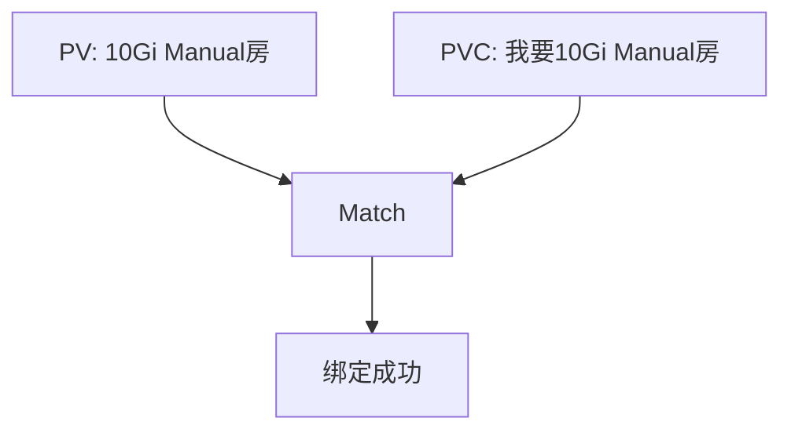
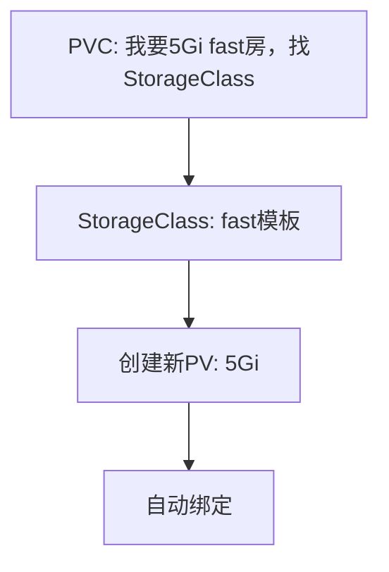

# 1. 卷（Volume）
Docker 容器本质上是 **瞬态（transient）**  的。 这意味着它们只能持续很短的时间。它们在App被创建时被调用，容器被销毁时，数据与容器一起被销毁。

为了使容器的数据**持久化**，我们将**容器**所在的 **Pod** 连接到**卷**。 容器中的数据放在该**卷**中，即使容器被删除，数据会仍然存在。

下面的yaml文件为**Pod**创建并连接**卷**：

- **Container**：其中的App随机生成一个0-100之间的数，并存到文件夹 `/opt` 中
- **Volume**：该**卷**名为`data-volume`，实际上是当前Node上的一个文件夹`/data`。所有用卷`data-volume`存储的信息，最后都会被放在Node的`/data`文件夹下

```yaml
# pod.yaml
apiVersion: v1
kind: Pod
metadata:
  name: simple-webapp
spec:
  containers:
  - name: simple-webapp
    image: simple-webapp
    command: ["/bin/sh", "-c"]
    args: ["shuf -i 0-100 -n 1 >> /opt/number.out;"]
    
    volumeMounts:       # (1) 将容器文件夹`/opt`挂载到名为data-volume的卷上
    - mountPath: /opt     # Container内部文件系统中的文件夹名
      name: data-volume   # Volume的名字
  
  volumes:              # (2) 创建卷：这里申明了一个在Node上的文件夹，也可以使用其他存储方式，比如引用（PVC）
  - name: data-volume     # Volume的名字
    hostPath:             # 使用节点本地存储 ‼️绑定Node！慎用！
      path: /data           # 节点上的绝对路径
      type: Directory       # 路径类型，还可以是DirectoryOrCreate，File，FileOrCreate etc
```
卷的使用确保了**Pod**被删除后，该**Pod**所产生的数据还被保留在所在的**Node**上，如图：


上面图中的的挂载方法只适用于单Node的集群。如果是多个**Node**，每个Node上的数据都是不一样的：


!!! warning "Volume的缺点"
    - **卷**与**Pod**相连 -> 每次新建一个需要存储空间的**Pod**，都需要手动配置卷
    - **卷**存在于**Node服务器**上 -> 分布在不同**Node**上的App无法访问到同一个的**卷**
    - 卷的这两个特性导致管理困难，而且也不利于扩大应用规模，因为无法支持多Node的应用，而**持久卷**能解决该问题

<!--
## 常见的 volume 的类型
|Volume|`hostPath` |云储存|
|:-|:-|:-|
|**级别**| Pod级别的volume| 比如`awsElasticBlockStore`，数据相对Node和App独立，分布在不同Node上的应用都统一访问云存储的空间|
|**多Node应用**|不支持|支持|
|**yaml<br />举例**|||
||||

# TODO：比较hostPath和emptyDir
|Volume|`hostPath`|`emptyDir` |云储存|
|:-|:-|:-|:-|
|**级别**| Pod级别的volume| `emptyDir`在Pod被分配到一个Node上时自动生成，初始化后没有任何内容。是零时卷，是Pod级别的volume，与该volume相关联的Pod的所有Container都能访问到volume中的内容。当 Pod 因任何原因从节点中移除时，emptyDir 中的数据将被永久删除。| 比如`awsElasticBlockStore`，数据相对Node和App独立，分布在不同Node上的应用都统一访问云存储的空间|
|**多Node应用**|不支持|不支持|支持|
|**yaml举例**||||
**更多卷（`volume`）的类型见[这里](https://kubernetes.io/docs/concepts/storage/volumes/#awselasticblockstore)。*
-->


# 2. 持久卷（PersistentVolume / PV）
我们想要一个 <span style="background-color: #ccd1f0">更中心化</span> 的解决方法，如有某个**多Node的应用**需要修改存储空间，管理员（Administrator）可以统一对其进行管理。**持久卷池**可以帮我们解决这个问题。

持久卷是**Cluster**层级的，放满 **存储卷** 的池子（Pool），由集群的管理员进行管理和配置。然后由Pod根据自己的需求发送 **存储卷请求（PersistentVolumeClaim / PVC）**。

⚠️ 一个PV本身是不可分割的单位，而管理员管理的是一堆存储容量大小各异的PV
```yaml
# 持久卷（PersistentVolume）的定义
# my-pv.yaml
apiVersion: v1
kind: PersistentVolume
metadata:
  name: pv-volume
spec:
  accessModes:          # 可能的mode： ReadOnlyMany, ReadWriteOnce 和 ReadWriteMany
    - ReadWriteOnce
  capacity:             # 所需的存储空间的大小
    storage: 1Gi
  hostPath:             # 卷的类型：Node（主机）上的文件夹 - 不推荐
    path: /tmp/data
  storageClassName: ""  # SC
```
生成持久卷：

```bash
kubectl create -f my-pc.yaml
```
查看已有的持久卷：
```bash
kubectl get persistentvolume
```

## 持久卷的类型
当我们在`pod.yaml`中定义`volumes`属性时，除了`hostPath`还有很多不同选择。比如：

- NFS、ClusterFS、Flocker、FibreChannel、CephFS、ScaleIO 
- 或公共云解决方案，如AWS EBS， Azure， Google Persistent Disk，或者AWS Elastic Block Store。比如：

```yaml
volumes:
- name: data-volume
  awsElasticBlockStore:
  	volumeID: <volume-id>
  	fsType: ext4
```
还有其他更多**持久卷**的类型：

- `awsElasticBlockStore`：AWS Elastic Block Store (EBS)
- `azureDisk`：Azure Disk
- `azureFile`：Azure File
- `cephfs`：CephFS volume
- `csi`：Container Storage Interface (CSI)
- `fc`：Fibre Channel (FC) storage
- `gcePersistentDisk`：GCE Persistent Disk
- `glusterfs`：Glusterfs volume
- `hostPath`：HostPath volume --> ⚠️ for single node testing only; WILL NOT WORK in a multi-node cluster; consider using local volume instead
- `iscsi`：iSCSI (SCSI over IP) storage
- `local`：local storage devices mounted on nodes.
- `nfs`：Network File System (NFS) storage
- `portworxVolume`：Portworx volume
- `rbd`：Rados Block Device (RBD) volume
- `vsphereVolume`：vSphere VMDK volume


# 3. 持久卷申领（PersistentVolumeClaim，PVC）
在定义了Cluster上的**PersistentVolume**之后。**Pod**需要发送PVC请求，以拿到试用PV的许可

!!! note "概念整理"
    - **PV**：由 **管理者（Administrator）** 配置的存储空间
    - **PVC**：由Pod的 **用户（User of Pod）** 发出的“想要使用一部分存储空间“的请求

```yaml
# my-pvc.yaml
apiVersion: v1
kind: PersistentVolumeClaim
metadata:
  name: my-claim
spec:
  accessModes:
    - ReadWriteOnce
  resources:        # 所需资源
    requests:
      storage: 500Mi
  storageClassName: ""
```
生成PVC：
```bash
kubectl create -f my-pvc.yaml
```
查看已有PVC：
```bash
kubectl get persistentvolumeclaim
```
PVC在Pod中的使用：
```yaml
apiVersion: v1
kind: Pod
metadata:
  name: mypod
spec:
  containers:
    - name: myfrontend
      image: nginx
      volumeMounts:
      - mountPath: "/var/www/html"
        name: mypd
  volumes:
    - name: mypd
      persistentVolumeClaim:  # 使用PVC
        claimName: myclaim
```
⚠️ 在Pod中添加PVC之后，ReplicaSets 和 Deployments中也会自动添加相对应的PVC定义！


## PVC如何选择PV (Binding)
### 1. 根据属性自动绑定
Kubernetes 尝试根据**PVC的要求**找到具有足够容量的PV。**PVC**可以定义:

  - 存储容量（`sufficient capacity`）
  - 访问模式（`access modes`）
  - 卷模式（`volume modes`）
  - 存储类（`StorageClass`）等属性
  
\* 如果有多个PV符合PVC的要求，则随机选择一个PV。

|条件|PVC 和 PV 必须一致|
|:-|:-|
|storage|PVC 请求的 ≤ PV 提供的|
|accessModes|PVC 请求的 ⊆ PV 支持的|
|storageClassName|必须匹配（或者都为空）|
|状态|PV 处于 Available 状态|

### 2. 根据selectors和labels选择
如果你想指定 PVC 使用哪个 PV, 也可以利用 PVC 的`labels`和`selectors`来定位到正确的PV。比如：

1. PVC中添加`selectors`属性
  ```yaml
  # pvc.yaml
  spec:
    selector:
      matchLabels:
        name: my-pv
  ```
2. 在PV中添加`labels`属性
  ```yaml
  # pv.yaml
  labels:
    name: my-pv
  ``` 

### 3. pvc 的 volumeName
如果你想指定 PVC 使用哪个 PV，可以提前给它设置 `volumeName`。 `volumeName` 是最直接的方式，但必须确保 PVC 的所有参数（如 `accessModes`、`storageClassName` 和 `size`）与该 PV 完全兼容。

```yaml
# pvc.yaml
apiVersion: v1
kind: PersistentVolumeClaim
metadata:
  name: my-pvc
spec:
  volumeName: my-pv  # 手动指定绑定到名为 "my-pv" 的 PV
  accessModes:
    - ReadWriteOnce
  resources:
    requests:
      storage: 10Gi
```

### 特例
最后，如果所有所有属性都匹配，且没有更好的选择，则较小的PVC最终可能会绑定比它要求更大的PV。-> ** 这可能导致PV的浪费！**

假设我们有一个PVC和一个PV。PVC要求的存储空间是`500Mi`，而现在可用的PV只有一个，那么PVC只能绑定到剩下的PV。用`k get pvc`可用看到：
```bash
NAME     STATUS    VOLUME   	CAPACITY   ACCESS MODES   STORAGECLASS    AGE
my-claim Bound     my-volume    1Gi        RWO            aws-xxx		  40m
```

## 没有可用的PV时，PVC的行为
如果当前的Cluster中，没有可用的PV，那么发出的PVC会一直处于`Pending`的状态。这时用`k get pvc`会看到：
```bash
NAME     STATUS    VOLUME   CAPACITY    ACCESS MODES   STORAGECLASS           AGE
my-claim Pending                                       vpc-block-1iops-tier   35h
```
当Administrator往Cluster中添加新的PV时，处于`Pending`状态的PVC会自动与新的PV完成绑定！

# 4. 删除PVC
删除PVC：

```bash
k delete pvc/my-claim
```
当PVC被删除时，**与之绑定的PV** 可能的行为有以下几种：

1. `Retain`: 被绑定的PV会依旧存在，没有被删除，除非Administrator手动删除。但该PV也无法被其他PVC使用。此时PV的Status会是`“Released”`，而不是`“Available”`。
2. `Delete`: 被绑定的PV也会自动被删除，由此，Cluster的整体**存储池**总体容量会变小
3. `Recycle`: 被绑定的PV被回收利用，PV上的数据会被删除，且可供其他PVC使用，Cluster的整体**存储池**总体容量会不变

你可以在YAML中定义：

```yaml
apiVersion: v1
kind: PersistentVolume
metadata:
  name: pv-volume
spec:
  accessModes:
    - ReadWriteOnce
  capacity:
    storage: 5Gi
  awsElasticBlockStore:
    volumeID: xxx
    fsType: ext4
  persistentVolumeReclaimPolicy: Recycle  # 对PV的行为进行规定："Retain", "Recycle", 或 "Delete"
```
⚠️ 对卷的绑定可以在Pod的定义文件中进行，也可以在Deployment或者ReplicaSet的定义文件中进行，效果是一样的

# 5. 存储类 / StorageClasses

!!! warning
    - PV（PersistentVolume） 就像已经准备好出租的房子
    - PVC（PersistentVolumeClaim） 就像租客的租房需求
    - StorageClass 就像中介公司给的template，帮你根据需求 **自动造房子**（即动态 provision）

    PVC 是用户的存储需求，PV 是系统可用的存储资源，而 StorageClass 则是动态创建 PV 的“建房模板”，三者一起构成 Kubernetes 存储资源的分配与管理体系。

!!! info
    `storageClassName: ""` 表示静态绑定

## Static Provisioning

假设我现在想使用GCE的存储空间，那么需要4个步骤：

1. 在GCE中新建存储空间
2. 创建一个使用GCE空间的PV
3. 创建一个PVC，对PV进行时使用
4. 在Pod中使用引用PVC


如图：


<!--  -->

这个过程被称作 **Static Provisioning**。

## Dynamic Provisioning

我们可以通过创建**存储类 / StorageClass**来自动化步骤（1）和（2），实现**“Dynamic Provisioning”** 。

- PVC通过`storageClassName`连接到StorageClass，StorageClass中的 **配置器/provisioner** 来配置新的GCE磁盘，并且自动生成一个相对应的PV
- 你不需要手动创建 PV，也不需要事先准备路径或磁盘挂载等工作

如图：



<!--  -->


!!! note "StorageClass举例"
    ```yaml
    # my-sc.yaml
    apiVerson: storage.k8s.io/v1
    kind: StorageClass
    metadata:
      name: google-storage

    provisioner: kubernetes.io/gce-pd   # 🌈 配置器：不同供应商提供不同的配置器
    VolumeBindingMode: WaitForFirstConsumer
    parameters:             # 配置额外的参数
      type: pd-standard
      replication-type: none
    ```

    **provisioner**: <br/>

    - k8s为每个云供应商都提供了不同的provisioner：比如`kubernetes.io/gce-pd`就是给 GoogleCloudEngine 的provisioner
    - ⚠️ 如果provisioner是`kubernetes.io/no-provisioner`，那么意味着该StorageClass不支持 dynamic provisioning


    **VolumeBindingMode/绑定模式** 可能的值有：<br/>
    
    - `WaitForFirstConsumer`: 将延迟 PV 的绑定和配置，直到创建使用了对应 PVC 的 Pod <br/>
    - `Immediate`
    

!!! info "Naming of 'StorageClass'"
    You can use different drive in different StorageClass, thats where the name come from:

    


!!! danger "有可能 PVC 无法通过 StorageClass 自动生成 PV"
    比如集群中根本没有安装这个 CSI 插件。那么 StorageClass 就失去了它存在的意义，直接用 Static Provisioning，即PV + PVC更合理


## 区别
Static和Dynamic Provisioning的区别如图(以GCE为例)：

|<div style="width: 220px">Static Provisioning</div>|<div style="width: 220px">Dynamic Provisioning</div>|
|:-|:-|
|<pre><code>Pod -> PVC -> PV -> GCE</code></pre>|<pre><code>Pod -> PVC -> SC(auto-generated PV)</code></pre>|


# 6. StatefulSet
**StatefulSet** 类似于 **Deployment**，因为它们基于模板创建 Pod。 他们可以增加和减少Pod的数量。 也可以执行滚动更新和回滚，但存在差异：<br/>

- **StatefulSet** 中 **Pod** 是按顺序创建的。 
- 部署第一个 **Pod** 后，它必须处于运行和就绪状态，才能继续部署下一个 **Pod** 。 
- **StatefulSet**给每一个创建的**Pod**都按照生成顺序编号，并根据编号生成独一无二的名字，比如：`sql-1`，`sql-2`

!!! note "使用场景"
    - StatefulSet: 需要有状态、稳定身份的应用（如数据库、分布式系统），比如MySQL、Cassandra、Zookeeper、Kafka 等分布式系统 
    - Deployment: 无状态应用（如 Web 应用、API 服务），比如Nginx、前端服务、微服务应用       

```yaml
# StatefulSet的定义文件和Deployment大同小异，主要把 kind的类型改了
apiVersion: apps/v1
kind: StatefulSet
metadata:
  name: mysql
spec:
  replicas: 3   # Pod 数量
  serviceName: mysql  # 声明要使用的 Headless服务
  selector:
    matchLabels:
      app: mysql
  template:
    metadata:
      labels:
        app: mysql
    spec:
      containers:
      - name: mysql
        image: mysql   
```
生成StatefulSet：

```bash
kubectl create -f my-ss.yaml
```
结果会生成 3 个 Pod × 1 个Containers/Pod = 3 个 Containers：
```txt
mysql-0 Pod:
  └── mysql 容器

mysql-1 Pod:
  └── mysql 容器

mysql-2 Pod:
  └── mysql 容器
```

!!! info "顺序操作"
    - 创建: 0→1→2 
    - 删除: 2→1→0

# Headless Service
不做loading balance，只提供DNS的服务。与StatefulSet一起使用时，为每一个Pod都提供一个DNS，格式为：`<pod-name>.<headless-service-name>.<namespace>.<cluster-domain>`比如：

- `mysql-0.mysql-headless.default.svc.cluster.local`
- `mysql-1.mysql-headless.default.svc.cluster.local`
- `mysql-2.mysql-headless.default.svc.cluster.local`

```yaml
apiVersion: v1
kind: Service
metadata:
	name: mysql-headless
spec:
	ports:
		- port: 3306
	selector:
		app: mysql
	clusterIP: None  # Headless服务与其他服务区分开来的地方
```
现在我们有两条路：

1. 手动创建Pod
2. 通过StatefulSet创建Pod

## 1. 手动创建Pod
```yaml
apiVersion: apps/v1
kind: Pod
metadata:
  name: myapp-pod
spec:
  containers:
  - name: mysql
    image: mysql

  subdomain: mysql-headless   # 1. subdomain = 服务名字
  hostname: mysql-pod         # 2. hostname 确保每个Pod都有各自的DNS
```

## 2. 通过StatefulSet创建Pod
如之前的例子所示，需要加一个`serviceName`即可

#  >>>  本章kubectl命令整理
**PersistentVolume相关**

`k get pv`

-- --

**PersistentVolumeClaim相关**

`k get pvc`

`k delete pvc/my-claim` 删除pvc

# 图片来源
<a href="https://www.flaticon.com/free-icons/database" title="database icons">Database icons created by phatplus - Flaticon</a>
<a href="https://www.flaticon.com/free-icons/folder" title="folder icons">Folder icons created by Good Ware - Flaticon</a>
