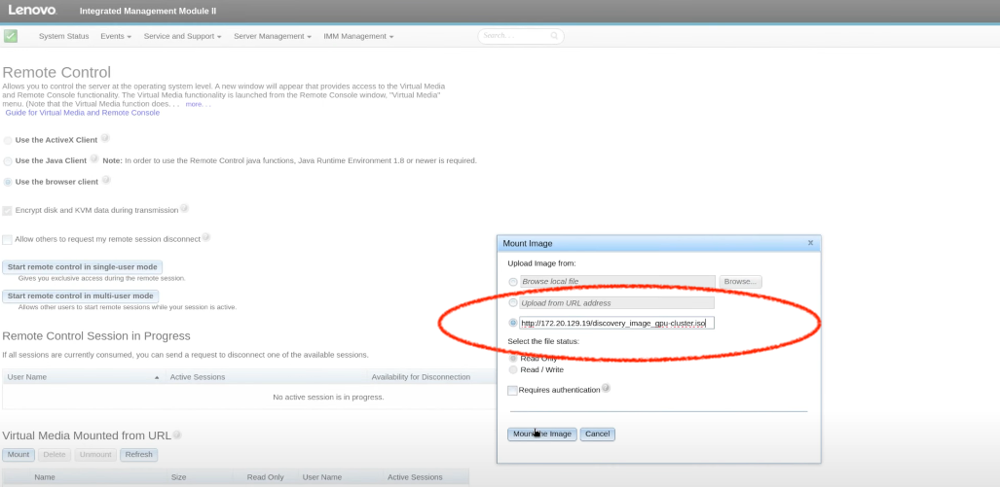

# Installation Methods
Reference: [https://www.redhat.com/zh/blog/red-hat-openshift-disconnected-installations](https://www.redhat.com/zh/blog/red-hat-openshift-disconnected-installations)

There are 4 **installation methods**. Under each methods there are **installation options**

## 1. Interactive
deploy cluster with a [web-based Assisted Installer](https://access.redhat.com/documentation/en-us/assisted_installer_for_openshift_container_platform). 适合连接到互联网的环境。

focus on bare metal, Nutanix, vSphere, and Oracle Cloud Infrastructure. The Assisted Installer also supports various CPU architectures, including x86_64, s390x (IBM Z®), arm64, and ppc64le (IBM Power®).

!!! note "Basic steps"
    Check a [walk-through video here](https://www.youtube.com/watch?v=c8J5lEbqaPY&ab_channel=TrustedAdvisor)

    1. [Configure the web-based Assisted Installer](https://docs.redhat.com/en/documentation/assisted_installer_for_openshift_container_platform/2025/html/installing_openshift_container_platform_with_the_assisted_installer/installing-with-ui#setting-the-cluster-details_installing-with-ui)
        - [The cluster configurator](https://console.redhat.com/openshift/assisted-installer/clusters/~new)
    2. Generate url to download ISO(Optical Disc Image)
    3. Put the downloaded ISO in a **HTTP server**
    4. When creating a Machine(Node), mount the ISO image from your **HTTP server**
        
    5. Power on the Node
    6. back to **web-based Assisted Installer** to see Nodes populating in the the **Host Inventory List**


## 2. Local Agent-based
需要先下载并配置[Agent-based Installer](https://console.redhat.com/openshift/install/metal/agent-based)，配置通过命令行完成。适用于断开连接的环境或受限网络。

-> 与web-based Assisted Installer类似，但不联网

## 3. IPI 
Installer-Provisioned Infrastructure

- OpenShift installer automates the provisioning of infrastructure.
- Less manual control over node placement, networking, and resource assignment.
- Customizations, such as ensuring site affinity, require post-install configuration or creative use of installer features (e.g., node labels, taints).


!!! note
    This method has the following installation options:

    - Default 
    - Custom
    - Network customization 
    - Restricted network
    - Private clusters
    - Existing virtual private networks
    - Government region 
    - Secret regions 
    - China regions

## 4. UPI 
User-Provisioned Infrastructure

- You are responsible for provisioning the underlying infrastructure (e.g., VMs, networking, storage) before installing OpenShift.
- Offers full control over how nodes are distributed across sites, which allows:
    - Pre-assigning nodes to specific data centers or availability zones.
    - Customizing networking, storage, and VM placement based on your requirements.


!!! note
    This method has the following installation options:

    - Custom
    - Network customization
    - Restricted network 
    - Shared VPC hosted outside of cluster project


## Interactive vs IPI

|方面|Web-based Assisted Installer|IPI (Installer-Provisioned Infrastructure)|
|:-|:-|:-|
|控制权|由 Red Hat 提供的 托管服务，安装过程发生在 web 界面中，用户只需提供基本信息。|用户在本地或云端运行 openshift-install，完全控制整个集群的部署过程。|
|部署环境|适用于裸金属（Bare Metal）环境，Red Hat OpenShift Assisted Installer 负责 PXE 启动、引导安装等。|适用于 云（AWS, GCP, Azure）或 vSphere 等 IPI 支持的平台，由 openshift-install 直接管理资源创建。|
|基础设施准备|自动引导节点（bootstrap）、分配 IP、安装 OpenShift，用户几乎不需要手动操作。|openshift-install 自动创建所需的基础设施（如 VMs、网络、存储等），但需要用户提供 cloud 访问权限。|
|适用场景|主要用于裸金属部署，特别适合没有 PXE 或 DHCP 的环境，适合 PoC 和生产环境。|适用于云端或虚拟化环境，是 OpenShift 在公有云上的官方推荐安装方式。|

# Methods x Platform

not in all the Platforms can do all the **Installation Options**. Check the table 

-> [Supported installation methods for different platforms](https://docs.redhat.com/en/documentation/openshift_container_platform/4.16/html-single/installation_overview/index#supported-installation-methods-for-different-platforms)

# Failure Domain
There are 2 ways to configure Failure Domain:

1. Before Install, add customization to `install-config.yaml`
2. After Install, modify the `infrastructures.config.openshift.io` resource


!!! note "Comparison: pre vs post"

    |Feature | install-config.yaml (Before Install) | infrastructures.config.openshift.io (After Install) |
    |:-|:-|:-|
    |Initial VM placement | ✅ Controls where nodes are created | ❌ Cannot move existing nodes |
    |Failure domains | ✅ Defined in platform.vsphere.failureDomains | ✅ Can update existing failure domains |
    |Load balancing & networking | ✅ Can configure in advance | ⚠️ Limited to post-install tweaks |
    |Effectiveness | ✅ Ensures correct setup from the start | ⚠️ May require additional manual steps |
    |Doc for vSphere|[Configure Failure Domain while installing](https://docs.redhat.com/en/documentation/openshift_container_platform/4.17/html/installing_on_vmware_vsphere/installation-config-parameters-vsphere)|[Add Failure Domain configuration after Install](https://docs.redhat.com/en/documentation/openshift_container_platform/4.16/html/installing_on_vsphere/post-install-vsphere-zones-regions-configuration#specifying-regions-zones-infrastructure-vsphere_post-install-vsphere-zones-regions-configuration)|


# vSphere
**vSphere** is VMware’s virtualization platform. **vCenter** and **ESXi Hosts** are components that work within that platform t
- **vCenter** provides centralized mgmt for both **VMs** and **ESXi Hosts**
- **ESXi**: is a bare-metal hypervisor that installs directly onto a physical machine and creates the separation necessary to divide it into one or more **VMs**


!!! note   
    You can deploy an **OpenShift Container Platform cluster** to multiple **vSphere data centers** that run in a single **VMware vCenter**. 
    Each data center can run multiple clusters. This configuration reduces the risk of a hardware failure or network outage that can cause your cluster to fail. 
    --> 通过将集群分散到多个数据中心，即使一个数据中心发生故障，其他数据中心的节点仍然可以保持集群的运行。

    
    To enable regions and zones, you must define multiple **failure domains/故障域** for your OpenShift Container Platform cluster.

    OpenShift 安装程序会自动将 控制平面节点 和 工作节点分布 到不同的故障域中。


## Stretched Cluster
In a Stretched Cluster setup, you can have one vCenter managing both data centers or two vCenters (linked mode) depending on your architecture.

1. Single vCenter (Common Setup): The two data centers are configured as separate **failure domains** within the same **vCenter**.
2. Two vCenters (Linked Mode)


### Zone vs Region
OpenShift 会在 同一个 region 内跨多个 zone 进行调度。但不会在不同的 region 之间自动调度 Pod。

!!! note "为什么 OpenShift 不会自动跨 region 调度？"

    - 区域之间的网络延迟：不同的 region 可能位于不同的地理位置，网络延迟较大，这会影响跨区域的调度效率和应用性能。
    - 可用性和冗余性：通常情况下，一个 region 已经具备了充分的冗余设计，能满足高可用的需求。跨 region 的调度需要特别的配置和管理，如多活架构和跨区域的数据库同步等。
    - 资源优化：跨 region 调度可能会增加存储和计算资源的分布复杂性，因此 OpenShift 默认会限制跨 region 的调度，以保持集群的高效性和简单性。

# RHCOS vs RHEL

||RHCOS（Red Hat Enterprise Linux `CoreOS`)|RHEL（Red Hat Enterprise Linux） `CentOS`|
|:-|:-|:-|
|适用场景	|专门用于 OpenShift 的容器操作系统，基于 **RHEL** 技术，但更轻量、自动化程度更高。|通用企业 Linux，适用于各种服务器和云计算、虚拟化、数据库等|
|软件管理| OSTree 进行系统更新。|dnf/yum |
|运行时|默认运行 CRI-O 容器运行时，优化了 OpenShift/Kubernetes 集群的运行。||
|||需要订阅 Red Hat 订阅服务，才能获取更新和支持。|


# Integrated vs not-integrated

in `install-config.yaml` file, you can see whether the current installation is integrated or not by checking:

```yaml
platform: none: {}
```

This means NOT integrated.

| Integrated Installation | NOT-integrated installation | 
|:-|:-|
|openshift has control on the infrastructure, e.g. can create VMs, can mount *.iso files|can NOT do such a thing|


