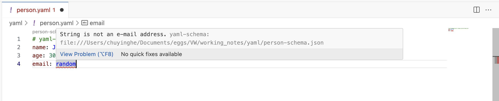

# yaml-language-server
yaml-language-server 是 Red Hat 开发的一个开源语言服务器，专门为 YAML 文件提供语言智能功能。([yaml-language-server Git repo](https://github.com/redhat-developer/yaml-language-server)). --> 可以为一个YAML文件自定义 **schema**！

> 💡 Tip: install the **Red Hat YAML** extension in VS Code

!!! info "yaml-language-server"
    遵循 Language Server Protocol (LSP) 协议，为代码编辑器提供：

    - 语法高亮
    - 自动完成
    - 错误检查
    - 格式整理
    - 悬停提示等功能

## 1. define schema
person-schema.json:

```json
{
  "$schema": "http://json-schema.org/draft-07/schema#",
  "type": "object",
  "properties": {
    "name": {
      "type": "string",
      "description": "Person's full name"
    },
    "age": {
      "type": "integer",
      "minimum": 0,
      "description": "Person's age in years"
    },
    "email": {
      "type": "string",
      "format": "email"
    }
  },
  "required": ["name", "age"]
}
```

## 2. YAML file
```yaml
# yaml-language-server: $schema=./person-schema.json
name: John Doe
age: 30
email: john@example.com
```

以VSCode为例，自动错误检查长这样：
