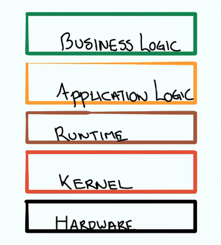
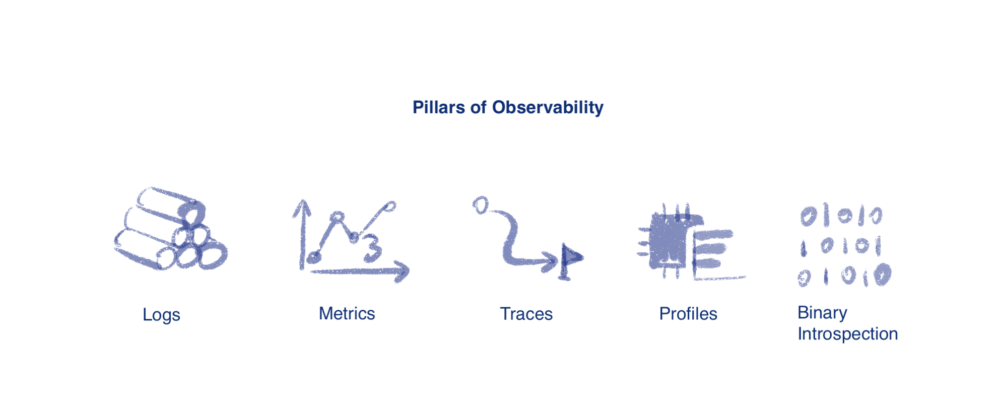
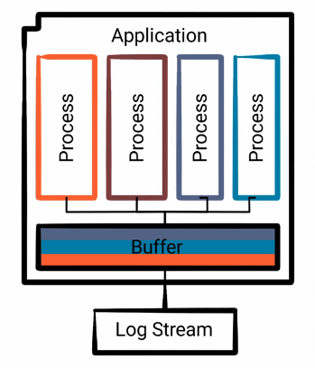
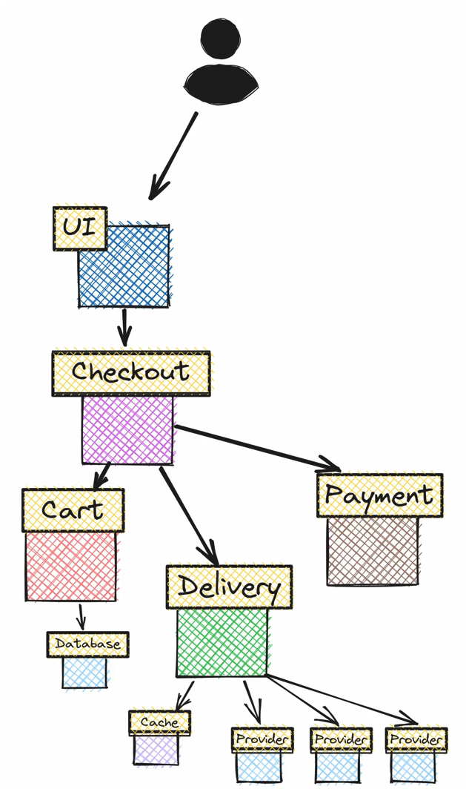
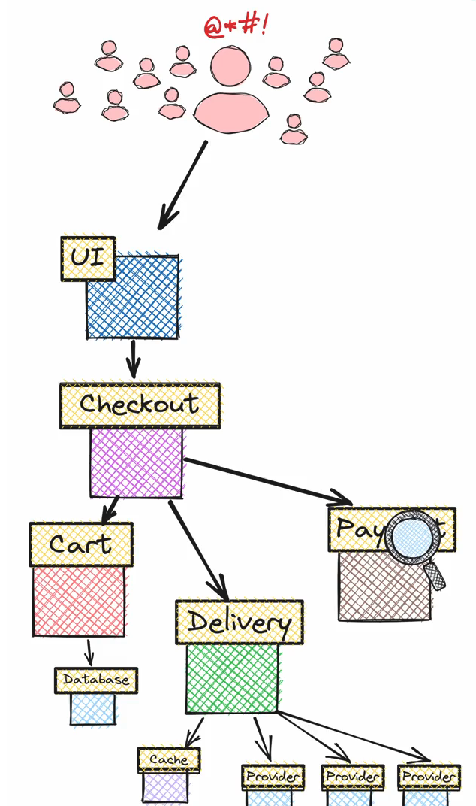
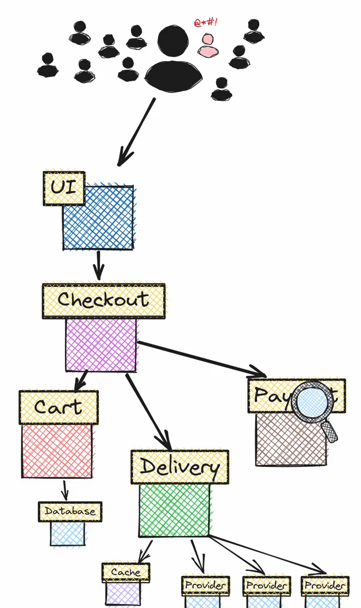
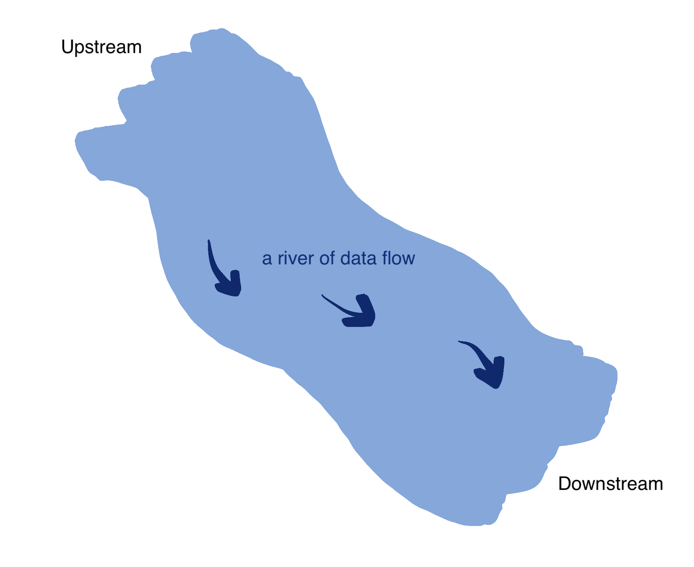

_Note: course from Andrew Howden_

The goal of observability is to identify/debug the Problem.

!!! note "Observability"
    How well you can reason through the software state by using telemetric outputs.
    
    "遥测" (telemetry) refers to the collection and transmission of data from remote sources, while "输出" (outputs) denotes the data that is generated and provided by the system.

Nowaday, **Microservice** is the trend. However, they also create a much more complex and diverse software architecture - since there are not so much ^^_central governance_^^ of these systems.

➡️ ➡️ ➡️ The system has become more complex, therefore we need **Observability**

# What are we observing?
Taking e-commerce shop as example. When a customer places an order, the system checks if the product is in stock, if the payment method is valid, and whether the customer has provided all necessary information (e.g., shipping address).

- Business Logic: The number of validation failures and the average time taken for validation checks.
- Application Logic: how many HTTP requests
- Runtime: if the App is writen in Go, how much time it spends in Garbage collection
- Kernel:  how is the CPU and memory utilization
- Hardware: The temperature of the CPU, or the speed of the fans



# Problem Types

- **Known Known**: I send a request to a server and get a 503, I know the app is unavailable.
- **Known Unknown**: I send a request to a server but it doesnt work, I have the hypothesize that the application is attempting to write to disk, but the disk
is full - but we cannot validate this as we have no telemetry on the disk.
- **Unknown Unknown**: we've validated everything that we can think of. But still couldn't find where the problem is
- **Unknown Known**: We are sure that the app works, but someons has overridden the DNS record, which points to our service.

# Effective Observability
A system requires two things in order to be observable:

1. The telemetric data: that describe its internal state at some specific time.
2. Understanding of the system. E.p. read the code

# Pillars of Observability


# Pillar 1: Logs

**Three Standard Streams** in computer programs: `STDIN`, `STDOUT`, `STDERR`, the `STDOUT` and `STDERR` are where the logs are. 

## Log Components

1. Trigger Event
2. Context: that you want to associate with the **Trigger Event**

### Syslog Severity Levels

|Level|Severity|Keyword|Description|
|:--|:--|:--|:--|
|0|Emergency|emerg|System is unusable|
|1|Alert|alert|Action must be taken immediately|
|2|Critical|crit|Critical conditions|
|3|Error|err|Error conditions|
|4|Warning|warning|Warning conditions|
|5|Notice|notice|Normal but significant condition|
|6|Informational|info|Informational messages|
|7|Debug|debug|Debug-level messages|

### Log Destination

1. Standard Stream (`STDERR`)
2. File
3. Network Socket
4. Pipe

Some log Destination may require a single owner process to coordinates:



However, a process will periodically flush these logs to the final destination, but many things might have written records to that buffer in the meantime.<br/>➡️ ➡️ ➡️ This means that as we're actually consuming the logs, they might be in a wrong order. The 2 sides of **Log Stream**:

|Advantages|Disadvantages|
|:--|:--|
|1. Easy to implement <br/>2. Well supported <br/>3. Arbitrarily complex <br/>4. Useful in production <br/>|    1. Expensive <br/> 2. Structured|


!!! info "When to use logs?"
    For the app that:

    1. Low traffic
    2. Single Instance
    3. Isolated

### Log Consumption
1. **in Terminal**
    Locally in your PC, or if you have the app on Cloud, you can do `kubectl log [Pod Name]` to view the logs.  Tools like `grep`(search tool) and `jq`(a JSON processor) are also useful for searching info.
2. **Log Aggregation & Indexing**. Advantages:
    - These indexes can be handy to establish patterns in the data. 
    - Beyond that they centralized logs and they can provide this like grep like or jq like functionality
    - that's not tied to your local machine and can be much faster to process a really large amounts of material.

    !!! note "Break down"
        **(1) Log Ingestion**<br/>Logs from various sources (applications, servers, etc.) are collected using agents (e.g., Filebeat, Fluentd) in JSON format (JSON is suitable for indexing) <br/>
            ```json
            {
                "timestamp": "2024-10-22T08:00:00Z",
                "log_level": "ERROR",
                "message": "Failed to connect to database",
                "service": "payment-service"
            }
            ```
        **(2) Log Indexing**<br/>An index is a data structure that allows quick lookups. For example, `Elasticsearch` builds inverted indexes which map terms <br/>
        **(3) Querying**<br/>Once indexed, logs can be queried
            ```json
            # QUERY:
            GET /logs/_search

            # RESULT:
            {
                "query": {
                    "bool": {
                    "must": [
                        { "match": { "log_level": "ERROR" }},
                        { "match": { "service": "payment-service" }}
                    ]
                    }
                }
            }
            ```

# Pillar 2: Distributed Tracing
Nowaday we have microservices architecture, instead of the monolithic. But microservices is more complex. For instance, imagine a user of an online-shop is trying to order sth:

|Problem:|<div style="width:200px">There is error in the order process, we don't know which microservice caused the error</div>|<div style="width:200px">The system become extremely slow, when the request increases</div>|<div style="width:200px">Only certain users have this slow order problem</div>|
|:-|:-|:-|:-|
|Illustration:||||

## History
|Year|Approach|Description|
|:-|:-|:-|
|2010|**Dapper**, a large-scale distributed systems tracing infrastructure|by Google, they describe the core challenge, specific designs and the trade-offs they made, and an evaluation of how well it works|
|2012|**Zipkin**|by Twitter, replicated many benefits from **Dapper**|
|2015|**T channel**, a new RPC protocol|by Uber, one of the protocol goals is the **Dapper** tracing being part of the format, similar to what **Zipkin** is doing, but it has limitations of how data is stored|
|2015|**OpenTracing**|It provides **turnkey tracing** by providing common standards for **span management** and **inter-process propagation**.|
|2017|**Jaeger**|by Uber, release it as open-source, and donated to CNCF|
|2018|**OpenCensus**|by Google, This framework went beyond **OpenTracing**, implementing APIs for metric collection and solving another really critical component of observability need.|
|||_However, the **OpenTracing** and **OpenCensus** projects were now competing projects, both implementing a tracing API, and neither was especially compatible with each other_|
|2019|**Open Telemetry**|= **OpenTracing** + **OpenCensus**, it seeks to provide high quality, ubiquitous and portable transport telemetry to enable effective observability. It contains ALL required technologies to export `metrics`, `logs` and `traces`. <br/><br/>Advantages: <br/>- support multiple programming languages<br/>- vendor-neutral|

!!! note "Turnkey Tracing"
    Turnkey表示“开箱即用的”或者“ready to use”): refers to providing an easy, ready-to-use solution for distributed tracing.

    Imagine a web request that goes through three services:
        ```
        Service A (frontend) → Service B (authentication) → Service C (payment processing).
        ```
    A **turnkey tracing** system automatically generates and collects trace data for each of these services, allowing you to see the entire lifecycle of a request without any heavy setup.

!!! note "Span Management"
    跨段管理, is the process of managing individual spans within a trace. Continuing the previous example:
        ```
        Span 1: Request starts in Service A (frontend).
        Span 2: Request is forwarded to Service B (authentication) and processed.
        Span 3: Service C (payment) completes the transaction.
        ```
    Each of these spans is collected and linked to form the complete picture of a request’s flow across services. **Span management** ensures that spans are tracked and organized correctly.

!!! note "Inter-Process Propagation"
    进程间传播, automatically passes tracing information between services, linking spans into a complete trace.


## Trace
**Traces** give us the big picture of what happens when a request is made to an application. Whether your application is ^^a monolith with a single database^^ or ^^a sophisticated mesh of services^^, **traces** are essential to understanding the full “path” a request takes in your application.

### Tracer
A Tracer creates **spans** containing more information about what is happening for a given operation, such as a request in a service. **Tracers** are created from **Tracer Providers**.


### Tracer Provider
**A Tracer Provider** is a factory for **Tracers**. In most applications, **a Tracer Provider** is initialized once and its lifecycle matches the application’s lifecycle. 

### Trace Exporters
Trace Exporters send **traces** to a consumer. This consumer can be standard output for debugging and development-time, the OpenTelemetry Collector, or any open source or vendor backend of your choice.


### Span
A **Span** represents ^^a single operation unit^^ within a **trace**. A **span** can includes another **span**。It can be represented in JSON:
```json
{
  "name": "hello",
  "context": {
    "trace_id": "5b8aa5a2",
    "span_id": "051581bf"
  },
  "parent_id": null,    # 💡 this indicates the parent/child relationship
  "start_time": "2022-04-29T18:52:58.114201Z",
  "end_time": "2022-04-29T18:52:58.114687Z",
  "attributes": {
    "http.route": "some_route1",
    "net.transport": "IP.TCP",
    "net.peer.ip": "172.17.0.1"
  },
  "events": [
    {
      "name": "Guten Tag!",
      "timestamp": "2022-04-29T18:52:58.114561Z",
      "attributes": {
        "event_attributes": 1
      }
    },
    {
      "name": "",
      "message": "OK",
      "timestamp": "2021-10-22 16:04:01.209512872 +0000 UTC"
    }
  ],
  "status_code": "STATUS_CODE_OK",
  "status_message": "",
}
```

Usually, a span includes the following informations:

- Name
- Parent span ID (empty for root spans)
- Start and End Timestamps
- Span Context: an immutable object on every span that contains `TraceID`, `SpanID`, `TraceFlags`, `TraceState`
- Attributes: key-value pairs that contain metadata
- Span Events: a structured log message (or annotation) on a Span, such as: 
- Span Links: to associate one span with one or more spans, implying a causal relationship. 
- Span Status: possible values are `Unset`, `Error`, `Ok`

! info "Types of Span"
    They are 5 types of Span: 

    - `Client`: a synchronous outgoing remote call such as: an outgoing HTTP request or database call. Note that in this context, “synchronous” does not refer to `async/await`, but to the fact that it is not queued for later processing.
    - `Server`: a synchronous incoming remote call such as: an incoming HTTP request
    - `Internal`: an operation which does not cross a process boundary such as: instrumenting a function call 
    - `Producer`: the creation of a job which may be asynchronously processed later such as: a remote job such as one inserted into a job queue 
    - `Consumer`: the processing of a job created by a producer and may start long after the producer span has already ended.


# Pillar 3: Metrics
A metric is a measurement of a service captured at runtime. 


-------


# Other Jargons
Lots of definitions are found [here](https://opentelemetry.io/docs/concepts/signals/)

## Endpoints
**Endpoints** define the API of a service. Every endpoint has a single, automatically discovered type: `BATCH`, `Database`, `HTTP`, `MESSAGING`, `RPC`, `GraphQL`

## Inbound Calls = Incoming Calls

the requests that your service or application receives from other services or clients. 

Antonym: **Outbound/Outgoing Calls**


## Latency
**Latency** is a measure of delay, usually in milliseconds. **Endpoint Latency** indicates how quickly an endpoint responds to incoming requests.

## Service
**Service** can be seen as a logical component that provides a public API. 

## Stream
**Upstream** vs **Downstream**

up and down are relative concepts according to the direction of ^^how the data flows^^


