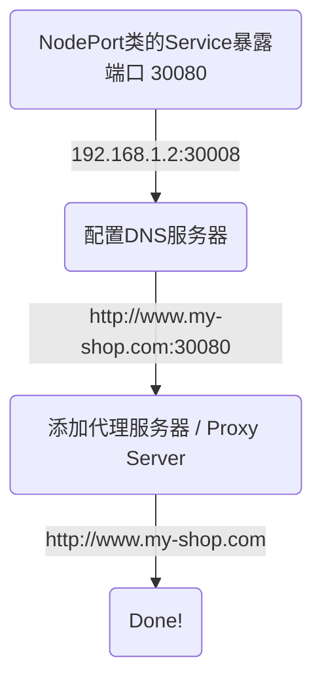

[TOC]

# 1. 服务（Service）
Kubernetes中的每个`Pod`都有它自己的IP地址，但`Pod`经常会因为各种原因而挂掉，如果我们用`Pod`的IP地址来访问该`Pod`，会常出现IP地址无效的情况，我们用 **服务（Service）**  解决这个问题。**服务**提供了稳定的IP地址，我们永远可以找到**服务**的IP地址，然后通过该**服务**访问到想要找的应用Pod。

在创建**Service**的时候，k8s也会创建一个同名的**Endpoint**，这个**Endpoint**将跟踪哪些 Pod 是Service的端点，起到了一个实时数据存储的作用。

> ⚠️ **注意**
> - Service的端口（`port`）是任意的，而Service指向的Pod的端口（`targetPort`）必须是Pod本身的端口
> - 一个Service可以开放**多个端口**，用于与不同的App进行沟通，但要注意的是，如果有多个端口开放，那么Service的每个端口都必须有一个名称

**服务**支持应用程序 **内/外（Internal/External Networking）** 的各种组件之间的通信。假设我们有一个前端的Pod，一个后端的Pod，以及一个数据库。他们之间的**内部沟通**正是由**服务**实现的（Internal Networking）。

## 集群上的IP地址
> **IP地址格式**
> IP address由两个部分组成：**网络地址（Network ID）** 和 **主机地址（Host ID）**。拿`192.168.1.10`举例：
> - 网络地址是前三个数：`192.168.1`，显示了当前所在的网络地址
> - 主机地址是最后一个数： `10`，显示当前网络中，主机的编号
>
> ⚠️ 当你使用VPN（Virtual Private Network）的时候，你的**网络地址**是被隐藏的
>  -- --
>  **IP地址类型**
>  有两种类型：**外部IP地址（external/public）**和**内部IP地址（internal/private）**。一般来说，每个设备都有自己的外部IP和内部IP，且一般两者不同。
>  - 外部IP地址：由你的网络供应商提供，你访问一个网页时（比如百度），百度可以看到你的外部IP地址，知道你是从哪儿来的
>  - 内部IP地址：是自动生成的。人如其名，只做内部使用。比如，用于在家庭网络中识别你的身份信息
>  

## 服务类型：
|Service类型  | 功能 |
|:-|:-|
|NodePort  | 该服务监听了Node的端口（Port），并将 **在端口收到的请求** 转发给某个Pod的端口 |
| ClusterIP （默认类型） |该服务在集群内部创建一个虚拟 IP，以实现不同服务之间的通信，例如前端服务器和后端服务器之间的通信。(Internal Networking)  |
| Headless |帮助访问某个特定的Pod  |
|LoadBalancer  | 该服务是负载均衡器，比如在用户访问量激增时，为Web 服务器分配负载 |


### （1）NodePort类
从NodePort 服务的角度看，有三个端口：
（1）Pod的端口（`TargetPort`）：可选。如不写明，默认与`Port`值相同
（2）Service的端口（`Port`）：必须写明，否则会报错。
（3）Node的端口（`NodePort`）：可选。如不写明，k8s会提供任意一个在 **[30000, 32767]** 范围内可用的端口
> ⚠️ 这三种Port的名字就是以 **服务** 自身为出发点设计的：
> - 服务自己的Port就叫`Port`
> - Pod的端口是服务想要访问的目标，所以叫`TargetPort`；
> - Node的Port叫`NodePort`，对 **外部访问** 可见，所有外部访问都从这里进


##### 比较
|**服务不存在**  |**有了服务之后**  |
|:--|:--|
| 为了更好的理解，我们看一下如果 **服务不存在** ，用户可以怎么访问Pod中的应用：<br /> **方法一：** 如果用户本身在Cluster内部，可以直接通过`curl http:10.244.0.2`访问应用<br />  **方法二：** 如果在Cluster外部，可以通过 **ssh** 来访问`curl http:10.244.0.2` |  **有了服务之后**，Cluster外部对应用的访问会更方便。服务（Service）相当于一个虚拟服务器，有自己的IP地址（这里是`10.106.127.123`）。这里我们不再需要 **ssh** ，而是直接访问Node所在的ip地址`192.168.1.2`<small>（⚠️用户本身的电脑IP和Node的IP是在同一个网络里面的，即IP地址中的前三部分时相同的，所以我们才能直接访问到Node得IP）</small>，<br /> 入口则使用Service提供的端口（`30080`），比如使用`curl 192.168.1.2:30080`|
|   |  |

##### 举例
```yaml
# my_service.yaml
apiVersion: v1
kind: Service
metadata:
	name: myapp-service
spec:
	type: NodePort	# Service的类型
	ports:
	- targetPort: 80
	  port: 80	
	  nodePort: 30008
	# selector用于指定该服务要访问的Pod
	selector:
		app: myapp
		function: frontend
```
>⚠️ `.spec.ports`
> 容纳的是一个数组，意味着，在一个服务中，是可以多个这样的映射的（`NodePort`->`Port`->`TargetPort`）
> ⚠️ `.spec.selector`
> 指定`targetPort`属于哪一个Pod，上面例子中绑定了一个`labels`中有`app=myapp`和`function=frontend`的Pod。很多情况下，一个前端App会有多个replicas，但因为他们都有相同的`labels`，他们会自动被service找到！

查看服务：
```bash
kubectl get services
```
结果如下：
```bash
NAME			TYPE		CLUSTER-IP		EXTERNAL-IP 	PORT(S)			AGE
kubernetes   	ClusterIP   10.43.0.1    	<None>        	443/TCP   		7m30s
myapp-service	NodePort	10.106.127.123	<None>			80:30008/TCP	30s
```
其中的 `kubernetes服务`是k8s在启动时创建的默认服务。`myapp-service`服务是我们创建的，现在作为用户可以通过`curl http://192.168.1.2:30008`直接访问到前端App了！

#### 多Node
当Pod的replicas分布在不同的Node上时，Service会自动扩展到多个Node上，我们不需要做任何多余的操作。
```bash
curl http://192.168.1.2:30008
curl http://192.168.1.3:30008
```


### （2）ClusterIP类 服务
假设现在有前端后端组成的程序，而前端和后端各有自己的`Replicas`（复制品，为了处理较大的用户访问而存在）。访问前端1的时候，前端1的API是发送给后端的哪一个`replica`的呢？

Kubernetes的**ClusterIP服务**可以帮助我们将 Pod 分组在一起（所有的前端replicas为一组，后端replicas为另一组），并提供单个接口（即Service）来访问组中的 Pod。Pod会因为各种bug生生死死，每次重生之后拿到的IP地址还不一样，所以我们没有办法直接用Pod，因为我们不知道该去哪个IP地址找，而Service提供了稳定的IP地址。如图：


> 问：Service如何找到目标Pod? 
> 答：Pod中的 `labels` == Service中的`selectors`
> -- --
> 问：Service如何决定在目标Pod中，访问哪一个端口？
> 答：用`.spec.ports`中的`targetPort`决定

```yaml
apiVersion: v1
kind: Service
metadata:
	name: backend
spec:
	type: ClusterIP
	ports:
	- targetPort: 80	# Pod's port
	  port: 80			# Service's port
	# selector用于指定targetPort属于哪一个Pod
	selector:
		app: myapp
		function: backend
```

### （3）Headless类 
当我们想要访问指定的Pod时，可以用**Headless服务**。大多数应用场景为Stateful 的应用（比如数据库），这种情况下，Pod的Replicas之间是有区别的。比如一个MySQL的应用会有`Master Pod`和`Worker Pod`：只有`Master Pod`可以向数据库写入数据，`Worker Pod`只负责同步和读取数据。

**那么如何才能访问到指定的Pod呢？** 我们需要Pod的`IP地址`，有两种方法可以找到`IP地址`：
- 方法一：用**k8s的API**列出所有的Pod以及它们的IP地址
- 方法二：用**DNS查询**，该查询可以返回Cluster的IP或者Pod的IP。当我们定义Service时，将`.spec.clusterIP`设置为`None`，该Service的IP地址将会是


### （4）LoadBalancer类 
`LoadBalancer`类Service = `NodePort`类Service + 发送一个 **添加负载均衡器（Load Balancer）** 的请求

## 创建服务（service）的三种方法
```bash
# 方法一：用yaml文件定义
k create -f my_service.yaml

# 方法二：生成service
# - port:TargetPort=8080:8080
# - 需要手动往YAML中修改`.spec.selector`
# - 自动生成了`.spec.ports.name`
k create service nodeport [ServiceName] \
	--tcp=8080:8080 \
	--dry-run=client \
	-o yaml > service.yaml
	
# 方法三：暴露deployment（以生成service）
# - 需要手动往YAML中添加`.metadata.labels`
k expose deployment/[DeploymentName] \
	--name=[ServiceName] \
	--port=8080 \
	--target-port=8080 \
	--type=NodePort \
	--dry-run=client -o yaml > service.yaml
```
# 2. Ingress
<!--
## 概念对比
### Service vs Ingress
Ingress是一个在生产环境中必不可少的资源，帮助客户用一个网址（比如`www.my-shop.com`）访问到在集群的App。

### Openshift的Route vs Kubernetes的Ingress
Openshift的`Route`诞生于k8s的`Ingress`之前，红帽作为k8s的主要贡献者之一，在很大程度上影响了`Ingress`的设计，可以说`Ingress`借鉴了`Route`的功能。
在k8s创建了`Ingress`之后，红帽为Openshift也设置了相关命令，现在在Openshift会监视`Ingress`对象，并创建一个或多个`Route`以满足`Ingress`指定的条件。
➡️ 如果在Openshift中创建`Ingress`对象，则无需再担心`Route`，因为在这种情况下，对应的`Route`会自动生成。
-->

## 背景
**🤔 当App在本地服务器上时，如何实现用域名 `http://www.my-shop.com`访问到`192.168.1.2:30008` 呢？**


**🤔 当App在云服务器上时（比如Google Cloud Platform），如何实现呢？**
--> `LoadBalancer`类的Service，不仅拥有`NodePort`类的功能，还向云服务器发送了一个 **添加负载均衡器(`LoadBalancer`)** 的请求
--> 云服务器自动配置一个负载均衡器（⚠️ **负载均衡器** 的价格是按“个”计算的！）
--> 该**负载均衡器**会发布一个可供外部访问的IP（我们叫他`LoadBalancerIP`）
--> 配置DNS服务器，指向`LoadBalancerIP`
--> `http://www.my-shop.com`

> ⚠️**负载均衡器** 可嵌套，比如对一个主域名下的子域名进行配置：
> 

这些步骤都完成以后，还需要配置`SSL`，使用户可以访问`https://www.my-shop.com` 而非 `http://www.my-shop.com`（用`https`！）。对`SSL`的配置可以在多个位置实现：
- App本身层面
- 负载均衡器层面
- 代理服务器层面

上述三种配置方法，均可实现同样的功能。
## 救星Ingress
各种各样的配置，你的头现在多大了呢？Ingress就是用来帮忙解决这个令人头疼的问题的！它包括但不限于路由（包括引流到不同App，比如`/shopping` 和`/game`）和`SSL`配置。


## Ingress是什么
把Ingress分为两个组件：**Ingress Controller**和**Ingress Resource**
### 1/2 Ingress Controller
Ingress控制器由四个资源组成：负载均衡器，ConfigMap，NodePort类的服务和ServiceAccount

1. 一个**负载均衡器**以一个单独软件的形式deploy到当前的cluster上。较为流行的有`GCE HTTPS
    LoadBalancer（谷歌）`，`Nginx`，`Contour`，`HaProxy`，`taefik`和`Istio`。其中`GCE
    HTTPS LoadBalancer（谷歌的）`和`Nginx`由Kubernetes管理。
    我们这里以`Nginx`为例：命名该Deployment为`nginx-ingree-controller`
    ```yaml
    apiVersion: apps/v1
    kind: Deployment
    metadata:
    	name: nginx-ingree-controller
    spec:
    	replicas: 1
    	selector:
    		matchLabels:
    			name: nginx-ingress
    	template:
    		metadata:
    			labels:
    				name: nginx-ingress
    		spec:
    			containers:
    				- name: nginx-ingress-controller
    				  image: quay.io/kubernetes-ingress-controller/nginx-ingress-controller:0.21.0
    			args:
    				# nginx程序存储在nginx-ingress-controller文件夹下，所以要在运行时进入文件夹
    				- /nginx-ingress-controller
    				# 使用configmap存nginx设置，而不是直接写在当前的Deployment里面
    				- --configmap=${POD_NAMESPACE}/nginx-configuration
    			env:
    				- name: POD_NAME
    				  valueFrom:
    				  	fieldRef: 
    				  		fieldPath: metadata.name
    				- name: POD_NAMESPACE
    				  valueFrom:
    				  	fieldRef: 
    				  		fieldPath: metadata.namespace
    			ports:
    				- name: http
    				  containerPort: 80
    				- name: https
    				  containerPort: 443
    ```
    ⚠️ 所使用的镜像是一个专门用来做Ingress的nginx镜像，可以在[这里](https://quay.io/repository/kubernetes-ingress-controller/nginx-ingress-controller)找到。
2. 一个ConfigMap：这里命名为`nginx-configuration`，该ConfigMap被1中的Deployment使用，用来存储和修改`nginx`配置，比如存储日志的路径，SSL 设置，最长等待时间等。
	```yaml
	apiVersion: v1
	kind: ConfigMap
	metadata: 
		name: nginx-configuration
	...
	```
3. 一个NodePort类型的Service：使Deployment `nginx-ingree-controller`可供外部访问
	```yaml
	apiVersion: v1
	kind:  Service
	metadata: 
		name: nginx-ingress-service
	spec:
		type: NodePort
		ports:
			- port: 80
			  targetPort: 80
			  protocol: TCP
			  name: http
			- port: 443
			  targetPort: 443
			  protocol: TCP
			  name: https
		selectors:
			# 对应Deployment的Label
			name: nginx-ingress
	```
4. 一个ServiceAccount：`nginx` Ingress还提供了额外的功能，比如监控从集群外部来的访问，并实时修改nginx配置。该操作需要正确的权限，所以我们需要一个ServiceAccount：
	```yaml
	apiVersion: v1
	kind:  Service
	metadata: 
		name: nginx-ingress-serviceaccount
	# Roles, ClusterRoles, RoleBindings...
	```

### 2/2 Ingress Resource
Ingress Resource是应用于Ingress Controller的**一组规则和配置**。比如：
- 对`www.my-shop.com/shopping`的访问流入到`Shopping App`应用中，而对`www.my-shop.com/game`的访问流入到`Game App`应用中
- 或者直接从domain就开始区分，比如常见的地域区分：`www.apple.cn`和`www.apple.de`

我们用yaml文件定义一个Ingress Resource。比如，下面这个最简单的例子，会将所有访问都导入到名为`shopping-service`的Service中去
```yaml
# ingress_resource.yaml
apiVersion: networking.k8s.io/v1
kind: Ingress
metadata:
	name: ingress-rule
spec: 
	backend:
		serviceName: shopping-service
		servicePort: 80
```
生成Ingress Resource：
```bash
kubectl create -f ingress_rule.yaml
```
查看生成的Ingress Resource：
```bash
kubectl get ingress
```
#### Ingress规则举例：网址子路径
假设我们想要实现一个分流，所有访问`www.my-shop.com/shopping`都将访问导入到名为`shopping-service`的Service，当个用户访问`www.my-shop.com/game`时，访问另一个名为`game-service`的Service。我们可以在Ingress Resource的yaml文件中写规则（rule），举例：
```yaml
# my_ingress_with_path.yaml
apiVersion: networking.k8s.io/v1
kind: Ingress
metadata:
	name: ingress-rule
spec: 
	rules:
	# 这里省略了host因为反正是同一个
	- http:
		paths:
		- path: /shopping
		  pathType: Prefix
		  backend:
		  	service:
		  		name: shopping-service
				port: 
					number: 80
		- path: /game
		  pathType: Prefix
		  backend:
		  	service:
		  		name: game-service
				port: 
					number: 80
```
此外，也可以用`kubectl`命令直接生成Ingress：
```bash
kubectl create ingress ingress-rule \
	--rule="www.my-shop.com/shopping*=shopping-service:80"
	--rule="www.my-shop.com/game*=game-service:80"
```

> ⚠️  `kubectl describe ingress/ingress-rule` 可以看到一个`Default backend`
> 
> 这个名为`default-http-backend`的服务是当用户输入的DNS地址（即网址）和规则中任意一条都不相符的时候会被访问！所以可以手动建一个这个名字的服务，然后访问一个404页面

#### Ingress规则举例：域名
```yaml
# my_ingress_with_host.yaml
apiVersion: networking.k8s.io/v1
kind: Ingress
metadata:
	name: ingress-rule
spec: 
	rules:
	- host: www.my-shop.cn
	  http:
		paths:
		  backend:
		  	serviceName: my-shop-cn
			servicePort: 80
	- host: www.my-shop.de
	  http:
		paths:
		  backend:
		  	serviceName: my-shop-de
			servicePort: 80
```


# 3. Network Policies
以图为例：用户通过80端口访问前端（Frontend），前端向服务器的5000端口发送请求，服务器则使用数据库的3306端口进行数据提取。
|  |  |
|:-|:-|
|  | **概念：** ingress和egress都是 **相对** 的概念，收到的请求叫ingress，发出的叫egress <br/> **背景：** 理论上一个cluster上所有的Pod之间都能通过Service互相沟通，但如图，我们可能不需要也不想要Frontend和Database之间直接进行沟通，我们可以通过 **Network Policies** 对某个Pod的traffic设限<br/> **Network Policies**：通过label和selectors将 **Network Policies** 连接到Pod上去|

Network Policies举例：
```yaml
# policy-definition.yaml
# 此文件
apiVersion: networking.k8s.io/v1
kind: NetworkPolicy
metadata:
	name: db-policy
	namespace: prod
spec:
	podSelector:
		matchLabels:
			# 说明此Network Policy用在名为db的pod上
			role: db
	policyTypes:
	# ⚠️这里写明了规则是限制了Ingress还是Egress还是两者都，这里两个都限制了
	- Ingress
	- Egress
	# ingress的规则如下：
	ingress:
	- from:
		- podSelector:				# 元素1
			matchLabels:
				role: api-pod
		  namespaceSelector: # 可选项目：如果api-pod不在当前的namespace，则需要注明selector
		  	matchlabels:
		  		name: staging
		- ipBlock:					# 元素2
			cidr: 192.168.5.12/32
	  ports:
	  - protocol: TCP
	    port: 3306
	egress:
	- to:
	  - ipBlock:
	  		cidr: 192.168.5.12/32
	  ports:
	  - protocol: TCP
	    port: 80
```
> ⚠️ 无论是 ingress 还是 egress的规则，都由两部分组成：`from`规定了通信的来源，`ports`规定了使用当前Pod的哪个端口进行通信。
>  - 如果只有`namespaceSelector`，没有`podSelector`，则表示该规则适用于某namespace上的所有Pod
>  - `ipBlock`： 假设规则想要应用到某个不在当前cluster上的App，则可使用它

创建Network Policies：

```bash
kubectl create -f policy-definition.yaml
```

`from`中包含的内容是否作为数组的元素存在很重要！如下：
| `namespaceSelector`并且`podSelector` | `namespaceSelector`或`podSelector` |
|--|--|
|  |  |


上面的例子中，`from`的第一个元素注明了`podSelector`和`namespaceSelector`，第二个元素注明了`ipBlock`。两者之间是“或”的关系

#  >>>  本章kubectl命令整理
> **服务（Service）**
> `kubectl get service`
> -- --
> **Ingress**
> `kubectl get ingress`
> ```bash
> kubectl create ingress ingress-rule \
> 	--rule="www.my-shop.com/shopping*=shopping-service:80"
> 	--rule="www.my-shop.com/game*=game-service:80" 
> ```
> -- --
> **Network Policies**
> `kubectl get networkpolicies`
> `kubectl get netpol`


<!--

# 课后小笔记
> **❓ Service vs ServiceAccount** 
https://juejin.cn/post/6888473619623018503
-->

