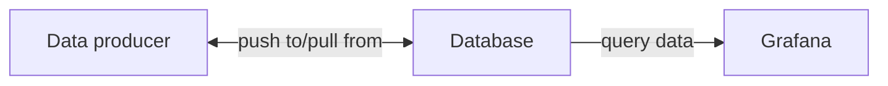

- [Official site](https://grafana.com/grafana/dashboards/)
- [Intro](https://www.youtube.com/watch?v=lILY8eSspEo&t=151s&ab_channel=TechandBeyondWithMoss)

Grafana is an open source web application commonly used for **monitoring resources** and **data visualization**

# Infrastructure

- Data producer: Jenkins CI server, Kubernetes pods, IoT Sensors, VM 
- Database: Prometheus, mySQL

# Data
There are 2 data categories: 

- **Metrics**: CPU oad, current memory Usage, CPU temperature
- **Logs**: logs, warning, error