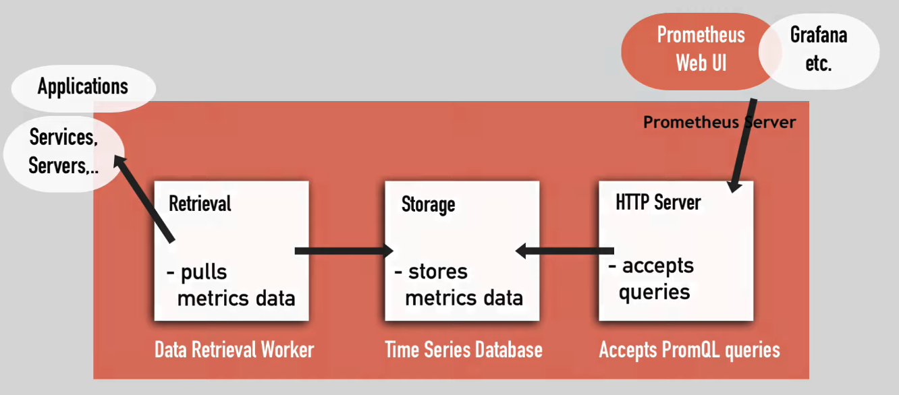
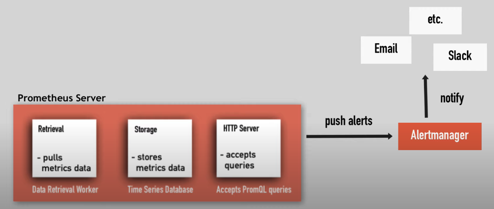
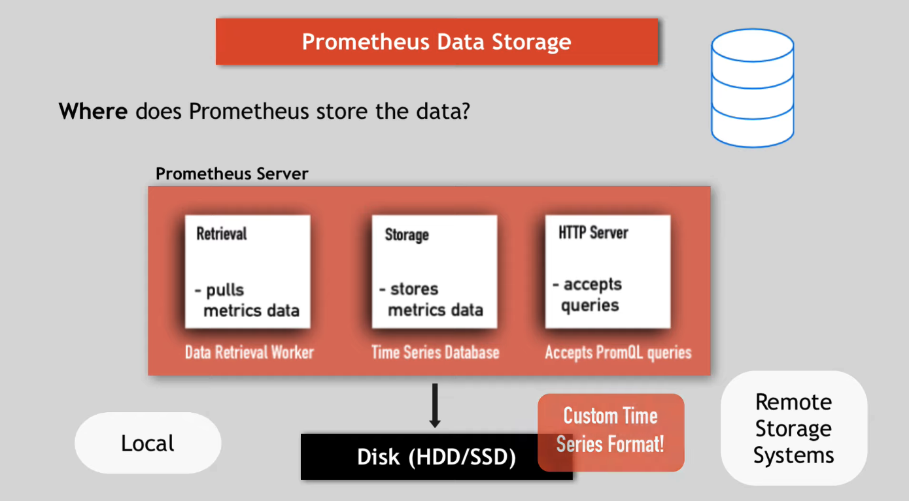
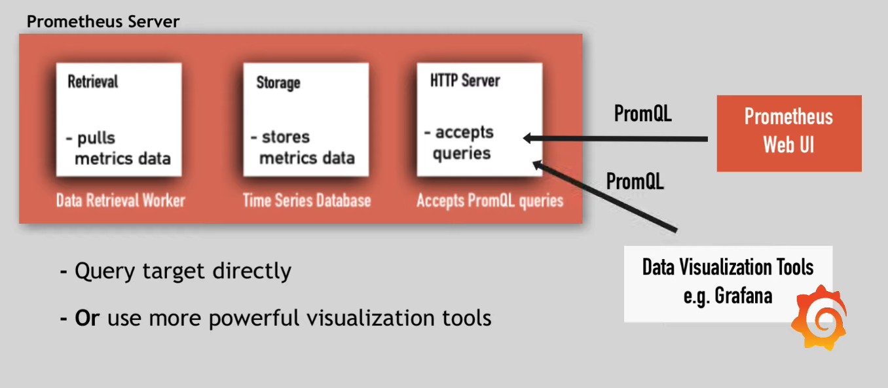

[Doc](https://www.youtube.com/watch?v=h4Sl21AKiDg&t=141s&ab_channel=TechWorldwithNana)

# What is Prometheus
to monitor highly dynamic container environment, such as K8s and Containers.

# Why Prometheus?
nowaday, the infrastructure is becoming more and more complex, Prometheus helps us to quickly identify where the error occures. Because it:

- constantly monitor all the services
- alert when crash
- identify problem before it occurs, e.g.:
    - checking memory usage --> if > 70% then a alert is sent
    - compare <u>available space</u> and <u>storage used by elasticsearch</u> --> sent alert if storage > 50%
    - monitoring network loads --> when one app has extremely high loads send alert

# Architecture
## Prometheus Server


### what does **Prometheus Server** monitor?
|Target|Metrics|
|:-|:-|
|Linux/Windows Server|CPU status, Memory/disk space usage|
|Single Application|Exceptions count, Requests count, Requests|
|Apache Server||
|Service such as Database||

All the **metrics** will be saved in **Prometheus Server > Storage**. **Metrics** are human-readable text-based, each **metric** has:
- `help`: description of what the metric is
- `type`: metric type
- `counter`: how many times did it happen
- `gauge`: whats the current value
- `histogram`: how long or how big

### How does **Prometheus Server** monitor its **target**?
**Prometheus Server > Retrival** pulls **metrics** over HTTP, doesn't matter what type of **target** it is, this **target** should provides Endpoint `hostaddress/metrics` in a Premetheus-understand-format.

!!! note "Exporter"
    Some services expose `/metrics` endpoint by default, if not, they need another component - **Exporter**:

    1. fetches metrics from **target**
    2. converts to correct format
    3. expose the `/metrics` endpoint

### why is **Prometheus** special??
due to its <u>pull system</u>

!!! warning "why pull better than push?"
    Application/servers **push** to a centralized collection platform:

    - high load of network traffice
    - monitoring can become the bottleneck of the whole project
    - needs to install additional tool to do the push

    **pull** system scraping from apps:

    - multiple **Prometheus** instances can pull metrics data
    - can detect service is problematic if doesnt get reponse

    Special case in **Prometheus** - **pushgateway**

# Example Configuration
what to scrape and when - all configured in `prometheus.yaml`

```yaml
# 1. scrape frequency
global:    
    scrape_interval: 15s
    evaluation_interval: 15s
# 2. rules to aggregate metric values, or create alerts
rule_files: 
    # - "first.rules"
    # - "second. rules"
# 3. target
scrape_configs:
    - job_name: prometheus 
      static_configs:
        - targets: ['localhost: 9090']
    - job_name: node_exporter 
      scrape_interval: 1m
      scrape_timeout: 1m
      static_configs:
        - targets: ['localhost: 9100']
```

> prometheus has its own `/metrics` endpoint!

## AlertManager component
Prometheus has the component **AlertManager**. It defines:
- what triggers alerts
- who recives the alerts



## Data Storage
to collect and store the data



### query data
to query the data, we use **PromQL**



!!! Example "PromQL"
    to query all HTTP status codes except 4xx ones
    ```promql
    http_requests_total{status!~"4.."}
    ```
    
    to return the 5-minute rate of the http_requests_total metric for the past 30mins
    ```promql
    rate(http_requests_total[5m])[30m:]
    ```

# Key Characteristics

## Advantages
- reliable
- stand-alone and self-containing
-  works, even if other parts of infrastructure broken
- no extensive set-up needed
- less complex

## Disadvantages
- difficult to scale
- limits monitoring

## Workarounds:
- increase Prometheus server capacity
- limit number of metrics
