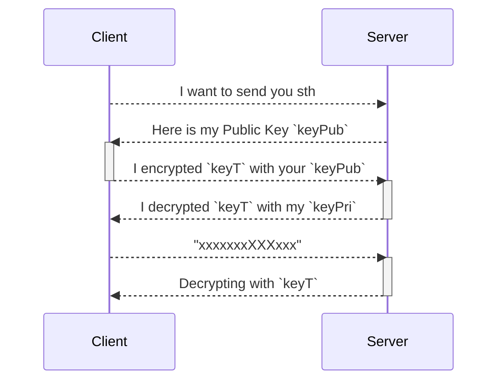
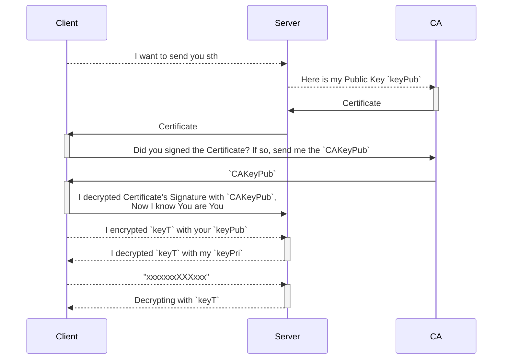

Source: [HTTP, HTTPS, CA, Certificate](https://www.youtube.com/watch?v=EnY6fSng3Ew&ab_channel=LaithAcademy)

- insecure connection == HTTP(Hypertext Transfer Protocol)
- secure connection == HTTPS(Hypertext Transfer Protocol Secure)

!!! warning "Data Transmission in Internet"
    Q: How is data transmitted through the Internet？ 
    A: 

    1.Cleart Text (human-readable) -> Binary (machine-readable)

        

    2. Binary -> Radio Wave Device -> Electrical Signals (0=0Volt, 1=+5Volt)

        

!!! info "protocol"
    protocol = set of rules

# HTTP
默认端口`80`.

!!! warning "Why is HTTP not secure?"
    the **Electrical Signals** are opening accessible, anyone who with a RW Detector can catch your data
    
    

# Concepts to understand

## Encryption
with use a **Key** for encryption, **Key** is nothing more than a STRING! 
    

## Symmetric Encryption
Encrypt and decrypt the text with the SAME key: 危险！因为除了encrypted Text，你也需要通过网络发送Key，而黑客有可能同时拿到两者

    

## Asymmetric Encryption
Encrypt and decrypt the text with DIFFERENT keys:  **Public Key** and **Private Key**

!!! note 
    - **Private Key**: ONLY keeps for itself
    - **Public Key**: public accessible, you could also google it

# Steps-2-steps
## 1. Symmetric + Asymmetric Keys
system has:

- Client has one Symmetric Key for encrypt/decrypt the text - `keyT`
- Server has Asymmetric Keys(`keyPub`, `keyPri`), and sends ONLY the `keyPub` to the Client

!!! danger
    This method can NOT avoid Middle Man Attack!

    The Hacker could pretend to be the Server!

## 2. Symmetric + Asymmetric Keys + Certificate Authority

!!! info "CA"
    A certificate authority (CA) is a trusted entity that issues digital certificates to authenticate content sent from web servers. There are around 12 CAs in the world.

In the following example, each actor has something we need:

|Client|Server 比如Facebook|CA 比如DigiCert|
|:-|:-|:-|
|- Sensitive Information|- Public Key `KeyPub`  - Private Key `KeyPri` |- Public Key `CAKeyPub`  - Private Key `CAKeyPri` - Certificate|

!!! info "Certificate"
    CA 发布的 X.509 Certificate 里到底有什么

    1. Metadata 
        - Issued to
        - Issued from
    2. Public Key - `KeyPub` received from Facebook
    3. Signature  = `CAKeyPri` encrypted `KeyPub`  

    

### x509 Certificate

!!! note
    |场景|证书格式|用途|
    |:-|:-|:-|
    |HTTPS|X.509|网站加密和身份验证|
    |代码签名|X.509|软件发布者验证（如微软签名）|
    |电子邮件加密|PGP/GPG|端到端加密（非 X.509）|
    |内部测试|Self-Signed X.509|无 CA 签名的临时证书|

!!! info "为什么有些 HTTPS 证书显示“不安全”？"
    可能原因：
    
    - 证书过期或域名不匹配。
    - 自签名证书（无 CA 签发）。
    - 浏览器不信任签发 CA（如企业内私有 CA 未预装）。

!!! info "如何获取 X.509 证书？"
    通过 CA 机构购买（如 DigiCert）或免费申请（如 Let's Encrypt）。

## 3. Chain of Trust
Its VERY dangerous if the Private key of a CA (`CAKeyPri`) get compromised., To minimize the possibility, we use **Chain of Trust** to make the `CAKeyPri` is as far as possible from the internet.
    
    

# HTTPS
S=Security

HTTPS= HTTP + Encryption through SSL/TLS Protocol

默认端口`443`.

Why is HTTPS secure? [#2. Symmetric + Asymmetric Keys + Certificate Authority] + [#3. Chain of Trust]

!!! info "SSL/TLS协议"
    SSL/TLS协议不仅定义了如何建立安全通信的流程（如握手协议），还详细规定了加密规则，包括加密算法、密钥生成方式、数据完整性校验等。
    
    - SSL（Secure Sockets Layer）
    - TLS（Transport Layer Security）

    TLS是SSL的后续版本！

