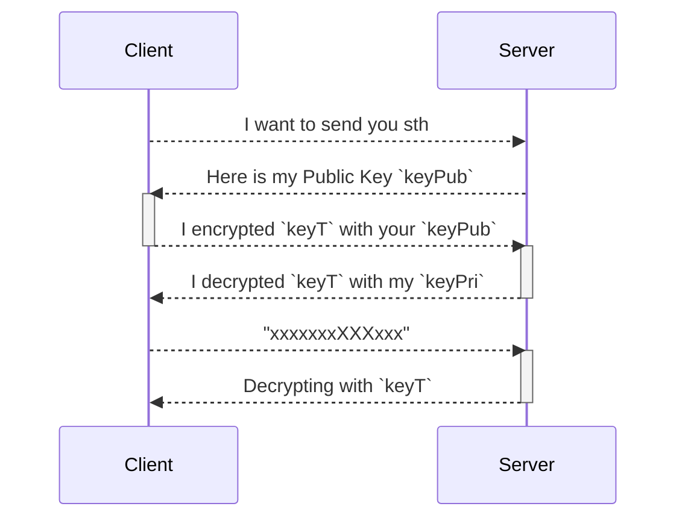
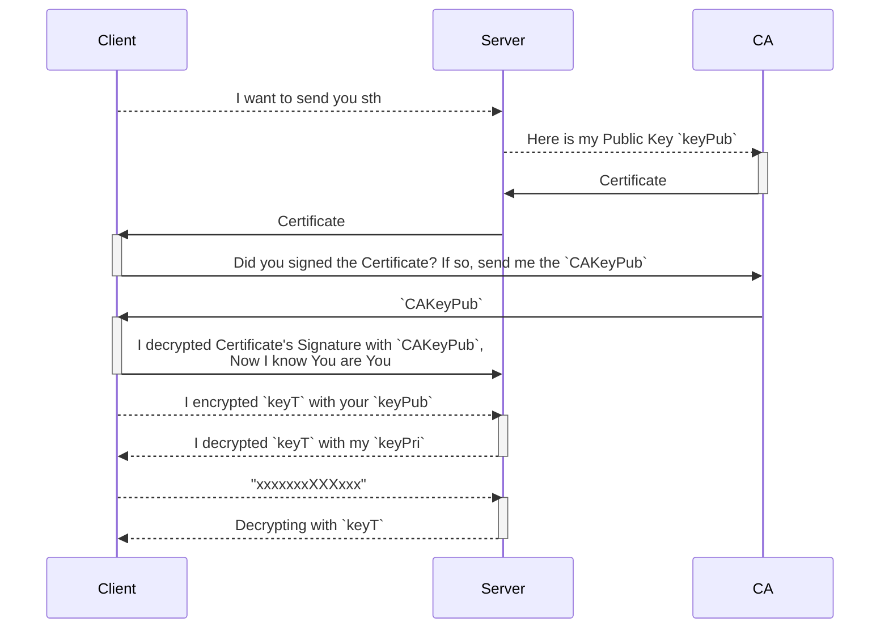

# Protocols / 协议

protocol = set of rules. “协议”就是设备或系统之间通信时约定的一套“说话规则”。

!!! note "例子"
    如果你说中文，我说英文，我们可能听不懂对方 —— 同样，如果两台电脑没有用同一种协议，它们也无法通信。
    比如：
    
    - 你访问一个网站，用的是 `HTTP` 协议；
    - 你登录服务器，是用 `SSH` 协议；
    - 你看在线视频，背后可能用的是 `RTMP` 或 `HLS` 协议。

重要且常见的通信协议清单，按照应用层、传输层、网络层的逻辑层次分组:

## 🔝 应用层协议

用户最直接接触的

|协议|全称|用途|常见场景|
|--|--|--|--|
|HTTP/HTTPS|HyperText Transfer Protocol (Secure) |  万维网通信（网页、API）| 浏览网页、调用 REST API|
|FTP/SFTP|File Transfer Protocol / Secure FTP |文件上传/下载 | 网站部署、文件服务器|
|SMTP|Simple Mail Transfer Protocol | 发送邮件|邮件服务器发送端|
|IMAP/POP3 | Internet Message Access Protocol / Post Office Protocol |接收/读取邮件 |邮件客户端收信
|DNS  | Domain Name System|域名解析|浏览器输入网址，找服务器 IP|
|SSH  | Secure Shell|安全远程登录服务器  | 远程运维、部署|
|Telnet|Teletype Network|非加密远程控制 |  过时，不建议使用|
|SNMP|Simple Network Management Protocol|网络设备监控|路由器、交换机状态查询|
|MQTT|Message Queuing Telemetry Transport  | 物联网消息传输  | 传感器、嵌入式设备|
|WebSocket  | -  | 实时双向通信|聊天系统、在线游戏、实时监控|
|SOAP|Simple Object Access Protocol  | 企业级 Web 服务（基于 XML）  |  银行/保险系统|
|REST|Representational State Transfer |  现代 Web 服务（基于 HTTP/JSON） |  移动/网页应用的后台接口|

## 📦 传输层协议
保障数据传输的可靠性或实时性

|协议|用途|特点|常见应用|
|--|--|--|--|
|TCP| 面向连接的可靠传输 |有序、可靠、重传机制|HTTP、FTP、SSH、SMTP 等|
|UDP |无连接的快速传输|轻量、低延迟、不保证可靠|视频流、语音通话、DNS 查询|
|QUIC|基于 UDP 的安全传输|结合了 TCP+TLS 优势，低延迟|新版 HTTP/3 协议的基础|

## 🌐 网络层协议
实现设备间通信

|协议|用途|说明|
|--|--|--|
|IP（IPv4/IPv6）| 唯一标识设备、路由数据包|互联网的基础协议|
|ICMP|诊断网络状态|ping 命令就是基于 ICMP|
|ARP | IP地址转MAC地址|局域网中通信时查找设备|

## 🔄 其他协议

|类型|协议示例|用途|
|--|--|--|
|消息队列|AMQP, STOMP, MQTT, JMS|异步、解耦的系统通信|
|远程调用|gRPC, Thrift, RMI | 跨服务调用，支持结构化数据|
|数据同步|Rsync, SCP|远程文件/数据复制|
|流媒体 | RTMP, HLS, RTP|视频直播、音频流|

## 不同层的协议之间的关系

**Q：**如何理解不同层中的 **协议/Protocol** 之间的关系？ 
**A：**类比：快递寄送包裹的过程, 想象你要把一封信寄到国外朋友那里：

1. 你写的信内容 👉 就是应用层的数据，比如网页内容（HTML）、API 响应（JSON）。
2. 你放进信封 👉 是应用层协议，比如 HTTP 把数据封装好。
3. 交给快递公司包装、贴地址 👉 就像传输层的 TCP 把 HTTP 数据再封装。
4. 装上卡车、运输路线规划 👉 就像网络层的 IP 协议负责找路（路由）。
5. 物理送达过程（走公路、海运） 👉 就是数据链路层、物理层。

!!! info "协议分层理解：HTTP 与 TCP 的关系"
    |协议层级|协议示例|职责|举例说明|
    |--|--|--|--|
    |应用层 | HTTP、FTP、SMTP、DNS  | 提供具体功能的通信，比如浏览网页、发邮件|浏览器发 HTTP 请求拿网页|
    |传输层  | TCP、UDP  | 提供可靠传输/速度优化，保证数据能正确传达 |  TCP 保证网页内容顺序、无丢失|
    |网络层  | IP（IPv4/IPv6）  | 负责数据从源头到目标地址的传递  | 负责找到服务器的地址|
    |数据链路层 |  Ethernet、Wi-Fi|在同一个局域网内通信|在家中 Wi-Fi 路由器传输数据|
    |物理层 |  电缆、光纤、无线信号|实际的物理传输方式  | 电信号、光信号等|

# HTTP

!!! note "HTTP vs HTTPS"
    Source: [HTTP, HTTPS, CA, Certificate](https://www.youtube.com/watch?v=EnY6fSng3Ew&ab_channel=LaithAcademy)

    - insecure connection == HTTP(Hypertext Transfer Protocol)
    - secure connection == HTTPS(Hypertext Transfer Protocol Secure)

!!! warning "Data Transmission in Internet"
    Q: How is data transmitted through the Internet？ 
    A: 

    1.Cleart Text (human-readable) -> Binary (machine-readable)

        

    2. Binary -> Radio Wave Device -> Electrical Signals (0=0Volt, 1=+5Volt)

        

默认端口`80`.

!!! warning "Why is HTTP not secure?"
    the **Electrical Signals** are opening accessible, anyone who with a RW Detector can catch your data
    
    

# Concepts to understand

## Encryption
with use a **Key** for encryption, **Key** is nothing more than a STRING! 
    

## Symmetric Encryption
Encrypt and decrypt the text with the SAME key: 危险！因为除了encrypted Text，你也需要通过网络发送Key，而黑客有可能同时拿到两者

    

## Asymmetric Encryption
Encrypt and decrypt the text with DIFFERENT keys:  **Public Key** and **Private Key**

!!! note 
    - **Private Key**: ONLY keeps for itself
    - **Public Key**: public accessible, you could also google it

# Steps-2-steps
## 1. Symmetric + Asymmetric Keys
system has:

- Client has one Symmetric Key for encrypt/decrypt the text - `keyT`
- Server has Asymmetric Keys(`keyPub`, `keyPri`), and sends ONLY the `keyPub` to the Client

!!! danger
    This method can NOT avoid Middle Man Attack!

    The Hacker could pretend to be the Server!

## 2. Symmetric + Asymmetric Keys + Certificate Authority

!!! info "CA"
    A certificate authority (CA) is a trusted entity that issues digital certificates to authenticate content sent from web servers. There are around 12 CAs in the world.

In the following example, each actor has something we need:

|Client|Server 比如Facebook|CA 比如DigiCert|
|:-|:-|:-|
|- Sensitive Information|- Public Key `KeyPub`  - Private Key `KeyPri` |- Public Key `CAKeyPub`  - Private Key `CAKeyPri` - Certificate|

!!! info "Certificate"
    CA 发布的 X.509 Certificate 里到底有什么

    1. Metadata 
        - Issued to
        - Issued from
    2. Public Key - `KeyPub` received from Facebook
    3. Signature  = `CAKeyPri` encrypted `KeyPub`  

    

### x509 Certificate

!!! note
    |场景|证书格式|用途|
    |:-|:-|:-|
    |HTTPS|X.509|网站加密和身份验证|
    |代码签名|X.509|软件发布者验证（如微软签名）|
    |电子邮件加密|PGP/GPG|端到端加密（非 X.509）|
    |内部测试|Self-Signed X.509|无 CA 签名的临时证书|

!!! info "为什么有些 HTTPS 证书显示“不安全”？"
    可能原因：
    
    - 证书过期或域名不匹配。
    - 自签名证书（无 CA 签发）。
    - 浏览器不信任签发 CA（如企业内私有 CA 未预装）。

!!! info "如何获取 X.509 证书？"
    通过 CA 机构购买（如 DigiCert）或免费申请（如 Let's Encrypt）。

## 3. Chain of Trust
Its VERY dangerous if the Private key of a CA (`CAKeyPri`) get compromised., To minimize the possibility, we use **Chain of Trust** to make the `CAKeyPri` is as far as possible from the internet.
    
    

# HTTPS
S=Security

HTTPS= HTTP + Encryption through SSL/TLS Protocol

默认端口`443`.

Why is HTTPS secure? [#2. Symmetric + Asymmetric Keys + Certificate Authority] + [#3. Chain of Trust]

!!! info "SSL/TLS协议"
    SSL/TLS协议不仅定义了如何建立安全通信的流程（如握手协议），还详细规定了加密规则，包括加密算法、密钥生成方式、数据完整性校验等。
    
    - SSL（Secure Sockets Layer）
    - TLS（Transport Layer Security）

    TLS是SSL的后续版本！

# TLS / SSH

## **Why Does SSH Key Generation Create Both Public and Private Keys, but TLS Does Not?**

Good observation! The difference comes from the purpose and design of SSH keys versus TLS certificates.

---

### **1. SSH Key Pair: Private & Public Keys Are Always Generated Together**
- SSH uses **asymmetric cryptography**, where the **private key** is kept secret, and the **public key** is shared.
- When you generate an SSH key (`ssh-keygen`), it automatically creates both:
  - **Private key** (`id_rsa` or similar): Used for authentication.
  - **Public key** (`id_rsa.pub`): Placed on the remote server to allow authentication.
- This is because SSH is designed for direct authentication (like logging into a server), so both keys are needed from the start.

---

### **2. TLS Certificates: Private Key and Public Certificate Are Separate**
- TLS (used in HTTPS, etc.) also uses **asymmetric cryptography**, but it requires a **Certificate Authority (CA)** to issue a certificate.
- When you generate a private key (`private.key`), it is **not automatically paired with a public certificate** because:
  - The public certificate needs to be **issued and signed** by a trusted CA.
  - You first generate a **Certificate Signing Request (CSR)**, which contains the public key and identity details.
  - A CA (like Let's Encrypt, DigiCert) verifies the CSR and issues a **signed certificate**.
  - Only after this process do you get a valid **TLS certificate** (`certificate.crt`).

---

### **Why This Difference?**

| Feature          | SSH Keys                                      | TLS Certificates                             |
|-----------------|---------------------------------------------|---------------------------------------------|
| Purpose         | Authentication for SSH access              | Encrypting HTTPS connections               |
| Key Pairing     | Automatically generates both keys         | Only the private key is generated first    |
| Public Key Use  | Directly used for authentication          | Must be signed by a CA before use         |
| Validation      | No external validation needed             | Requires CA validation for trust          |

---

### **Conclusion**  
SSH keys are self-sufficient, while TLS certificates involve a trusted third party (CA) to issue and verify them. That’s why SSH key generation is immediate, while TLS requires extra steps to get a certificate.

# Telnet
Telnet(Teletype Network) is a CLI Tool developed in 1969 that is used to access remote servers. Because it is invented before internet, there is no security concerns designed for telnet. Later `SSH` is invented as a better alternative to `Telnet`