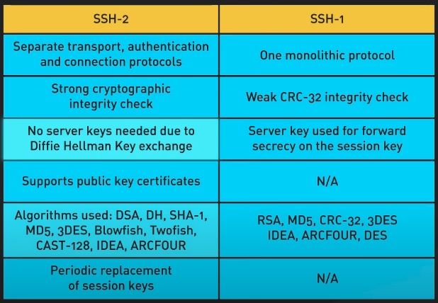

# IP
Find IP address in MacOS, in the following result there are several parts:

1. `lo` (loopback interface) - ignore this
2. Network Interface such as `ens192`, `eth0`, `enpXsY`
    - the IPv4 address is shown after `inet`
    - The `/24` means the subnet mask (255.255.255.0).


```bash
$ ip a
1: lo: <LOOPBACK,UP,LOWER_UP> mtu 65536 qdisc noqueue state UNKNOWN group default
    link/loopback 00:00:00:00:00:00 brd 00:00:00:00:00:00
    inet 127.0.0.1/8 scope host lo
       valid_lft forever preferred_lft forever
    inet6 ::1/128 scope host 
       valid_lft forever preferred_lft forever

2: ens192: <BROADCAST,MULTICAST,UP,LOWER_UP> mtu 1500 qdisc fq_codel state UP group default qlen 1000
    link/ether 00:50:56:aa:bb:cc brd ff:ff:ff:ff:ff:ff
    inet 192.168.100.10/24 brd 192.168.100.255 scope global dynamic ens192
       valid_lft 86300sec preferred_lft 86300sec
    inet6 fe80::250:56ff:feaa:bbcc/64 scope link 
       valid_lft forever preferred_lft forever
```


!!! note ipv4 vs ipv6
    https://www.geeksforgeeks.org/differences-between-ipv4-and-ipv6/

    ipv4: binary
    ipv6: hexadecimal


# CIDR
## CIDR blocks
A CIDR block is a group of IP addresses that share the same start and size. Big blocks have more IP addresses. Big internet groups give out large CIDR blocks to smaller groups. These smaller groups then give them to companies. If you’re at home, you get your CIDR block from your internet company.


## CIDR notation
CIDR notation shows an IP address with a number at the end. This number tells how much of the address is for the network. For example the 192.168.1.0/22 means the first 22 bits of the address are for a network. This way of writing a IP addresses helps the routers know where to send the data.


# ssh

`SSH` 就像是一把 远程控制的钥匙，可以安全地连接到另一台电脑。具体原理见[博客](https://www.ruanyifeng.com/blog/2011/12/ssh_remote_login.html)。




!!! note 
    SSH（Secure Shell）依赖于 TCP 来建立安全的远程连接：

    - TCP 是 运输层协议，负责可靠的数据传输，就像一条 稳定的公路。
    - SSH 是 应用层协议，使用 TCP 作为 底层传输通道，就像在公路上跑的 加密邮车。
